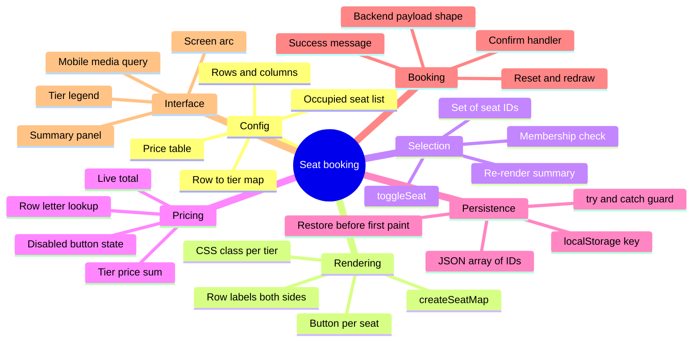

A cinema seat map looks like a solved problem until you try to build one. The grid is easy. The moment a person taps four seats, expects the right total, closes the tab by accident, and comes back to an empty map, you find out how much of the "easy" part was really design.

The version most people end up with is a table of colored squares that adds up prices. The version people actually keep using needs tiers, a hard block on already-booked seats, a live total, and a selection that survives a refresh. All of that is front-end work, and all of it fits in a single HTML file with no framework, no bundler, and no server.

This is the pattern we reach for when a seat map needs to feel real but the constraint is a static host: one `index.html`, a configuration block at the top, a render function, a `Set` for selection, and `localStorage` for persistence. Copy it, run it, then extend it.

<!--more-->

## What Pure HTML and JavaScript Actually Buys You Here

A seat map has no state that outlives a click, no server data to normalise, and no component reused in a second place. The entire meaningful state is "which seat IDs are currently chosen" - a `Set` of strings. That is a data problem, not an architecture problem, and vanilla JavaScript expresses it directly.

What you get by the end of this guide:

- A generated seat map with row labels on both sides
- Three price tiers driven by a row-to-type map
- Pre-occupied seats that are genuinely unclickable
- Multi-seat selection, deselection, and a live total
- A summary panel with a confirm and clear action
- `localStorage` persistence so a refresh does not lose the selection
- A layout that holds together on a phone

## Seat Tiers and the Pricing Model

Pricing is a configuration decision, not a rendering decision. Keep the tiers in a table like this and the rest of the code never hardcodes a number:

| Tier | Price (INR) | Colour | Where it lives |
|------|-------------|--------|----------------|
| Regular | 150 | Green | Back and middle rows |
| Premium | 250 | Blue | Middle rows, closer to the screen |
| VIP | 400 | Gold | Front rows, centre block |
| Occupied | - | Grey | Already booked, not selectable |
| Selected | - | Red | The user's current selection |

Two separate objects drive this. `ROW_TYPES` maps a row letter to a tier name, and `PRICES` maps a tier name to a number. The renderer reads the first, the total calculator reads the second, and neither knows the other exists. Swapping a whole auditorium layout is a matter of editing the first object.

> [!TIP]
> Add a centre aisle by splitting each row into two flex children with a fixed-width gap between them. It costs one extra wrapper div and makes a 12-column grid instantly readable.

## Project Structure

One file, because the whole point is that you can hand someone an `index.html` and they can double-click it.

```
movie-seat-booking/
  index.html
```

If you want to host it as a public demo, static hosting is all this needs. The [Hugo on GitHub Pages setup](/p/hugo-github-pages-setup/) walks through the deployment, and the [Hugo SEO checklist](/p/hugo-seo-guide/) covers the metadata once the demo becomes a tutorial page with its own URL.

## Complete Source Code

Paste this into an `index.html` file and open it in any modern browser.

```html
<!DOCTYPE html>
<html lang="en">
<head>
  <meta charset="UTF-8" />
  <meta name="viewport" content="width=device-width, initial-scale=1.0" />
  <title>Advanced Movie Seat Booking</title>
  <style>
    * {
      box-sizing: border-box;
      margin: 0;
      padding: 0;
    }

    body {
      font-family: system-ui, -apple-system, BlinkMacSystemFont, "Segoe UI", sans-serif;
      background: #0f172a;
      color: #e2e8f0;
      min-height: 100vh;
      padding: 20px;
    }

    .container {
      max-width: 960px;
      margin: 0 auto;
    }

    h1 {
      text-align: center;
      margin-bottom: 8px;
      font-size: 1.75rem;
    }

    .subtitle {
      text-align: center;
      color: #94a3b8;
      margin-bottom: 24px;
      font-size: 0.95rem;
    }

    .screen {
      background: linear-gradient(to bottom, #64748b, #334155);
      height: 12px;
      border-radius: 4px 4px 50% 50%;
      margin: 0 auto 32px;
      width: 70%;
      box-shadow: 0 4px 20px rgba(100, 116, 139, 0.4);
      position: relative;
    }

    .screen::after {
      content: "SCREEN";
      position: absolute;
      top: -22px;
      left: 50%;
      transform: translateX(-50%);
      font-size: 0.7rem;
      letter-spacing: 2px;
      color: #94a3b8;
    }

    .legend {
      display: flex;
      justify-content: center;
      flex-wrap: wrap;
      gap: 16px;
      margin-bottom: 24px;
      font-size: 0.85rem;
    }

    .legend-item {
      display: flex;
      align-items: center;
      gap: 6px;
    }

    .seat {
      width: 28px;
      height: 28px;
      border-radius: 6px 6px 10px 10px;
      cursor: pointer;
      transition: transform 0.15s ease, background 0.15s ease;
      border: none;
    }

    .seat:hover:not(.occupied):not(.selected) {
      transform: scale(1.12);
    }

    .seat.regular { background: #22c55e; }
    .seat.premium { background: #3b82f6; }
    .seat.vip { background: #eab308; }
    .seat.occupied {
      background: #64748b;
      cursor: not-allowed;
      opacity: 0.7;
    }
    .seat.selected {
      background: #ef4444;
      box-shadow: 0 0 0 2px #fecaca;
    }

    .seat-map {
      display: flex;
      flex-direction: column;
      align-items: center;
      gap: 8px;
      margin-bottom: 32px;
    }

    .row {
      display: flex;
      gap: 6px;
      align-items: center;
    }

    .row-label {
      width: 24px;
      text-align: center;
      font-size: 0.8rem;
      color: #94a3b8;
      font-weight: 600;
    }

    .summary {
      background: #1e293b;
      border-radius: 12px;
      padding: 20px;
      margin-bottom: 20px;
    }

    .summary h2 {
      font-size: 1.1rem;
      margin-bottom: 12px;
    }

    .selected-list {
      min-height: 40px;
      margin-bottom: 12px;
      color: #cbd5e1;
      font-size: 0.95rem;
    }

    .price-row {
      display: flex;
      justify-content: space-between;
      font-size: 1.15rem;
      font-weight: 600;
      margin-bottom: 16px;
    }

    .btn {
      display: inline-block;
      padding: 12px 28px;
      border: none;
      border-radius: 8px;
      font-size: 1rem;
      font-weight: 600;
      cursor: pointer;
      transition: background 0.2s ease, transform 0.1s ease;
    }

    .btn-primary {
      background: #ef4444;
      color: white;
      width: 100%;
    }

    .btn-primary:hover:not(:disabled) {
      background: #dc2626;
    }

    .btn-primary:disabled {
      background: #475569;
      cursor: not-allowed;
    }

    .btn-secondary {
      background: transparent;
      color: #94a3b8;
      border: 1px solid #475569;
      margin-top: 10px;
      width: 100%;
    }

    .btn-secondary:hover {
      background: #334155;
      color: #e2e8f0;
    }

    .message {
      text-align: center;
      padding: 12px;
      border-radius: 8px;
      margin-top: 16px;
      display: none;
    }

    .message.success {
      background: #14532d;
      color: #86efac;
      display: block;
    }

    @media (max-width: 500px) {
      .seat {
        width: 22px;
        height: 22px;
      }
      .row {
        gap: 4px;
      }
    }
  </style>
</head>
<body>
  <div class="container">
    <h1>Cinema Seat Booking</h1>
    <p class="subtitle">Select your seats for Avengers: New Era • 7:30 PM</p>

    <div class="screen"></div>

    <div class="legend">
      <div class="legend-item">
        <div class="seat regular" style="width:18px;height:18px;cursor:default"></div>
        <span>Regular ₹150</span>
      </div>
      <div class="legend-item">
        <div class="seat premium" style="width:18px;height:18px;cursor:default"></div>
        <span>Premium ₹250</span>
      </div>
      <div class="legend-item">
        <div class="seat vip" style="width:18px;height:18px;cursor:default"></div>
        <span>VIP ₹400</span>
      </div>
      <div class="legend-item">
        <div class="seat occupied" style="width:18px;height:18px;cursor:default"></div>
        <span>Occupied</span>
      </div>
      <div class="legend-item">
        <div class="seat selected" style="width:18px;height:18px;cursor:default"></div>
        <span>Selected</span>
      </div>
    </div>

    <div class="seat-map" id="seatMap"></div>

    <div class="summary">
      <h2>Your Selection</h2>
      <div class="selected-list" id="selectedList">No seats selected</div>
      <div class="price-row">
        <span>Total</span>
        <span id="totalPrice">₹0</span>
      </div>
      <button class="btn btn-primary" id="bookBtn" disabled>Confirm Booking</button>
      <button class="btn btn-secondary" id="clearBtn">Clear Selection</button>
      <div class="message" id="message"></div>
    </div>
  </div>

  <script>
    // ======================
    // CONFIGURATION
    // ======================
    const ROWS = ["A", "B", "C", "D", "E", "F", "G", "H"];
    const COLS = 12;

    // Seat type by row (you can customize this map)
    const ROW_TYPES = {
      A: "vip",
      B: "vip",
      C: "premium",
      D: "premium",
      E: "regular",
      F: "regular",
      G: "regular",
      H: "regular"
    };

    const PRICES = {
      regular: 150,
      premium: 250,
      vip: 400
    };

    // Pre-occupied seats (simulate already booked)
    const OCCUPIED = [
      "A4", "A5", "B7", "C2", "C3", "D9", "E1", "E11", "F6", "G8", "H3", "H4"
    ];

    // ======================
    // STATE
    // ======================
    let selectedSeats = new Set();

    // Load from localStorage if available
    const saved = localStorage.getItem("movieSelectedSeats");
    if (saved) {
      try {
        selectedSeats = new Set(JSON.parse(saved));
      } catch (e) {
        selectedSeats = new Set();
      }
    }

    // ======================
    // RENDER SEAT MAP
    // ======================
    const seatMap = document.getElementById("seatMap");

    function createSeatMap() {
      seatMap.innerHTML = "";

      ROWS.forEach((row) => {
        const rowEl = document.createElement("div");
        rowEl.className = "row";

        const label = document.createElement("div");
        label.className = "row-label";
        label.textContent = row;
        rowEl.appendChild(label);

        for (let col = 1; col <= COLS; col++) {
          const seatId = `${row}${col}`;
          const type = ROW_TYPES[row];
          const isOccupied = OCCUPIED.includes(seatId);
          const isSelected = selectedSeats.has(seatId);

          const seat = document.createElement("button");
          seat.className = `seat ${type}`;
          seat.dataset.id = seatId;
          seat.dataset.type = type;
          seat.title = `${seatId} • ${type} • ₹${PRICES[type]}`;

          if (isOccupied) {
            seat.classList.add("occupied");
            seat.disabled = true;
          } else if (isSelected) {
            seat.classList.add("selected");
          }

          seat.addEventListener("click", () => toggleSeat(seat));
          rowEl.appendChild(seat);
        }

        // Right side label for better readability on wide screens
        const labelRight = document.createElement("div");
        labelRight.className = "row-label";
        labelRight.textContent = row;
        rowEl.appendChild(labelRight);

        seatMap.appendChild(rowEl);
      });
    }

    // ======================
    // SEAT INTERACTION
    // ======================
    function toggleSeat(seatEl) {
      if (seatEl.classList.contains("occupied")) return;

      const id = seatEl.dataset.id;

      if (selectedSeats.has(id)) {
        selectedSeats.delete(id);
        seatEl.classList.remove("selected");
      } else {
        selectedSeats.add(id);
        seatEl.classList.add("selected");
      }

      saveSelection();
      updateSummary();
    }

    // ======================
    // SUMMARY & PRICE
    // ======================
    function updateSummary() {
      const listEl = document.getElementById("selectedList");
      const priceEl = document.getElementById("totalPrice");
      const bookBtn = document.getElementById("bookBtn");

      if (selectedSeats.size === 0) {
        listEl.textContent = "No seats selected";
        priceEl.textContent = "₹0";
        bookBtn.disabled = true;
        return;
      }

      const seatsArray = Array.from(selectedSeats).sort();
      listEl.textContent = seatsArray.join(", ");

      let total = 0;
      seatsArray.forEach((id) => {
        const row = id.charAt(0);
        const type = ROW_TYPES[row];
        total += PRICES[type];
      });

      priceEl.textContent = `₹${total}`;
      bookBtn.disabled = false;
    }

    // ======================
    // PERSISTENCE
    // ======================
    function saveSelection() {
      localStorage.setItem(
        "movieSelectedSeats",
        JSON.stringify(Array.from(selectedSeats))
      );
    }

    // ======================
    // BOOKING & CLEAR
    // ======================
    document.getElementById("bookBtn").addEventListener("click", () => {
      if (selectedSeats.size === 0) return;

      const seats = Array.from(selectedSeats).sort().join(", ");
      let total = 0;
      selectedSeats.forEach((id) => {
        const type = ROW_TYPES[id.charAt(0)];
        total += PRICES[type];
      });

      const message = document.getElementById("message");
      message.className = "message success";
      message.textContent = `Booking confirmed! Seats: ${seats} | Total: ₹${total}. Enjoy the show.`;

      // In a real app you would send this data to a server.
      // Here we simply clear the selection after a short delay
      // so the user can see the confirmation.
      setTimeout(() => {
        selectedSeats.clear();
        saveSelection();
        createSeatMap();
        updateSummary();
      }, 2500);
    });

    document.getElementById("clearBtn").addEventListener("click", () => {
      selectedSeats.clear();
      saveSelection();
      createSeatMap();
      updateSummary();
      document.getElementById("message").style.display = "none";
    });

    // ======================
    // INIT
    // ======================
    createSeatMap();
    updateSummary();
  </script>
</body>
</html>
```

## How the Code Works

### Configuration sits above everything

Rows, columns, row-to-tier mapping, prices, and the occupied list are all declared as constants at the top of the script. Nothing below that block knows how a VIP seat is defined. Change `ROWS` to add a ninth row and the seat map, the row labels, and the totals all follow without a single edit elsewhere. When the theatre moves Premium from ₹250 to ₹280 for an evening show, you edit one line instead of hunting through a click handler.

### The seat map is generated, not hand-written

`createSeatMap()` loops rows, then columns, and builds one `<button>` per seat. A seat's appearance comes entirely from its classes - `regular`, `premium`, or `vip` from the row type, plus `occupied` or `selected` when applicable. There is no inline colour anywhere in the script.

The choice of `<button>` over a `<div>` is deliberate. You get keyboard focus, Enter and Space activation, a disabled state for occupied seats, and a focusable element in the accessibility tree, all for free. The reference on what these elements give you is the MDN page for [`<button>`](https://developer.mozilla.org/en-US/docs/Web/HTML/Element/button).

### Selection is a Set, not an array

Clicking a seat adds or removes its ID in a `Set`. A `Set` gives you three things an array does not: duplicates are impossible, `has()` is effectively constant time, and iteration order is insertion order, so the summary reflects click order. At 96 seats the performance difference is irrelevant, but duplicate-safety is not - with an array, a double-fired click can push the same ID twice and quietly double the total. `selectedSeats.has(id)` and `selectedSeats.delete(id)` are the entire interaction model, and everything else in the file reads from that one source of truth.

### The total is derived, never accumulated

`updateSummary()` reads the row letter off each selected ID, looks up the tier, and adds the price. It never increments a running total. That distinction matters: an incremental total drifts the moment anything deselects a seat, while a derived total cannot. Recomputing 96 seats' worth of arithmetic on every click costs nothing, so there is no reason to be clever about it.

### Persistence writes on every change

`saveSelection()` serialises the `Set` to a JSON array and writes it to `localStorage` under a single key. On load, the script reads that key back and rebuilds the `Set` before the first render, so `createSeatMap()` paints the restored selection directly. There is no "has this loaded yet" flag, because the restore happens before the first paint rather than after it.

## The Whole Architecture at a Glance



<details>
<summary>Same map as a text outline</summary>

```text
Seat booking
  - Config
    - Rows and columns
    - Row to tier map
    - Price table
    - Occupied seat list
  - Rendering
    - createSeatMap
    - Button per seat
    - CSS class per tier
    - Row labels both sides
  - Selection
    - Set of seat IDs
    - toggleSeat
    - Membership check
    - Re-render summary
  - Pricing
    - Row letter lookup
    - Tier price sum
    - Live total
    - Disabled button state
  - Persistence
    - localStorage key
    - JSON array of IDs
    - try and catch guard
    - Restore before first paint
  - Booking
    - Confirm handler
    - Success message
    - Reset and redraw
    - Backend payload shape
  - Interface
    - Screen arc
    - Tier legend
    - Summary panel
    - Mobile media query
```

</details>

## Five Fixes Before This Goes Anywhere Real

The version above runs and demos well. These are the five things to change before it handles a real user, in the order they tend to bite.

### 1. Sort seat IDs naturally, not lexicographically

`Array.from(selectedSeats).sort()` compares strings, so `"A10"` lands before `"A2"` and the summary reads `A10, A2, A4`. A numeric comparator on the column fixes it:

```js
function seatOrder(a, b) {
  const rowCmp = a.charAt(0).localeCompare(b.charAt(0));
  if (rowCmp !== 0) return rowCmp;
  return Number(a.slice(1)) - Number(b.slice(1));
}

const seatsArray = [...selectedSeats].sort(seatOrder);
```

Use it in both `updateSummary()` and the confirm handler so the two never disagree.

### 2. Guard localStorage on write, not just on read

The read is wrapped in `try/catch`. The write is not, and that is where it fails: Safari in private mode historically threw a quota error on `setItem`, and some managed corporate browsers disable storage entirely. An uncaught throw inside a click handler leaves the seat visually selected but the total frozen, which is a genuinely confusing bug to reproduce.

```js
const STORE_KEY = "movieSelectedSeats";

function loadSelection() {
  try {
    const raw = localStorage.getItem(STORE_KEY);
    return new Set(raw ? JSON.parse(raw) : []);
  } catch (err) {
    console.warn("Seat selection could not be restored:", err);
    return new Set();
  }
}

function saveSelection() {
  try {
    localStorage.setItem(STORE_KEY, JSON.stringify([...selectedSeats]));
  } catch (err) {
    console.warn("Seat selection could not be saved:", err);
  }
}
```

Both halves of the contract now degrade the same way: the app keeps working, it just forgets.

### 3. Describe every seat to assistive technology

A grid of coloured squares announces as "button" ninety-six times. Three attributes fix that:

```js
seat.setAttribute("aria-label", `${seatId}, ${type} seat, ${PRICES[type]} rupees`);
seat.setAttribute("aria-pressed", String(isSelected));
```

Then keep `aria-pressed` in sync inside `toggleSeat`, and add a visible focus ring, because the default outline on a background-coloured button is easy to miss:

```css
.seat:focus-visible {
  outline: 3px solid #f8fafc;
  outline-offset: 2px;
}
```

Give the container `role="group"` and an `aria-label` like `"Seat map for Avengers: New Era, 7:30 PM"` so the landmark is announced before the buttons.

### 4. Cap the number of seats per booking

Nothing stops a user selecting all ninety-six. Real booking flows cap it, and the cap has to be enforced where the click happens, not in the summary:

```js
const MAX_SEATS = 8;

// inside toggleSeat, before adding
if (selectedSeats.size >= MAX_SEATS) {
  notify(`You can book up to ${MAX_SEATS} seats per order.`, "warn");
  return;
}
```

A `warn` variant on the message element is a small addition, and it is worth having a warning state at all - a booking form that can only say "yes" or "nothing" feels broken.

### 5. Reset the confirmation state through the class, not inline style

`clearBtn` hides the message with `element.style.display = "none"`, while the confirm handler shows it by setting `className`. Two mechanisms for one piece of state is the kind of thing that survives until a third button appears. Move both to classes - `.message.success`, `.message.warn` - and let CSS own visibility.

While you are there, push the booked seats into `OCCUPIED` before the redraw. It is still front-end-only fiction, but it makes the demo behave the way a real confirmation does:

```js
OCCUPIED.push(...seatsArray);
```

## Keeping Two Tabs Honest

Open the page in two tabs and they will drift apart, because `localStorage` writes do not fire a `storage` event in the tab that made the change. The other tab keeps showing a stale total until someone touches it. Two lines fix it:

```js
window.addEventListener("storage", (event) => {
  if (event.key !== STORE_KEY) return;
  selectedSeats = loadSelection();
  createSeatMap();
  updateSummary();
});
```

The [MDN documentation for the storage event](https://developer.mozilla.org/en-US/docs/Web/API/Window/storage_event) spells out the same-tab exclusion, which is why this handler only needs to worry about the other tabs.

Once you add a movie and showtime picker, also fold those into the storage key - `dev9b:seats:avengers-new-era-1930` - so two different shows never share one selection. The [`Storage` interface reference on MDN](https://developer.mozilla.org/en-US/docs/Web/API/Storage) covers the quota behaviour worth knowing about before you rely on it.

## Wiring It to a Real Backend Later

The `setTimeout` in the confirm handler is a placeholder with a deliberate shape: it already holds the seat list and the total, which is exactly the payload an API needs.

```js
const response = await fetch("/api/bookings", {
  method: "POST",
  headers: { "Content-Type": "application/json" },
  body: JSON.stringify({
    showId: "avengers-new-era-1930",
    seats: [...selectedSeats].sort(seatOrder),
    total
  })
});
```

One rule matters more than the request itself: **never trust the total from the browser**. Recompute it on the server from the authoritative seat map, and treat the posted total as a display value at best. A client-side-only price is a price anyone can edit in devtools, and the same principle shows up in [AI coding agents explained](/p/ai-coding-agents-explained/), where the model proposes the change and the guardrails live outside it.

The other half of a real booking flow is concurrency: two people picking the last seat at the same time. Front-end `Set` logic cannot solve that, and no amount of `disabled` attributes will pretend to. The server needs a transaction that rejects the second request.

## Where This Pattern Falls Apart

- **More than roughly ten columns on a phone.** Seats at 22 pixels are already at the edge of a comfortable tap target. Shrink them further and accuracy collapses. Wrap the grid in an `overflow-x: auto` container and let the map scroll instead.
- **One storage key for every show.** Fix the key format before you add a second movie, not after people have already booked the wrong show.
- **A full re-render on every click.** Reasonable at 96 buttons, wasteful at 1,000. Toggle the single seat's class in place and only call `createSeatMap()` when the layout actually changes.
- **Prices in the HTML.** A user with devtools open can set the total to one rupee. The number is a convenience; the server is the authority.
- **Colours as the only signal.** Red and green are the most common colour vision deficiency pairing there is. The tier label, the tooltip, and the legend need to carry the meaning too.

## Extending the Project

Once the base works, the natural next features are all additive: a movie and showtime selector that rebuilds the seat map from a JSON layout, a hold timer that releases the selection after a few minutes of inactivity, separate layouts per screen type (IMAX, standard, balcony) as separate data objects, a printable ticket via `window.print()` and a print stylesheet, a theme toggle built on CSS custom properties, and group seating where picking F5 also suggests F6 and F4.

None of these require a framework. They are all new configuration objects and new event handlers, which is the practical argument for the vanilla approach: the extension cost stays flat. More hands-on front-end walkthroughs live in the [Tutorials category](/categories/tutorials/), and if you want to extend the logic with an AI assistant rather than by hand, the [OpenCode setup guide](/p/how-to-setup-opencode-tui/) covers the terminal workflow. If the same project later needs to live inside a page builder rather than a static file, the [Skelementor and Elementor walkthrough](/p/how-to-use-skelementor/) is the right reference for that side.

## FAQ

### Can I build a movie seat booking system with only HTML and JavaScript?

Yes. This project builds a complete interactive seat map, multiple price tiers, occupied seats, live totals, and localStorage persistence using pure front-end code. No framework, no build step, no backend.

### How do I save selected seats so they survive a page refresh?

Store the list of selected seat IDs in localStorage whenever the selection changes. On page load, read that data and re-apply the selected class to the matching seats. Wrap both the read and the write in try/catch, because storage throws in some privacy modes.

### How can I add different seat prices for VIP and regular seats?

Define a mapping of rows to seat types plus a separate prices object. When calculating the total, look up each selected seat's row, get its type, and add the corresponding price. Keep pricing in configuration, never inside the click handler.

### Is this project suitable for beginners?

Yes. The code is organized into clear sections: configuration, rendering, interaction, summary, and persistence. Beginners can start by changing prices and occupied seats, then work up to the selection and calculation logic.

### How do I make the seat map responsive?

Use a flex row per seat row and shrink the seat box inside a media query for narrow screens. If a layout can hold more than about ten columns, add a horizontal scroll container around the grid instead of shrinking seats below a comfortable tap target.

### Can I connect this to a real backend later?

Yes. Replace the confirmation setTimeout with a fetch call that posts the selected seat IDs to your API. Recalculate the total on the server from the seat map and never trust the total sent by the browser.

## Key Takeaways

- Keep every tunable value - rows, columns, tiers, prices, occupied seats - in a configuration block above the logic.
- A `Set` of seat IDs is the entire state model. Derived totals beat accumulated ones, and buttons beat clickable divs.
- Write to localStorage on every change and read it back before the first paint, so a refresh is invisible to the user.
- `try/catch` the storage write, not just the read. That is where privacy modes actually fail.
- Treat the client total as a display convenience. The server recomputes the price and arbitrates the last seat.

## Conclusion

A seat booking interface is a configuration problem with a rendering loop attached. The moment the prices, tiers, and occupied seats move out of the click handler and into a data block, the rest is ninety lines of DOM code you can read in one sitting.

What makes it feel real is not visual polish. It is that the total is derived rather than accumulated, the selection is restored before the first paint, and occupied seats are genuinely unclickable rather than just grey. Those three details are the difference between a demo and something you would put in front of a person.

In practice teams like F9XR treat this as a small, budgeted front-end piece - one file, no build step, hosted statically, with the price authority kept server-side from day one. If you want it in front of real traffic, the [Hugo on GitHub Pages guide](/p/hugo-github-pages-setup/) covers deployment and the [Hugo SEO checklist](/p/hugo-seo-guide/) covers the page itself.

Ready to contribute? The [Contributor Guide](/contribute/) explains how to submit an article to Dev9b, and everything we publish is reviewed against the standards in our [Editorial Policy](/editorial-policy/).

---

*This guide was researched and drafted with the assistance of an AI coding assistant, then reviewed by the F9XR Review Board before publishing. The sample script was executed and its behaviour checked - 96 seats rendered, 12 occupied seats disabled, tier pricing, deselection, the localStorage round trip, and restore-on-load all verified. Behaviour in specific browser privacy modes was reasoned about rather than tested, and the localStorage guards above are the mitigation. Have feedback or want to contribute your own article? See our [Contributor Guide](/contribute/) and [Editorial Policy](/editorial-policy/).*
