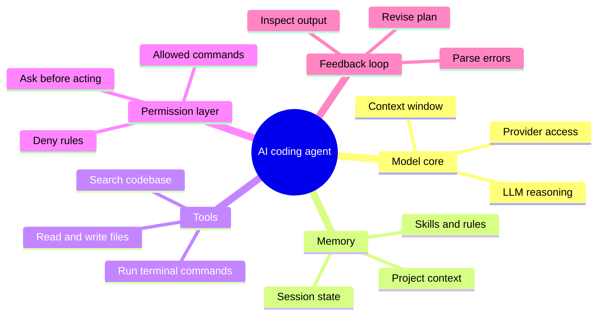

Every few months someone packages the same idea under a new name — autocomplete became pair-programmers, became agents. But an AI coding agent is a genuinely different thing from the chat window you are used to: it does not just answer, it does.

Understanding how these agents are built changes how you use them, how you prompt them, and how much you can safely trust them. This guide breaks down the anatomy of an agent — no marketing, no hype.

<!--more-->

## The Core Loop: Plan, Act, Check

Strip away the branding and an AI coding agent is a loop with three repeating phases:

1. **Plan** — the model asks what it needs to do, in what order, and what it does not know yet.
2. **Act** — it calls tools: reading a file, running a search, executing a terminal command, writing an edit.
3. **Check** — it inspects output, errors, and diffs, then decides whether the goal is met or the plan needs another pass.

Each iteration feeds back into the next. The agent never leaves the terminal in the way the plan expects, so it notices — that is what makes it an agent instead of a script.

## The Five Parts of Any Agent



And as plain text, the same map:

```
AI coding agent
  - Model core
    - LLM reasoning
    - Context window
    - Provider access
  - Memory
    - Project context
    - Session state
    - Skills and rules
  - Tools
    - Read and write files
    - Run terminal commands
    - Search codebase
  - Permission layer
    - Ask before acting
    - Deny rules
    - Allowed commands
  - Feedback loop
    - Inspect output
    - Parse errors
    - Revise plan
```

### 1. The Model Core

Every agent is an LLM at heart, wrapped in scaffolding. The same model can behave completely differently depending on how much of your codebase fits in its context and how the agent formats its thinking. This is why OpenCode supports 75+ models — the scaffolding is stable, and you choose the brain.

### 2. Memory

Agents have no lifelong memory. Each session re-reads what it needs. Three things do persist: your project files, the session's own edits, and **skills** — reusable instruction files you write once so the agent keeps following your conventions. That is the trick behind the [OpenCode skills guide](/p/opencode-skills-guide/): you encode memory, the agent applies it.

### 3. Tools

Tools are how an agent touches the real world. The standard set: file reads and edits, terminal commands, codebase search, and sometimes web fetches or issue lookups. Tools are where most of the practical difference between agents lives — a tool layer that understands git and package managers behaves like a developer, not a typist.

### 4. The Permission Layer

Safe agents gate every dangerous action behind a consent prompt or a deny rule. Our own denial experience: you set permissions in `opencode.json`, allow trusted commands, and deny the rest. The agent asks; you approve; nothing runs silently. This is the single most important feature to verify before letting an agent near a repository you care about.

### 5. The Feedback Loop

The final piece reads the outcomes. Did the command succeed? Does the test pass? Instead of assuming, the agent parses stderr, re-runs, and revises. Agents that skip this step are just autocomplete with extra steps.

## A Real Session, Top to Bottom

In practice a session looks like: you ask OpenCode to add a feature across two files. It lists the files it wants to read, reads them, writes a sketch, runs the build, notices a broken import it introduced, fixes it, replaces a hardcoded value with a config lookup, and hands you a diff. Every step was visible, every command was approved, and the agent corrected its own mistake without being asked.

## Key Takeaways

- An agent is a plan-act-check loop, not a chat box.
- Five components decide capability and safety: model, memory, tools, permissions, feedback.
- Agents re-read your codebase each session — skills are how you give them lasting conventions.
- Permission gating is a feature, not a nuisance; check it before trusting any agent.

## Conclusion

Agents are young, but the mental model is stable: a reasoning model wrapped in tools, bounded by permissions, that checks its own work. Try it on a small project first — install [OpenCode in VS Code](/p/opencode-vscode-setup/), watch it work, and keep our [contributor guide](/contribute/) in mind if you want to write up what you learn. Guides like this one are reviewed against the standards in our [editorial policy](/editorial-policy/).