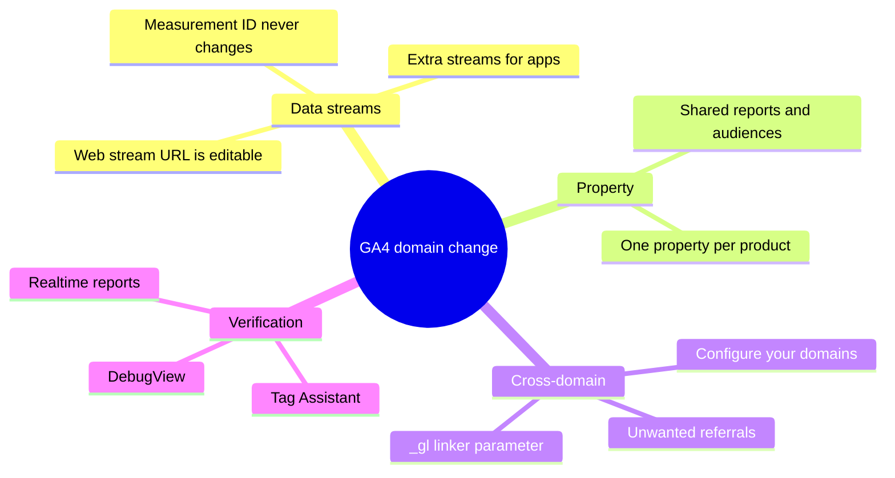

Migrating a site to a new domain, then opening your analytics dashboard to find a flat line, is a rite of passage for anyone who has shipped a rebrand. Universal Analytics kept a domain field sitting right there in property settings. GA4 deleted it. In GA4 the URL lives on a data stream, the tag in your pages only ever cares about a Measurement ID, and the gap between those two facts is where most migrations quietly break.

This is the developer path through the fix: editing the Website URL on an existing stream, adding extra streams to one property, configuring cross-domain measurement so a visitor does not fall out of your funnel when they cross a root domain, and verifying the result with DebugView before you trust a number.

<!--more-->

## GA4 structure: account, property, data stream

Before clicking anything, get the hierarchy right. Most GA4 mistakes are not configuration mistakes, they are modeling mistakes made three levels too high.

- **Account** — the ownership and billing container. One company or agency normally has one, more only when you need separate billing boundaries.
- **Property** — one logical product or brand. Every report, audience, and conversion lives here.
- **Data stream** — the actual collection point. A website, an iOS app, an Android app.

All streams inside a single property roll up into the same reports. That is exactly what you want when a marketing site and a checkout live on different root domains, because you get one continuous funnel instead of two disconnected ones. It is also precisely why unrelated properties must stay apart: drop a developer blog and a SaaS dashboard into the same property and no report will ever separate them cleanly again.

| Scenario | Recommended approach | Why |
|----------|----------------------|-----|
| Rebrand or domain change, old to new | Edit the existing web stream URL, keep the same Measurement ID | Historical data and audiences stay continuous |
| Unrelated properties such as blog versus SaaS | Separate properties | Clean reporting, no blending |
| Marketing site plus checkout on different root domains | One property with cross-domain settings | Continuous user journey |
| Subdomains of one root such as `blog.example.com` | Same stream, same Measurement ID | Works automatically, no extra setup |
| Website plus iOS or Android apps | Multiple streams inside one property | Combined reporting |



<!--
Markdown tree fallback (for readers without Mermaid rendering):

GA4 domain change
  - Data streams
    - Web stream URL is editable
    - Measurement ID never changes
    - Extra streams for apps
  - Property
    - Shared reports and audiences
    - One property per product
  - Cross-domain
    - Configure your domains
    - Unwanted referrals
    - _gl linker parameter
  - Verification
    - Tag Assistant
    - DebugView
    - Realtime reports
-->

## How to change the domain on an existing data stream

The URL is editable, and this is the part that surprises people who assumed GA4 froze it at creation time.

1. Open [Google Analytics](https://analytics.google.com) and select the correct property.
2. Click the **Admin** gear in the lower left.
3. Under **Property**, expand **Data collection and modification** and click **Data streams**.
4. Click the web stream you want to update.
5. In the stream details card at the top, click the edit icon.
6. Update **Stream name** if the old label is now misleading, for example `Main Site - newdomain.com`.
7. Change **Website URL** to the new scheme and domain, including any path prefix.
8. Click **Update stream**.

Two things to internalise here. First, the Measurement ID does not change. Ever. Second, the Website URL is mostly metadata: it drives some Enhanced Measurement defaults and how the stream is labelled in the UI, but collection is driven entirely by the tag on the page. Editing the URL is housekeeping, not migration. The migration is installing the same `G-XXXXXXXXXX` on the new domain.

### The checklist that actually decides whether the move worked

- Confirm the new domain loads the identical Google tag or the same GTM container carrying the same Measurement ID.
- Put permanent 301 redirects from the old domain to the new one, and keep the redirect map somewhere version controlled.
- Update any hardcoded filters, referral exclusions, or internal-traffic rules that still reference the old hostname.
- Re-check Search Console. Our [Hugo SEO guide](/p/hugo-seo-guide/) covers the metadata side of a rebuild, and if the move also means new DNS records, the walkthrough for [creating a Cloudflare subdomain for GitHub Pages](/p/how-to-create-cloudflare-subdomain-github-pages/) is the companion piece.
- Verify with Tag Assistant or DebugView before you touch a single report.

> [!IMPORTANT]
> If your new domain is served from a different static build pipeline, check that the Measurement ID is injected from config rather than hardcoded in a layout. On this site the ID lives in one config value, so a domain move is a one-line change instead of a grep across templates.

## How to add multiple data streams in one GA4 property

A property accepts any mix of web, iOS, and Android streams. This is how you combine a website with its apps under shared reporting, audiences, and conversions.

1. Go to **Admin**, then **Data streams**.
2. Click **Add stream**, then **Web**.
3. Enter the website URL and a stream name someone else will understand six months from now.
4. Leave Enhanced Measurement enabled. You can toggle individual events later without touching the stream itself.
5. Click **Create stream**.
6. Copy the new Measurement ID and install it on that site, or map it as a variable in GTM.

> [!NOTE]
> Google's own guidance is worth reading before you add web streams freely. Most sites are best served by a single web stream. Multiple web streams for one logical site fragment your data and make Explorations harder to reason about. Add a second stream when you genuinely need a separate collection point, such as a website plus its mobile apps, or fully independent regional sites that should still share audiences.

## How to set up cross-domain tracking

When a visitor moves from `example.com` to `checkout.otherdomain.com`, GA4 treats it as a new session and the original traffic source is lost. Your conversion data now lives in a different bucket than the acquisition data that produced it. Cross-domain measurement fixes this by decorating outbound links with a short-lived `_gl` linker parameter.

You need the same Measurement ID present on every domain in the journey, and Editor permission or higher on the property.

### Configure it from the Admin panel

1. Go to **Admin**, then **Data streams**, and select your web stream.
2. Click **Configure tag settings** near the bottom of the stream page.
3. Under Settings, click **Configure your domains**.
4. Click **Add condition**.
5. Choose a match type. `Contains` is the safe default for simple cases, `Ends with` is stricter, and regex is available when you need it.
6. Enter each domain that participates in the journey.
7. Repeat for every domain, then click **Save**.

### Exclude those domains as referrals

Under the same **Configure tag settings** area, expand **Show all** and open **List unwanted referrals**. Add the identical domain list there too. Skipping this is the single most common reason teams still see phantom self-referrals after enabling cross-domain tracking: one list without the other does nothing useful.

### The code-level equivalent

If you are not running GTM, you can set the linker explicitly in the config call:

```html
<script async src="https://www.googletagmanager.com/gtag/js?id=G-XXXXXXXXXX"></script>
<script>
  window.dataLayer = window.dataLayer || [];
  function gtag(){dataLayer.push(arguments);}
  gtag('js', new Date());
  gtag('config', 'G-XXXXXXXXXX', {
    linker: {
      domains: ['example.com', 'checkout.otherdomain.com']
    }
  });
</script>
```

If you already have a tag on the page, add the `linker` object to that existing `gtag('config', ...)` call rather than adding a second one. Two config calls for one Measurement ID means two pageviews per navigation, which quietly inflates every metric on the site.

> [!WARNING]
> Cross-domain tracking is not a substitute for a measurement plan. If you deploy it across twenty domains because it seemed free, you will get one enormous unreadable property instead of twenty clear ones. Scope the domain list to the actual user journey.

## How to verify that data is actually flowing

Configuration screens lie by omission, so verify instead of assuming.

1. Open the new or additional domain in an incognito window, so extensions and cached cookies cannot help you.
2. Run the Google Tag Assistant extension, or open **DebugView** from the Admin panel while you browse.
3. Confirm `page_view` events arrive and that they carry the Measurement ID you expect.
4. Click a cross-domain link and inspect the destination URL. It should contain a `_gl=` parameter.
5. In DebugView on the destination domain, confirm the client ID is unchanged across the hop.
6. Give it a few minutes, then check the Realtime report.

When nothing shows up, the cause is almost always one of these:

- The two domains are sending different Measurement IDs, so you are looking at two unrelated data sets.
- A consent banner or ad blocker suppressed the tag before it could fire.
- A redirect stripped the `_gl` query parameter in transit.
- The stream still points at the old domain, so Enhanced Measurement defaults no longer match what the new site actually does.

## Practical tips for developers

- Prefer GTM over hardcoded gtag snippets once you have more than one domain. Swapping Measurement IDs and maintaining a linker list becomes a variable change rather than a code deploy.
- After a domain change, update the matching Search Console property and request indexing of the new URLs. Our guide to [GitHub Pages with a custom domain on Cloudflare](/p/github-pages-custom-domain-cloudflare/) covers the hosting side of that migration.
- Use the **Page location** dimension in Explorations to segment by hostname when several domains or subdomains report into one stream.
- Keep the cross-domain list and the unwanted-referrals list in sync, and store both in your repo so they are reviewable. Teams like F9XR treat that list as config, because config gets diffed and tribal knowledge does not.
- Test form submissions and JavaScript redirects carefully. Some of them rewrite query parameters and silently break the `_gl` hand-off.
- Document the Measurement ID and the domain list next to your deployment config. The [Hugo on GitHub Pages setup guide](/p/hugo-github-pages-setup/) shows where that belongs in a static site, and if you would rather have an agent maintain the file than a human, the [OpenCode skills guide](/p/opencode-skills-guide/) covers turning the setup into a repeatable script.

## FAQ: changing domains and streams in GA4

### Can I change the domain of an existing GA4 data stream?

Yes. Go to **Admin**, then **Data streams**, select the web stream, and click the edit icon in the stream details card. Update the Website URL and optionally the stream name, then save. The Measurement ID remains the same.

### Do I need a new data stream when I change domains?

Usually no. Keep the existing stream, update its URL for housekeeping, and install the same Measurement ID on the new domain. Create a new stream only if you want the new domain to be a completely separate data source.

### How do I track multiple domains in one GA4 property?

Install the same Measurement ID on every domain, then open the web stream, choose **Configure tag settings**, open **Configure your domains**, and add each domain. Also list them under unwanted referrals so they do not appear as referring traffic.

### What is the difference between multiple data streams and cross-domain tracking?

Multiple data streams create separate collection points, which is how you combine a website with its apps. Cross-domain tracking keeps a single user session continuous when a visitor moves between different root domains that share the same Measurement ID.

### Why is my new domain not showing data in GA4?

Most often the Measurement ID on the new pages is different, the tag is blocked, or a redirect is stripping the `_gl` parameter. Use DebugView and Tag Assistant to confirm the tag fires and that the client ID stays consistent.

### Do subdomains need cross-domain configuration?

No. GA4 sets its cookies on the registrable domain by default, so `blog.example.com` and `www.example.com` share the same client ID automatically when they load the same Measurement ID.

## Key Takeaways

- In GA4 the domain lives on the data stream, not on the property. Edit the Website URL with the pencil icon in the stream details card.
- Keep the same Measurement ID on the new domain. That single decision preserves historical data, audiences, and conversions.
- Add extra streams only when you need a real separate collection point, such as a website plus its mobile apps.
- For cross-domain journeys, configure the domains list under **Configure tag settings**, then mirror it into unwanted referrals.
- Verify with DebugView and by inspecting the `_gl` parameter on outbound links, not by trusting the Admin screen.
- Subdomains of one root domain usually need no cross-domain setup at all.

## Conclusion

Changing domain in GA4 is a two-minute edit in the Admin panel wrapped around a one-hour verification job. The edit is easy to get right; the verification is what stops you from reporting a flat line as a traffic collapse.

Keep the Measurement ID and the domain list in version control, verify each hop in DebugView, and your new domain feeds the same property continuously instead of starting a second, emptier one.

Want to write something like this for Dev9b? The [Contributor Guide](/contribute/) explains how to submit an article, and everything we publish is reviewed against the standards in our [Editorial Policy](/editorial-policy/).

---

*This guide was researched and drafted with the assistance of an AI coding assistant, then reviewed by the F9XR Review Board before publishing. GA4 interface paths change occasionally, so confirm them against Google's [official data stream documentation](https://support.google.com/analytics/answer/9304776) if your Admin panel looks different.*