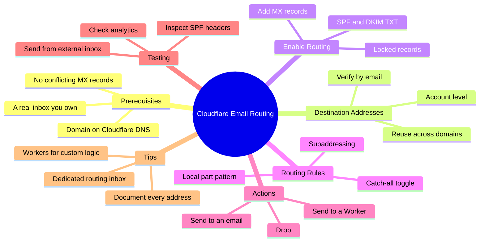

You own the domain. You already point DNS at Cloudflare. So why keep paying for extra mailboxes or exposing your real inbox every time you need a `support@` or `hello@` address?

Cloudflare Email Routing lets you create unlimited custom addresses on your domain and forward everything to an inbox you already check. It is free on every plan, private by design, and needs zero extra servers. This guide walks developers through the exact dashboard steps, DNS changes, verification flow, and the patterns that hold up in production.

<!--more-->

We set this up across several client domains on the F9XR team and hit the same two gotchas every time: a destination address sitting in "Pending" because nobody clicked the verification link, and leftover Google Workspace MX records quietly blocking Cloudflare's servers. Both are covered below. If you are still getting the DNS layer in place, our [Cloudflare subdomain guide for GitHub Pages](/p/how-to-create-cloudflare-subdomain-github-pages/) and the [apex domain walkthrough](/p/github-pages-custom-domain-cloudflare/) show how records, proxy status, and SSL fit together before you touch mail.



Prefer plain text? The same map as a tree:

```
Cloudflare Email Routing
  - Prerequisites
    - Domain on Cloudflare DNS
    - A real inbox you own
    - No conflicting MX records
  - Destination Addresses
    - Account level
    - Verify by email
    - Reuse across domains
  - Enable Routing
    - Add MX records
    - SPF and DKIM TXT
    - Locked records
  - Routing Rules
    - Local part pattern
    - Catch-all toggle
    - Subaddressing
  - Actions
    - Send to an email
    - Send to a Worker
    - Drop
  - Testing
    - Send from external inbox
    - Check analytics
    - Inspect SPF headers
  - Tips
    - Dedicated routing inbox
    - Workers for custom logic
    - Document every address
```

## Prerequisites Before You Start

Your domain must use Cloudflare as the authoritative nameserver. Email Routing will not activate if DNS is only partially proxied or managed elsewhere. If your domain is not on Cloudflare yet, add it under **Add a site** and switch the nameservers first.

You also need:

- Admin access to the Cloudflare account that owns the zone
- At least one personal or team inbox you control (Gmail, Outlook, Proton, etc.)
- No existing MX records that conflict with Cloudflare's routing servers

If you already run Google Workspace or Microsoft 365 on the domain, remove or carefully migrate those MX records first. Email Routing takes ownership of inbound mail for the whole zone, so it cannot coexist with another inbound provider on the same hostname.

## Step 1: Add and Verify Destination Addresses

Destination addresses are the real inboxes that receive the forwarded mail. They live at the account level, so one verified address can serve every domain in the account.

1. Log in to the Cloudflare dashboard and select your account.
2. Go to **Compute** > **Email Service** > **Email Routing** > **Destination Addresses**.
3. Enter the full email address you want to forward to (for example `yourname@gmail.com`) and submit.
4. Open the verification email Cloudflare sends and click **Verify email address**.

Until the status shows **Verified**, any routing rule that points to that address stays disabled. You can resend the verification email or delete pending addresses from the same page.

> [!TIP]
> Verify two or three destinations up front. It makes testing and failover easier later, and Cloudflare lets you reuse them across every domain in the account.

## Step 2: Enable Email Routing on the Domain

1. Still inside **Email Routing**, select the domain you want to configure (or use **Onboard Domain** if prompted).
2. Review the MX and related records Cloudflare will add.
3. Click **Add records and enable**.

Cloudflare automatically inserts the required MX records (`route1.mx.cloudflare.net` and companions) plus SPF and DKIM-related TXT records. These records are locked, so you cannot accidentally break routing by editing them by hand. After the records propagate, usually within minutes, Email Routing is live for that zone.

> [!WARNING] MX conflicts
> Leaving an old provider's MX records in place is the most common reason mail silently disappears. Delete them before you enable routing, then confirm the only MX entries left point at `*.mx.cloudflare.net`.

## Step 3: Create Custom Addresses (Routing Rules)

Now create the actual custom addresses.

1. Go to **Compute** > **Email Service** > **Email Routing** > **Routing Rules**.
2. Select **Create routing rule** (or **Create address**, depending on the current UI label).
3. In **Email pattern**, enter the local part only (for example `support` or `hello`). Choose your domain from the dropdown.
4. Under **Action**, choose one of the options in the table below.
5. In **Destination**, pick a verified address.
6. Save.

The rule appears in the list. Toggle it **Active** once the destination is verified. You can create as many rules as you need: `sales@`, `billing@`, `careers@`, or disposable ones for one-off signups.

### Catch-all Rule

Enable the catch-all toggle if you want every message sent to any local part, including typos, to land in one inbox. It is useful for small teams that do not want to maintain dozens of explicit rules. Be aware that a catch-all also collects spam aimed at random addresses, so pair it with a dedicated inbox you can filter.

### Subaddressing (Plus Addressing)

Turn on subaddressing under **Settings**. Messages to `support+ticket123@yourdomain.com` will match the `support@` rule while preserving the `+tag` for filtering or Workers. That single feature replaces a pile of one-off rules for ticketing and signup tracking.

## Common Actions and What They Do

| Action           | Behavior                                      | Best For                          |
|------------------|-----------------------------------------------|-----------------------------------|
| Send to an email | Forwards the full message to a verified inbox | Everyday support, contact forms   |
| Send to a Worker | Hands the message to a Cloudflare Worker      | Filtering, auto-replies, storage  |
| Drop             | Silently discards the message                 | Honeypots, temporary addresses    |

Only one destination address is supported per simple rule. If you need fan-out to multiple inboxes, route to a Worker that calls `message.forward()` for each verified destination. The [Email Routing addresses documentation](https://developers.cloudflare.com/email-service/configuration/email-routing-addresses/) describes the exact rule shape, and the [Email Workers guide](https://developers.cloudflare.com/email-routing/email-workers/) covers the custom logic path.

## Testing and Verification Checklist

1. Send a test message from an external account to your new custom address.
2. Confirm it arrives in the destination inbox within a minute or two.
3. Check the Email Routing analytics page for delivery metrics.
4. Verify SPF alignment by inspecting the received message headers.
5. Disable the rule, resend, and confirm mail stops arriving.

If nothing arrives, double-check that the destination is verified, the rule is Active, and no older MX records remain on the zone. When we switched a domain over from Workspace, a stale `aspmx.l.google.com` record was the entire reason nothing worked, and it took a header traceback to spot it.

## Practical Tips for Developers

- Keep a dedicated destination address just for Cloudflare routing. Filtering and searching stay cleaner than mixing it with your primary inbox.
- Routing only solves the inbound half. To reply as your custom address for free, follow our [Gmail Send-As with Cloudflare guide](/p/gmail-send-as-cloudflare-email-routing/).
- Use Workers when you need to reject known spam senders, auto-reply, or store the message in R2 or a database before forwarding.
- Document every custom address in a simple spreadsheet or Notion page. Six months from now you will forget why `newsletter-2024@` exists.
- For high volume or transactional outbound mail, look at Cloudflare's Email Sending feature, which is separate from routing. Routing only handles inbound.
- DNS propagation is usually fast, but if you just switched nameservers, give it a few hours before declaring failure.
- To automate follow-ups on routed mail, pair a Worker with a workflow tool. Our [local n8n setup guide](/p/how-to-install-n8n-locally-on-pc/) shows how to run that automation on your own machine.
- If you later change the primary domain, update your analytics tracking at the same time. The [GA4 multi-stream domain guide](/p/change-domain-ga4-multiple-data-streams-guide/) walks through the stream settings so reporting does not silently split.

## Key Takeaways

- Destination addresses must be verified before any rule becomes active.
- Email Routing is free and works on every Cloudflare plan as long as you control the DNS.
- Custom addresses are just local-part rules that point at verified inboxes or Workers.
- Catch-all and subaddressing cover most edge cases without extra rules.
- Always test from an external mailbox and inspect headers for SPF/DKIM alignment.
- Use Workers when simple forwarding is not enough.

## Frequently Asked Questions

### Is Cloudflare Email Routing free?

Yes. Email Routing is available at no extra cost on all plans, including the free plan. Cloudflare does not store or read the content of routed messages.

### Can I forward to Gmail, Outlook, or Proton Mail?

Yes. Any mailbox that can receive normal email works as a destination address once verified.

### What happens if I already have MX records from Google Workspace?

You must remove or replace those MX records. Email Routing requires Cloudflare's MX servers to be authoritative for inbound mail.

### Can one custom address forward to multiple destinations?

Not with a simple rule. Create a Worker that calls `message.forward()` for each verified destination address.

### How long does verification take?

The verification email usually arrives within seconds. Click the link and the status updates to Verified immediately.

### Does Email Routing handle outbound mail?

No. Email Routing only handles inbound mail. For outbound transactional email, use Cloudflare's separate Email Sending feature.

## Conclusion

Cloudflare Email Routing turns a domain you already own into unlimited custom mailboxes in about ten minutes, with no new servers and no monthly bill. Verify your destinations, enable routing on the zone, clear any old MX records, and define local-part rules that forward to inboxes or Workers. The two failures that cost most people time, an unverified destination and a leftover MX record, are easy to avoid once you know to check for them.

If you are building the rest of the stack around that domain, our [Hugo on GitHub Pages setup guide](/p/hugo-github-pages-setup/) covers the publishing side that pairs naturally with a Cloudflare-managed zone. This article was written with AI assistance on the F9XR Team and reviewed against Cloudflare's [Email Routing documentation](https://developers.cloudflare.com/email-routing/) before publishing. Every post on Dev9b passes review against our [editorial policy](/editorial-policy/); if you spot an edge case we missed, open an edit with the **Suggest changes** button or read the [contributor guide](/contribute/) to submit your own article.
