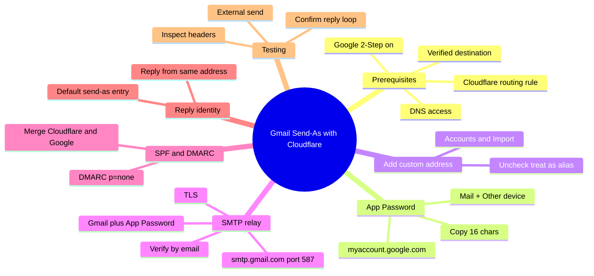

You already forward custom addresses like `admin@yourdomain.com` into your personal Gmail with Cloudflare Email Routing. Receiving works. The missing piece is sending and replying as that same professional address without paying for Google Workspace or another mailbox.

The Gmail "Send mail as" feature plus Gmail's own SMTP lets you do exactly that for free. Recipients see your business identity in the From field. Replies stay consistent. Everything still lands in the same Gmail inbox you already live in.

This guide walks developers through the complete setup: App Password, SMTP configuration, verification, SPF records, and the small details that keep deliverability clean.

<!--more-->

We run this pattern across client domains at F9XR, and the part that trips people up is not the SMTP screen, it is the SPF record. Cloudflare publishes one when you enable routing, and if you do not merge Google into it, your outbound mail leaves with a soft fail and starts landing in spam. The map below shows the whole flow before we walk each step.



Prefer plain text? The same map as a tree:

```
Gmail Send-As with Cloudflare
  - Prerequisites
    - Cloudflare routing rule
    - Verified destination
    - Google 2-Step on
    - DNS access
  - App Password
    - myaccount.google.com
    - Mail + Other device
    - Copy 16 chars
  - Add custom address
    - Accounts and Import
    - Uncheck treat as alias
  - SMTP relay
    - smtp.gmail.com port 587
    - Gmail plus App Password
    - TLS
    - Verify by email
  - SPF and DMARC
    - Merge Cloudflare and Google
    - DMARC p=none
  - Reply identity
    - Reply from same address
    - Default send-as entry
  - Testing
    - External send
    - Inspect headers
    - Confirm reply loop
```

## Prerequisites

Before you start you need:

- A working Cloudflare Email Routing rule that forwards your custom address (for example `admin@yourdomain.com`) to your Gmail
- The destination Gmail address already verified in Cloudflare
- Two-Step Verification enabled on the Google account
- Ability to edit DNS records in the Cloudflare zone

If inbound routing is not yet configured, finish that first. Our [Cloudflare Email Routing setup guide](/p/cloudflare-email-routing-custom-addresses/) walks through destination verification and the MX records that make forwarding work. Gmail sends a verification message to the custom address during setup, and that message must reach your inbox, so the inbound half has to be solid before you continue.

## Step 1: Create a Google App Password

Gmail no longer accepts your normal login password for SMTP. You need a 16-character App Password.

1. Go to [Google App Passwords](https://myaccount.google.com/apppasswords).
2. Sign in if prompted.
3. Under "Select app" choose **Mail**.
4. Under "Select device" choose **Other** and type a label such as "Cloudflare Send-As".
5. Click **Generate**.
6. Copy the 16-character password. Store it somewhere safe. You will not see it again.

Two-Step Verification must be turned on or the App Passwords page will not appear. If you are on a Workspace account, an admin policy can also disable App Passwords, which is one reason this trick is aimed at free personal Gmail.

## Step 2: Add the Custom Address in Gmail

1. Open Gmail.
2. Click the gear icon, then **See all settings**.
3. Open the **Accounts and Import** tab.
4. In the "Send mail as" section click **Add another email address**.
5. Enter the display name recipients should see (for example "Alex from Acme").
6. Enter the full custom address (`admin@yourdomain.com`).
7. Uncheck **Treat as an alias** if you want replies to use the custom address cleanly.
8. Click **Next Step**.

> [!TIP]
> Leave "Treat as an alias" unchecked when the custom address is your real public identity. Aliases are for cases where the address is disposable and you want Gmail to route replies to your primary account instead.

## Step 3: Configure Gmail's Own SMTP

Gmail will ask for SMTP server details. Use Gmail itself as the relay:

| Field              | Value                          |
|--------------------|--------------------------------|
| SMTP Server        | smtp.gmail.com                 |
| Port               | 587                            |
| Username           | your full Gmail address        |
| Password           | the 16-character App Password  |
| Secured connection | TLS (or SSL on port 465)       |

Click **Add Account**.

Gmail now sends a verification message to `admin@yourdomain.com`. Because Cloudflare is already routing that address into the same Gmail inbox, the message appears within seconds. Open it and click the confirmation link or enter the code.

Once verified, the custom address appears in the "Send mail as" list and becomes available in the From dropdown when you compose or reply.

## Step 4: Fix SPF so Messages Do Not Land in Spam

Cloudflare already published an SPF record when you enabled Email Routing. You must extend it so Google is also allowed to send on behalf of your domain.

In the Cloudflare DNS dashboard for the zone, edit the existing TXT record at the root (`@`) or create one if it is missing.

Recommended value:

```
v=spf1 include:_spf.mx.cloudflare.net include:_spf.google.com ~all
```

Save. Propagation is usually quick. You must keep both `include` mechanisms in a single record. Two separate SPF TXT records at the same name is an RFC violation and will break validation, which is why you edit the existing one instead of adding a second. The [SPF specification in RFC 7208](https://datatracker.ietf.org/doc/html/rfc7208) is the authoritative reference if you want to check the syntax rules yourself.

Optionally add a basic DMARC record so you can see how receivers treat your mail:

- Type: TXT
- Name: `_dmarc`
- Content: `v=DMARC1; p=none; rua=mailto:your-report@email.com`

Start with `p=none` so you can monitor reports before tightening the policy. Jumping straight to `p=reject` before you have confirmed SPF and DKIM alignment is a fast way to lose legitimate mail.

> [!WARNING] Do not replace the Cloudflare include
> Deleting `include:_spf.mx.cloudflare.net` breaks inbound forwarding validation for some receivers. Merge the two includes; never swap one for the other.

## Step 5: Set Default Reply Behavior

Back in Gmail **Settings** > **Accounts and Import**:

- Under "When replying to a message" choose **Reply from the same address the message was sent to**.
- Optionally set your custom address as the default "Send mail as" identity.

Now every reply automatically uses the business address that received the original message. This is the setting that makes the whole setup feel native: a message that arrived at `support@` gets answered from `support@`, without you touching the From dropdown.

## Testing the Full Loop

1. Compose a new message in Gmail and select `admin@yourdomain.com` in the From field.
2. Send it to an external address you control.
3. Inspect the received headers. You should see the custom address in From and a clean path through Google's servers.
4. Reply to that message and confirm the reply also leaves from the custom address.
5. Check that both the original and the reply land correctly in your Gmail inbox via Cloudflare.

If the verification email never arrived, double-check the Cloudflare routing rule status and that the destination address is still marked Verified. When we first wired this up, a routing rule had been left inactive after a DNS migration, and the verification mail bounced before it ever reached Gmail.

## Practical Tips That Save Time Later

- Keep the App Password in a password manager. Revoke it from the Google account page if you ever rotate credentials.
- Create one App Password per device or purpose so you can revoke them independently.
- For higher volume or better deliverability, later switch the SMTP settings to a dedicated relay (Brevo, SMTP2GO, Amazon SES, etc.) while keeping the same Gmail "Send mail as" entry.
- Watch Google's roadmap. As of late 2026 the classic "Send mail as" for non-Google addresses is still functional, but Google has signaled changes for 2027. Plan a migration path if you rely on this long term.
- Filters in Gmail can automatically label or star mail that arrives via the custom address so it stays organized.
- If you automate follow-ups, a local workflow tool pairs nicely here. Our [n8n local install guide](/p/how-to-install-n8n-locally-on-pc/) covers running that automation on your own machine.
- Keep your DNS tidy as the project grows. The same zone can serve your site and mail, and the [Cloudflare subdomain guide for GitHub Pages](/p/how-to-create-cloudflare-subdomain-github-pages/) shows how records stay separated.

## Key Takeaways

- Cloudflare Email Routing handles free inbound delivery to Gmail.
- Gmail's own SMTP plus an App Password lets you send as the custom address at zero cost.
- Uncheck "Treat as an alias" for cleaner reply behavior.
- Merge Cloudflare and Google into a single SPF record to protect deliverability; never create a second SPF record.
- Always verify the full send-receive-reply loop with an external mailbox.
- Monitor Google's policy updates around the 2027 timeline.

## Frequently Asked Questions

### Do I need Google Workspace for this?

No. The free personal Gmail account is enough when combined with Cloudflare Email Routing and an App Password.

### Why does Gmail ask for SMTP credentials at all?

Gmail needs a relay that is allowed to send mail with your custom domain in the From header. Using `smtp.gmail.com` with your own App Password is the simplest free option.

### Will recipients see "via gmail.com"?

In most cases modern clients hide the "via" line when SPF and the sending path are correct. Proper SPF reduces the chance of it appearing.

### What if the verification email never arrives?

Confirm the Cloudflare routing rule is Active and the destination address shows Verified. Send a test message to the custom address from outside Gmail to prove inbound routing works.

### Can I use the same setup for multiple custom addresses?

Yes. Repeat the "Add another email address" process for each address. You can reuse the same App Password.

## Conclusion

Cloudflare Email Routing plus Gmail's "Send mail as" is the cheapest credible way to run a professional address on your own domain: free inbound, free outbound, one inbox. Generate an App Password, add the address with Gmail's SMTP, merge Google into your existing SPF record, and set replies to use the address that received the message. Do those four things and the "via gmail.com" worry mostly disappears.

If you are still standing up the domain itself, our [Hugo on GitHub Pages setup guide](/p/hugo-github-pages-setup/) and the [GA4 multi-stream domain guide](/p/change-domain-ga4-multiple-data-streams-guide/) cover the publishing and analytics sides that usually ship alongside it. This article was written with AI assistance on the F9XR Team and checked against Cloudflare's [Email Routing documentation](https://developers.cloudflare.com/email-routing/) before publishing. Every post on Dev9b passes review against our [editorial policy](/editorial-policy/); if you hit an edge case we missed, open an edit with the **Suggest changes** button, or read the [contributor guide](/contribute/) to write the follow-up yourself.
