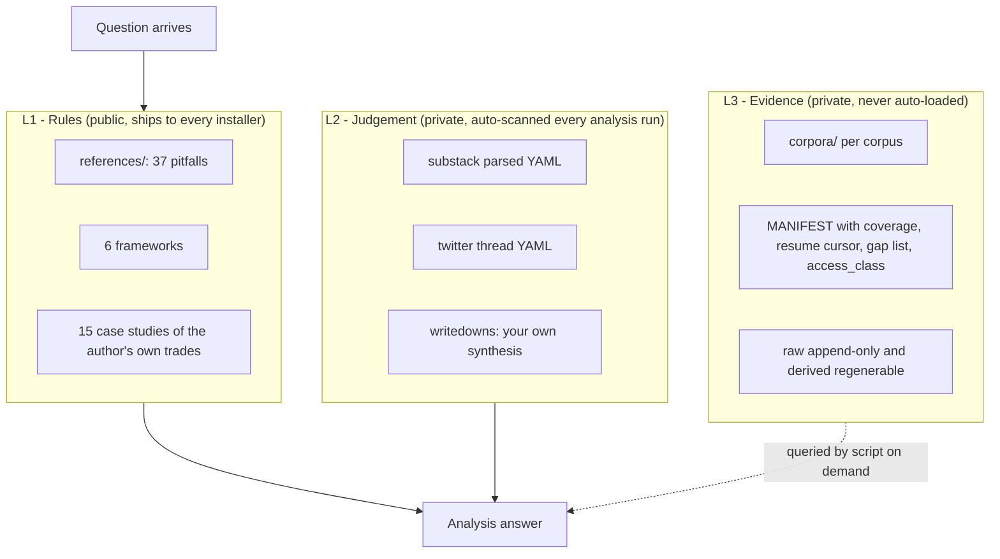

You ask a general-purpose coding agent about an options trade. It gives you a bull put spread, no strikes, no bid/ask, no probability of the short leg being hit, and no idea what implied volatility is currently pricing. It reads like competence and carries no information.

That gap is what `himself65/trade-skills` tries to close. It is a small, actively maintained Claude Code plugin that replaces vague structure suggestions with a specific workflow: force the agent to check flow before predicting an IV crush, count conviction before it picks a structure, and compute a profit and loss matrix before it recommends anything.

This is a developer article about installing and operating a skill, not a trading strategy. We read the skill's source, its routing rules, its hard rules, and its behavioural test suite to write it, and everything quoted here is from the repository rather than the marketing description.

> [!WARNING] Educational content only
> Options trading involves substantial risk of loss and is not appropriate for every investor. Nothing in this article or in the tool it describes is financial, investment, or trading advice. Do your own research, and consult a qualified, licensed financial adviser before risking capital. Never treat AI-generated output as a trade ticket.

<!--more-->

## What trade-skills Actually Is

`himself65/trade-skills` is a personal Claude Code plugin marketplace, currently at version 2.17.1, and it ships exactly one skill: `trade`. The repository passed 450 GitHub stars in the five months since it was created in April 2026, and it was pushed to the day we checked. Its sibling marketplace, `himself65/finance-skills`, is larger still at roughly 3,350 stars and provides the data-access half of the stack.

If you have not installed a skill before, the mechanics are covered in [how to add skills to your coding agent](/p/opencode-skills-guide/), and the reasoning about what an agent actually does with a tool is in [AI coding agents explained](/p/ai-coding-agents-explained/). The short version is that a skill is markdown instructions plus reference files that a coding agent loads on demand, which makes it a very natural way to ship a domain playbook.

What ships inside the `trade` skill is worth being precise about, because the counts are verifiable in the file tree:

- **37 pitfalls**, one file each, numbered `01` through `37`, indexed by trade type. They cover things like consensus not being bearish, single flow not being smart money, priced-in being a percentage rather than a yes or no, stop distance determining size rather than the reverse, and a per-trade cap being useless without a daily loss limit.
- **15 case studies**, one per ticker, each with a month attached: 6981, APP, BE, CBRS, INTC, MAG-7, MDB, MU, NBIS, NOK, NQ, SATS, SNOW, TSEM, and VIX.
- **Six frameworks** that are always available: structure selection, dealer gamma and GEX, price action and orderbook microstructure, macro judgment, overnight futures attribution, and parent-order-flow classification.

The interesting part is not the count, it is the loading model. All of that lives as an [Open Knowledge Format](https://github.com/GoogleCloudPlatform/knowledge-catalog/tree/main/okf) v0.1 bundle: plain markdown concept files with YAML frontmatter, cross-linked into a graph, entered through a single `references/index.md`, and version-controlled next to the code. OKF is a Google Cloud specification for portable, vendor-neutral knowledge bundles, and adopting it means the knowledge base is not trapped inside one agent's proprietary storage.

The consequence is that the agent does not read 37 pitfalls on every turn. It loads the framework that matches the question and then pulls the individual pitfalls that the situation routes to. That is the difference between a knowledge base you can actually ship and a wall of text that blows the context window.

## The Knowledge Architecture: Three Tiers

The design decision that makes this more than a prompt collection is how it splits knowledge by *who owns it* and *how it gets used*. There are three tiers, and the boundary between them is the whole contract.



L1 is the public library that installs for everyone. L2 is your own synthesis of outside material: the digest you wrote after reading a research note, your parsed post archives, your own writedowns. L3 is the raw evidence underneath those digests, bulk enough that scanning it every session would be wasteful, so it is queried by script on demand instead.

Two rules in the skill are worth quoting because they are the kind of thing most knowledge-base projects get wrong. The first is a strict destination rule: a de-identified rule that helps everybody is L1, your own conclusion about someone else's material is L2, and anything you merely collected is L3. The second is a size budget on L2, because it is scanned on every single analysis run, so the moment it outgrows one session the bulk has to move down to L3 and only the synthesis stays behind.

There is a privacy consequence that the README does not shout about. L2 and L3 are normally separate git repositories from the plugin itself, and a repository's visibility is set by its most restrictive corpus: one `paid` or `closed-community` corpus makes the entire repo private. So if you point the durable corpus at your own paid research, you should keep it in a private repo rather than letting convenience quietly turn a public one private or, worse, publish a summary of material you paid for.

## Install trade-skills

Four documented paths. All of these are from the project README and were verified against the current repository.

### The plugin install

```bash
npx plugins add himself65/trade-skills
```

This reads the repository's `.claude-plugin/marketplace.json`, which declares a single plugin named `trade` sourced from `./plugins/trade`, and installs the whole thing.

### Just the skill

```bash
npx skills add himself65/trade-skills
```

### Other agents

```bash
npx skills add himself65/trade-skills -a <agent-name>
```

The skill file itself is a standard `SKILL.md` with YAML frontmatter, so any agent that understands that format can load it. Be realistic about the limits: the data integrations and the subcommand routing are written against Claude Code's plugin and MCP system, so on another agent you get the knowledge base and probably have to wire the data tiers yourself.

### Local development

```bash
git clone https://github.com/himself65/trade-skills.git ~/trade-skills
ln -s ~/trade-skills/plugins/trade/skills/trade ~/.claude/skills/trade
```

This is the path to take if you intend to edit pitfalls, because it makes the reference directory a live symlink.

### Companion skills and keys

The data access is not self-contained. The skill calls three skills from the related `finance-skills` marketplace, under the plugin name `finance-data-providers`: `tradingview-mcp`, `tradingview-reader`, and `funda-data`. Install those too, or every market-data call degrades.

Keys go in a `.env` at the root of your working repository:

```bash
export FUNDA_API_KEY="your-funda-api-key"
export UNUSUAL_WHALES_API_KEY="your-uw-api-key"
```

Unusual Whales is optional but preferred, and the skill is explicit that without a key that tier simply does not exist. There is a detail worth knowing if you hit auth errors: the direct Unusual Whales integration requires an `UW-CLIENT-API-ID` header, and its own docs call out entitlement traps where a valid key still gets you nothing for certain datasets.

One honest note about licensing. The README and the plugin manifest both state MIT, but the repository does not currently ship a `LICENSE` file. That is a small thing and probably an oversight rather than a restriction, but if you are planning to vendor or redistribute any of the knowledge, ask the author for the file instead of relying on the README line.

## The Five Commands and How Routing Works

Everything is addressed as `/trade <command>`, and the router picks the command for you when you just talk to it normally.

| Command | What it does |
|---|---|
| `/trade setup` | Scaffolds the personal knowledge directory with Substack, X thread, and writedown templates. Run this first. |
| `/trade import <path or url>` | Parses one raw artifact into structured YAML, or digests a link into a writedown with attribution, a not-independently-verified caveat, and a bear case. |
| `/trade report [tickers or basket]` | Today's capital-flow read across one or more names, as a comparison table plus a cross-section synthesis. |
| `/trade daily <ticker>` | The repeatable one-name state read: tape, activity gate, block filter ladder, dark-pool baseline, IV term structure and percentile, dealer GEX plus max pain, sector cross-check, ending in a named composite state with falsification signposts. |
| `/trade analysis [ticker or situation]` | The default. Preflight, then situation-specific reference loads. |

Routing is three rules deep. No argument at all and you get the menu. A first word that matches one of the five names and it loads that command's reference file. A first word that does not match and it defaults to `analysis`, which covers the natural-language case like "structure a trade on APP into earnings".

Three exceptions then override the naive routing, and they are the part worth memorising:

- **"What is TICKER doing today"** routes to `daily`, not `analysis`. The distinction the skill draws is that `daily` is a *state* read and `analysis` is a *decision*. A follow-up "how about now" inside the same session is a delta re-run of `daily`, not a fresh full report.
- **"What is that block print"** is a lookup, not a state read. It should be answered from the minute bars and the print itself first, and only then offered the full `daily`.
- **"Where is capital flow going in COHR LITE MU"** routes to `report` even though no command word was used, while the same question about a *single* name is better served by `daily`.
- **A link with no question** is an ingestion request, so it goes to `import` and writes to your personal knowledge directory, never to the plugin's public `references/`.

There is one more rule that is quietly important for cost. Once a request is routed, the agent must read that command's reference file before answering, even when the question looks answerable from a case study, an attached document, or the surrounding context, and even when no market data source is connected. The reference file holds the preflight the answer depends on. An answer produced without it skips those steps without saying so, which is exactly the failure mode that produces a confident, unverifiable answer.

## The Hard Rules, and the Evals That Enforce Them

The skill declares three hard rules, and they are the actual product.

1. **Pull net options premium flow and check the catalyst clock before predicting an IV crush or a T+1 fade.** Pattern recognition without a data check has produced documented errors, and the skill points at pitfall 20, pitfall 21, and the NOK April 2026 case study as the receipts.
2. **Run the bull-conviction count before picking a structure** on any directional earnings or event trade. At a count of 4 or higher, the asymmetry rule activates and Jade Lizard, iron condor, calendar, and diagonal are forbidden regardless of IV regime.
3. **Always compute the counterfactual P/L matrix** for setups at 4 or more conviction, across spot, +10%, +20%, +35%, and +50%, and reject any candidate that flat-lines or loses in the highest-conviction column.

The second and third rules are where this stops being a personality prompt. Notice what the conviction count actually does: it does not pick a direction, it removes four structures from the menu. That is a constraint, and constraints are the part of a prompt that tends to survive contact with a persuasive user.

What convinced us this is real software rather than a good README is the test suite. The repository ships nine behavioural eval cases run through `claude plugin eval`, in three families:

| Family | Cases | What it pins down |
|---|---|---|
| `route-*` | 5 | Command routing, with mocked Unusual Whales tool answers and real tool schemas so the budget for API pulls is measurable |
| `pushback-*` | 2 | That the agent updates a wrong call when the pushback holds, and keeps the right call with evidence when it does not |
| `gate-*` | 2 | That the hard rules actually fire: one grader forbids the jade lizard outright, another requires the variance-risk-premium gate, another requires reading pitfall 36 |

The grading philosophy is the part a developer will appreciate: grade behaviour, not self-report. Deterministic graders check which tools were called, which files exist, and regex over recorded mock calls, and LLM judges are reserved for short pass or fail conditions on the final answer. They even document the trap where an `llm` judge focused on the trace only sees the first and last twelve lines, so a write call in the middle of a long run gets elided and you have to grade it with a regex instead.

Two workflow details are worth stealing regardless of what you are building. You can validate every case, grader, mock, and tool grant without spending anything by running the suite with `--scaffold --max-cost-usd 0 --no-publish`, which loads everything and stops before the first run. And a `.gitignore` entry that ignores `knowledge/` at any depth will silently swallow your eval fixture if you name a directory that, which is why the fixtures are stored under another name and copied in by a scaffold script.

## Data Sources Are Tiered, and the Skill Says So Out Loud

The data layer is the part that decides whether any of this is usable, so it is worth understanding the ordering.

| Tier | Source | Used for |
|---|---|---|
| 0 | Unusual Whales, only with your own key | Options flow, dark pool prints, dealer GEX, IV rank, intraday net premium |
| 1 | TradingView MCP | Quotes, technical readouts, screeners, futures overview, pre and after market, quick chain looks |
| 2 | TradingView desktop reader | Options chains with Greeks, per-strike IV skew, expiries and open interest, chart screenshots |
| 3 | Funda AI API | Fundamentals, filings, transcripts, analyst estimates, premium flow and GEX proxies |

Tier 0 is described as the upstream source that the Funda options fields are derived from, so with a key you query it directly instead of through a proxy. The skill is also unusually disciplined about failure: it is told never to substitute yfinance, web search, or guesses, never to present a Unusual Whales-only dataset as available when it is not, and to name which proxy any given read was built on. For a domain where a plausible wrong number is worse than no number, refusing to invent data is a feature.

One caveat to carry: the TradingView MCP chain data is Yahoo-sourced, which the skill itself flags as fine for chain shape, open interest, and volume, but not for IV rank or skew decisions. If you are trading skew, that distinction matters.

## Practical Notes and Honest Limits

Start with `/trade setup` and import two or three of your own past trade notes before you trust a live answer. The personal layer is what makes the output feel like your assistant rather than a generic one, and it is also the part that most improves the routing, because the agent loads your notes on every analysis run.

Use `daily` and `report` as a ritual. Running the same checklist pre-market and post-close is where a consistent process beats ad-hoc questions, and the falsification signposts are the part to actually act on.

When the agent pushes back, ask which pitfall or case study it is citing. That is usually the fastest way to learn the library, and it is a fair test of whether the citation is real.

The limits are worth stating plainly:

- **This is one trader's book.** The 37 pitfalls and 15 case studies encode a single person's experience and a single market regime. Case studies from a handful of tickers in 2026 are not a base rate, and treating them as one is how people talk themselves into a bad trade.
- **The hard rules are opinionated and can be wrong.** A conviction count of 4 banning four structures is a policy, not a theorem. It will occasionally veto a trade that worked. That is a deliberate trade of flexibility for consistency, and you should know you are making it.
- **The data tiers are gated.** Without an Unusual Whales key, the best flow and skew data is not available and the skill says so, but "the tool was honest about its handicap" is not the same as "the read was good".
- **No LICENSE file ships today**, as noted above.
- **It is educational software.** The project says so in its own README, in a warning at the top of the file. Treat that as the operating constraint rather than boilerplate, because the failure mode here is not a bad commit, it is a bad position.

If you want the plumbing rather than the trading, the same MCP setup that makes the data tiers work is covered in [setting up MCP servers for a coding agent](/p/opencode-mcp-servers/), and if you would rather evaluate agent platforms first, [OpenCode versus Cursor](/p/opencode-vs-cursor/) and [the OpenCode TUI setup guide](/p/how-to-setup-opencode-tui/) cover the alternatives.

## FAQ

### What is himself65/trade-skills?

It is a Claude Code plugin marketplace that ships one skill, called `trade`, aimed at active US-equity options traders. The skill loads a curated library of 37 severity-tagged pitfalls, 15 case studies written about named tickers, and six domain frameworks, packaged as an Open Knowledge Format v0.1 bundle of markdown concept files with YAML frontmatter. It is a knowledge and workflow layer, not a prediction engine.

### How do I install the trade skill in Claude Code?

Run `npx plugins add himself65/trade-skills` for the full plugin, or `npx skills add himself65/trade-skills` for the skill only. For local development, clone the repository and symlink `plugins/trade/skills/trade` into `~/.claude/skills/trade`. Use the `-a <agent-name>` flag on the skills command to target other agents that understand the SKILL.md format.

### Does trade-skills work with other AI agents besides Claude Code?

The install command accepts an `-a <agent-name>` flag for other agents that understand the SKILL.md format. The data integrations are built around Claude Code's plugin and MCP system, so the market data tiers and command routing are tuned for that ecosystem and may need manual wiring elsewhere.

### What data sources does the skill use?

Tier 0 is Unusual Whales, used only when you supply your own subscription key, and it is the preferred source for options flow, dark pool prints, dealer gamma exposure and IV rank. The fallbacks are, in order, a TradingView MCP server for quotes and screeners, a TradingView desktop reader for options chains with Greeks, and the Funda AI API for fundamentals, filings, transcripts and premium-flow proxies. The skill is instructed to name its proxy rather than invent numbers.

### Can I add my own research to the skill?

Yes. Run `/trade setup` once to scaffold a personal knowledge directory, then `/trade import` on a PDF, screenshot, or text file to parse it into structured YAML, or hand over a link to have it digested into a writedown. That personal layer is auto-scanned on every analysis run and normally lives in its own git repository so it stays private.

### Is trade-skills financial advice?

No. The project states in its own README that it is for educational and informational purposes only and that nothing in it constitutes financial advice. Nothing in this article is a recommendation, a strategy, or a view on any instrument. Options trading can lose you money, and any output from an AI system needs independent verification before you risk capital.

## Key Takeaways

- `trade-skills` is a single-purpose Claude Code skill, version 2.17.1, wrapping 37 pitfalls, 15 ticker case studies, and six frameworks into an Open Knowledge Format bundle that loads selectively instead of flooding the context.
- The three-tier L1, L2, L3 knowledge split is the real design idea, and it has a privacy edge: your synthesis and your collected evidence belong in separate private repos, because one paid corpus makes a whole repository private.
- Install with `npx plugins add himself65/trade-skills`, the skills-only variant, or a symlink for local editing, and install the three `finance-data-providers` companion skills from `finance-skills` or the data tiers degrade.
- The three hard rules are constraints, not suggestions: check flow before calling an IV crush, run the conviction count before choosing a structure, and compute the P/L matrix before recommending anything.
- Nine behavioural eval cases with deterministic graders are what separate this from a prompt file, and the `--scaffold --max-cost-usd 0 --no-publish` dry run lets you validate the whole suite for free.
- It is one person's trading book with an opinionated policy attached. Educational, MIT-declared but unlicensed in file form, and not financial advice under any circumstances.

## Conclusion

What is genuinely reusable here is not options knowledge, it is skill architecture. Separate public rules from private judgement from raw evidence, declare where each one loads from, make the knowledge base portable and graph-navigable rather than a wall of markdown, and then write graders that prove the rules fire instead of trusting that they do. A trading skill is an unusually honest place to learn that, because the failure mode is visible.

If you are evaluating it as a developer, the questions are the same ones you would ask of any agent tool. Does the routing actually pick the right command, or does the model improvise? Can it tell you which file it based an answer on? When it is wrong, does it update, and when it is stubborn, is it stubborn with evidence? The eval suite suggests the author asked all four.

Teams like F9XR apply the same test to any agent integration: the instructions are reviewable, the outputs are untrusted until something verifies them, and the scope of what the tool is allowed to touch is written down before anyone runs it at scale. That is the difference between a useful agent and an incident.

Ready to contribute? The [Contributor Guide](/contribute/) explains how to submit an article to Dev9b, and everything we publish is reviewed against the standards in our [Editorial Policy](/editorial-policy/).

---

*trade-skills is created by Alex Yang (`himself65`) and is not affiliated with Anthropic, Unusual Whales, TradingView, or Funda AI. The README and plugin manifest both state an MIT licence, though the repository does not currently include a `LICENSE` file. Version, file counts, command names, hard rules, eval cases, and install commands in this guide were read from the source repository on 30 September 2026, and the skill ships new pitfalls and case studies regularly, so verify against the current README. This guide was drafted with the assistance of an AI coding assistant, then reviewed by the F9XR Review Board before publishing. Nothing here is financial, investment, or trading advice.*
