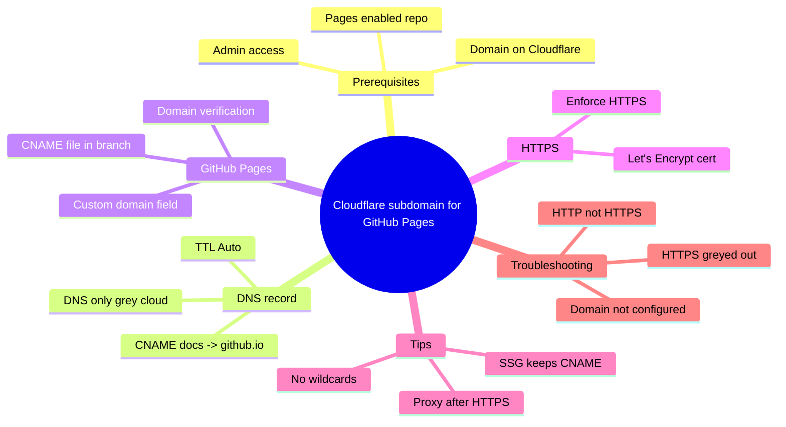

Most developers start with the free `username.github.io` URL. It works fine for testing, but once you want a clean branded address like `docs.yourdomain.com` or `blog.yourdomain.com`, you need a proper **Cloudflare subdomain**. Cloudflare makes this straightforward because its DNS is fast, free, and gives you full control over records and proxy settings.

This guide walks through the exact process of creating a subdomain in Cloudflare and pointing it at a GitHub Pages site. No fluff — just the steps that actually work in 2026, plus the gotchas that trip people up, especially around the orange cloud proxy and HTTPS certificates.

<!--more-->

You end up with four decisions: what the CNAME record points to, where you register the domain in GitHub, when to flip the proxy to orange, and how to keep the certificate renewing. None of it is hard, but each choice has a trap. Want the apex domain instead of a subdomain? Our [Cloudflare domain to GitHub Pages guide](/p/github-pages-custom-domain-cloudflare/) covers A records, CNAME flattening, and the SSL modes in depth. The map below shows the whole flow.



Prefer pure Markdown? The same map as a tree:

```
Cloudflare subdomain for GitHub Pages
  - Prerequisites
    - Domain on Cloudflare
    - Pages enabled repo
    - Admin access
  - DNS record
    - CNAME docs -> github.io
    - DNS only grey cloud
    - TTL Auto
  - GitHub Pages
    - Custom domain field
    - CNAME file in branch
    - Domain verification
  - HTTPS
    - Enforce HTTPS
    - Let's Encrypt cert
  - Tips
    - No wildcards
    - Proxy after HTTPS
    - SSG keeps CNAME
  - Troubleshooting
    - Domain not configured
    - HTTPS greyed out
    - HTTP not HTTPS
```

## Prerequisites

Before you begin, make sure you have:

- A domain already added to Cloudflare, with nameservers pointed at Cloudflare.
- A GitHub repository with GitHub Pages enabled (user site, org site, or project site).
- Admin access to both the Cloudflare zone and the GitHub repo.

If your domain is not yet on Cloudflare, add it first from the Cloudflare dashboard under **Add a site**. The free plan is enough for everything in this tutorial.

## Step 1: Create the Cloudflare Subdomain DNS Record

1. Log in to the Cloudflare dashboard and select your domain.
2. Go to **DNS** → **Records**.
3. Click **Add record**.
4. Choose these values:

| Type  | Name (example)     | Content (Target)          | Proxy status      | TTL      |
|-------|--------------------|---------------------------|-------------------|----------|
| CNAME | docs               | yourusername.github.io    | DNS only (grey)   | Auto     |

Replace `docs` with the subdomain you want (`blog`, `portfolio`, `api-docs`, etc.) and `yourusername` with your actual GitHub username or organization name.

Important notes:

- Always point the CNAME to `username.github.io` (or `orgname.github.io`). Never point it to the project-specific `username.github.io/repo-name` URL.
- Start with **DNS only** (grey cloud). Enabling the orange cloud proxy too early can delay GitHub's certificate issuance.
- Save the record.

DNS propagation is usually fast on Cloudflare (often under a minute), but allow up to a few hours in rare cases.

> [!IMPORTANT]
> A CNAME points at a host, never at a path. If your target contains `/repo-name`, GitHub will reject the domain and the certificate will never issue.

## Step 2: Connect the Subdomain in GitHub Pages

1. Open your GitHub repository.
2. Go to **Settings** → **Pages**.
3. Under **Custom domain**, type the full subdomain (for example `docs.yourdomain.com`).
4. Click **Save**.

GitHub will create (or update) a `CNAME` file in the root of your publishing branch. If you use a static site generator that overwrites the root, make sure the `CNAME` file survives the build or add it via GitHub Actions. On this very site, Hugo writes the file from `static/CNAME` on every deploy, which is why the domain has never reset itself.

After saving, GitHub starts checking DNS. You should see a message that it is verifying the domain. Once verification succeeds, the **Enforce HTTPS** checkbox becomes available (this can take from a few minutes to several hours).

## Step 3: Verify DNS and Enable HTTPS

Open a terminal and run:

```bash
dig docs.yourdomain.com +nostats +nocomments +nocmd
```

You should see something like:

```
docs.yourdomain.com.  300  IN  CNAME  yourusername.github.io.
yourusername.github.io.  3600  IN  CNAME  ...github.io...
```

When the dig output looks correct and GitHub shows the domain as verified:

1. Go back to GitHub Pages settings.
2. Check **Enforce HTTPS**.
3. Wait for the green lock to appear (usually 5–30 minutes after verification).

Once HTTPS is active, you can optionally turn the Cloudflare proxy (orange cloud) back on if you want Cloudflare's CDN, WAF, or analytics. Many developers leave it DNS-only for pure GitHub Pages sites because GitHub already serves content from a global CDN and has no bandwidth limits. See [GitHub's HTTPS documentation](https://docs.github.com/en/pages/getting-started-with-github-pages/securing-your-github-pages-site-with-https) for the official guidance on enforcing HTTPS.

## Practical Cloudflare Subdomain Tips for Developers

- **Multiple project sites under one domain**: Each repo gets its own subdomain and its own CNAME record pointing to the same `username.github.io`. GitHub routes based on the Host header and the `CNAME` file inside each repo. This is exactly how agencies like F9XR run several client properties off one zone without touching the apex.
- **Avoid wildcards**: Never create a `*.yourdomain.com` CNAME pointing at GitHub Pages. It opens the door to subdomain takeovers. Cloudflare's [subdomain record documentation](https://developers.cloudflare.com/dns/manage-dns-records/how-to/create-subdomain/) shows the correct single-record pattern.
- **Static site generators**: If you use Hugo, Jekyll, or Next.js static export, commit the generated `CNAME` file or inject it during the GitHub Actions build. The deploy pipeline for Hugo in particular is walked through in our [Hugo on GitHub Pages setup guide](/p/hugo-github-pages-setup/).
- **Testing before go-live**: Use `curl -I https://docs.yourdomain.com` to confirm the certificate and redirects without relying on browser cache.
- **Proxy decision**: Keep the record grey while GitHub issues the certificate. Switch to orange only after Enforce HTTPS is checked and working.
- **Verify the finish line**: Once the subdomain is live, run the crawl described in our [Hugo SEO checklist](/p/hugo-seo-guide/) to confirm canonicals, sitemap, and feeds all point at the new host. It catches the exact class of broken-link bugs that follow a domain change.

## Troubleshooting Common Cloudflare Subdomain Issues

**GitHub says "Domain is not properly configured"**  
Double-check that the CNAME points exactly to `username.github.io` and that no conflicting A or AAAA records exist for the same subdomain.

**HTTPS checkbox stays disabled**  
Wait longer or temporarily remove and re-add the custom domain in GitHub Pages settings. This forces a new certificate request.

**Orange cloud causes certificate errors later**  
GitHub's Let's Encrypt certificates renew on port 80. Cloudflare's proxy can interfere. Either keep the record DNS-only or create rules that allow HTTP validation for `/.well-known/acme-challenge/*`. Cloudflare's [SSL/TLS troubleshooting guide](https://developers.cloudflare.com/ssl/troubleshooting/) covers the full set of failure modes.

**Site loads on HTTP but not HTTPS**  
Clear your local DNS cache (`ipconfig /flushdns` on Windows, `sudo dscacheutil -flushcache` on macOS) and try an incognito window.

## Key Takeaways

- Create a single CNAME record in Cloudflare that points your chosen subdomain to `username.github.io`.
- Add the same full subdomain in the GitHub Pages custom domain field — the order of these two steps stays the same as the apex setup.
- Start with DNS-only (grey cloud) until GitHub verifies the domain and issues HTTPS.
- Enforce HTTPS in GitHub once the checkbox is available.
- Avoid wildcard records and never point the CNAME to a repo-specific path.

## Frequently Asked Questions

### How long does it take for a Cloudflare subdomain to work with GitHub Pages?

DNS changes on Cloudflare are usually live within seconds to a few minutes. GitHub domain verification and certificate issuance typically complete within 30 minutes, though it can occasionally take up to 24 hours.

### Should I enable the Cloudflare orange cloud proxy for GitHub Pages?

Start with DNS only. After HTTPS is enforced and stable, you can turn the proxy on if you want Cloudflare's WAF, caching, and analytics. Many developers leave it off because GitHub Pages already provides excellent global performance.

### Can I use the same GitHub username for multiple subdomains?

Yes. Point every subdomain CNAME to the same `username.github.io`. GitHub uses the custom domain value stored in each repository's `CNAME` file (or Pages settings) to route traffic correctly.

### What happens if I already have an apex domain set up?

You can add as many subdomains as you like without affecting the apex. Just create additional CNAME records. Do not use a wildcard.

### Do I need a paid Cloudflare plan?

No. The free plan fully supports custom subdomains, DNS records, and Universal SSL.

### Is a CNAME file required in the repository?

When you add the custom domain through the GitHub Pages settings UI, GitHub creates the `CNAME` file automatically for branch-based publishing. For GitHub Actions workflows the file is optional but still recommended for clarity.

## Conclusion

A Cloudflare subdomain turns a generic `username.github.io` URL into a clean, branded endpoint in about fifteen minutes once DNS propagates. Keep the record DNS-only through certificate issuance, enforce HTTPS, and only then decide whether the orange cloud earns its place. For docs, blogs, and status pages, one CNAME per repo — never a wildcard — stays the cleanest pattern.

This is the same setup that runs Dev9b: static sites published to GitHub Pages and routed through a Cloudflare-managed domain. Every article on this site passes the F9XR review board against the standards in our [editorial policy](/editorial-policy/). Spot a DNS edge case we missed? Use the **Suggest changes** button in the toolbar above to open an edit on GitHub, or read the [contributor guide](/contribute/) to write a follow-up yourself. This draft was written with AI assistance and verified against the Cloudflare and GitHub documentation linked throughout.