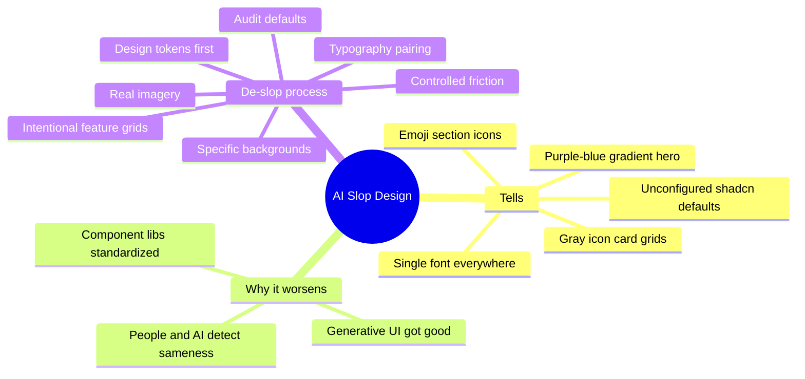

Open ten SaaS landing pages built in the last year and you'll probably see the same page five different times. Purple-to-blue gradient hero, bold serif headline over a soft blob shape, three rounded cards with a gray icon circle on top, a pricing table with the middle plan highlighted, and a footer with four columns of links nobody clicks. None of it is broken. All of it is forgettable, and increasingly, visitors and search systems alike can tell.

This is AI slop design: the visual equivalent of generic AI-written copy. It happens when a tool like v0, Lovable, Bolt, or a quick Claude or Cursor prompt generates a competent, defaultish UI, and nobody pushes past the first result. The layout works. It also looks like every other page the same tool generated for someone else. If you build products or client sites and you've noticed your output starting to blur together, this guide walks through how to spot AI slop design, why it costs you more than it used to, and exactly how to de-slop a website design without throwing away the speed that got you there in the first place.

<!--more-->

## What AI Slop Design Actually Is

AI slop design is a visual style that emerged from how generative UI tools produce output. These tools are trained on huge volumes of existing sites and components, so when you give them a short prompt, they reach for the statistically safest, most common pattern. The result looks polished on its own but instantly recognizable the moment you've seen a handful of other AI-generated pages.

It's not that AI tools produce bad design. The individual choices — spacing, contrast, component structure — are often technically sound. The problem is sameness. A dozen different products end up with visually interchangeable homepages because the underlying model keeps converging on the same safe defaults.

### Why This Is Worse Than It Sounds

A generic layout isn't just an aesthetic complaint. It has real, measurable costs for developers shipping products:

* **Weaker brand recall.** If your product page looks like three others a visitor saw this week, nothing about it sticks.
* **Lower perceived credibility.** Visually templated pages read as low-effort, even when the underlying product is excellent, which quietly drags down trust and conversion.
* **Flatter differentiation in a crowded market.** When every competitor's landing page is built with the same generative tool and barely customized, the product with distinct visual identity wins the click.
* **AI search engines reward specificity too.** Tools like ChatGPT, Gemini, Claude, and Perplexity increasingly summarize and recommend products based on how clearly a page communicates what makes it different. A page that visually and textually reads as boilerplate gives these systems less to latch onto.

## Spotting the Tells: A Pattern Checklist

Once you know what to look for, AI slop design is easy to spot on your own site. Here are the patterns that show up constantly.

| Pattern | What it looks like | Why it reads as slop |
|---|---|---|
| Purple-to-blue (or pink-to-orange) gradient hero | Full-bleed gradient background behind the headline | The single most overused hero treatment in AI-generated UI right now |
| Default Inter or Geist everywhere | Same system sans-serif font for headline, body, and buttons | No typographic hierarchy or personality, just the tool's default |
| Floating blob or mesh shapes | Soft organic shapes scattered behind content | Became a shorthand for "modern" and is now instantly dated |
| Rounded cards with a gray circle icon | Three or four identical cards, each with a centered icon in a light circle | The default feature-grid component in nearly every generated layout |
| Glassmorphism overload | Frosted-glass panels stacked on busy backgrounds | Hard to read, and used as decoration rather than for a real reason |
| Emoji as section icons | Rocket, lightning bolt, and target emoji used instead of designed iconography | Fast to generate, zero visual consistency with the rest of the brand |
| Identical hero copy structure | Bold claim, lighter subhead, two buttons (primary and ghost) | Matches thousands of other AI-generated landing pages exactly |
| Bento grid for everything | Every section forced into an asymmetric grid of boxes | A genuinely good layout pattern, overused until it means nothing |
| Stock-feeling AI people | Smiling, slightly too-perfect faces in testimonial sections | Reads as synthetic even when it technically isn't AI-generated |
| Shadcn-default everything | Unmodified shadcn/ui components, default spacing and radii | Fast to ship, but instantly recognizable as unconfigured defaults |

If four or more of these describe your current site, you've got a slop problem worth fixing, not a design problem worth starting over on.



## Why This Is Happening More in 2026

Three things are compounding at once, and they're worth understanding before you fix anything.

**Generative UI tools got genuinely good at production-ready output.** Tools built on top of models like Claude and GPT can now ship a working, responsive component tree in seconds. That's a massive win for speed, and it's exactly why so many products now share the same visual DNA: they're drawing from the same underlying training patterns and the same small set of popular component libraries. If you're already leaning on agents for implementation, our guide to [what DESIGN.md does for AI agents](/p/what-is-getdesign-md-ai-agents-design-system/) covers how to give those tools a real design file instead of hoping for distinct output.

**Component libraries standardized the building blocks.** shadcn/ui, Tailwind's default palette, and similar systems are excellent foundations, but when nobody customizes the tokens, every project built on top of them inherits the same spacing scale, the same border radius, and often the same color ramp.

**Visitors and AI systems have both gotten more pattern-sensitive.** People have now seen enough AI-generated sites that the pattern itself triggers skepticism, the same way an obviously AI-written paragraph does. And answer engines summarizing a market tend to favor sources that communicate something distinct, since indistinct pages don't give them anything specific to extract or cite. The copy side of the same problem is covered in our earlier piece on [vibe coding versus vibe engineering](/p/vibe-coder-vs-vibe-engineer/): unreviewed AI output, in text or in UI, ships sameness.

## The De-Slop Process for Developers

This isn't about abandoning AI tools in your design workflow. It's about using them as a fast first draft, then applying a handful of deliberate decisions that break the pattern.

### Step 1: Build a Real Design Token System First

Before you generate another component, lock in a small set of actual decisions: a primary color that isn't the default purple-blue gradient, a secondary accent, your type scale, your spacing scale, and your border-radius value. Put these in actual design tokens — CSS variables, a Tailwind config, a theme file — so every component you generate afterward inherits your choices instead of the tool's defaults.

```css
:root {
  --color-primary: #1b4332;
  --color-accent: #d4a373;
  --font-display: "Fraunces", serif;
  --font-body: "IBM Plex Sans", sans-serif;
  --radius-base: 6px;
  --space-unit: 8px;
}
```

This one step alone kills a huge share of slop, since most of the sameness comes from nobody bothering to override the defaults before shipping. The [Tailwind theme configuration docs](https://tailwindcss.com/docs/theme) are the practical place to encode those decisions if that's your stack, and tools that install a real `DESIGN.md` for your agent — covered in our [getdesign.md guide](/p/what-is-getdesign-md-ai-agents-design-system/) — work the same way one level up.

### Step 2: Pick a Typography Pairing That Isn't Inter Plus Inter

Default AI output almost always reaches for a single geometric sans across every element. Breaking that pattern is one of the cheapest, highest-impact fixes available:

* Pair a distinctive display font for headlines — a serif, a slab, something with real character — with a clean, readable sans for body copy.
* Avoid the current default stack of Inter, Geist, or Manrope used identically for everything. They're fine fonts; the problem is using them exactly like everyone else does.
* Set real type scale ratios instead of accepting whatever Tailwind's default text sizes hand you.

[Google Fonts](https://fonts.google.com/) is still the fastest source for pairing experiments. Download two candidates, drop them into a scratch page with your real headline and body copy, and compare at mobile width before you commit.

### Step 3: Replace Generic Gradients and Blobs With Something Specific

A gradient isn't inherently bad. The problem is the specific purple-blue (or pink-orange) combination that's become shorthand for "AI built this." If you want a gradient or background treatment, make it:

* Built from your actual brand palette, not a default preset
* Tied to something real: a product screenshot, an actual data visualization, a texture relevant to what you do
* Used with restraint, as an accent rather than the entire hero background

### Step 4: Rebuild Your Feature Grid With Intent

The three-or-four-card feature grid with a centered gray icon circle is everywhere because it's the fastest pattern to generate. To de-slop it:

* Vary card sizes based on actual content importance instead of forcing uniform grid cells
* Replace generic icon-in-circle treatments with real product screenshots, short GIFs, or custom illustrations where they add real information
* Write feature copy that states a specific capability rather than a vague benefit — this is where the design and copy cleanup actually overlap

Component-library users have an extra trap here. If you're shipping Skelementor or Elementor blocks straight from the kit, readers of our [Skelementor guide](/p/how-to-use-skelementor/) already know the drill: override the defaults before the first client sees the page, or you're renting someone else's visual identity.

### Step 5: Audit Every Default Component You Shipped

Go through your component library — shadcn, Radix-based systems, whatever you're on — and check which ones are still running on factory settings. For each one, ask:

* Does the border radius match a deliberate value, or is it the library default?
* Does the button hover state do anything, or does it just darken 10 percent like every other button?
* Do your cards, inputs, and modals share a consistent visual language with each other, or do they look like they came from three different kits?

The [shadcn/ui documentation](https://ui.shadcn.com/docs) walks through exactly where the theme tokens live. Ten minutes there beats an hour of guessing which border-radius is "the" radius on your site.

### Step 6: Replace Synthetic-Feeling Imagery

AI-generated or overly polished stock photography of people is one of the fastest ways to undercut trust, even on a site with strong copy. Swap in:

* Real product screenshots with real data, not placeholder lorem content
* Actual team photos if you're a small team or solo founder — imperfect beats synthetic
* Custom illustration in a style distinct enough that it couldn't be mistaken for a template library's default icon set

If the hero needs more than a static image, a 3D scene or interactive element can break the template feeling immediately. The [Three.js landing page guide](/p/setup-threejs-models-landing-page/) shows one concrete path for putting real models on a hero instead of another gradient blob.

### Step 7: Add Friction Where It Signals Craft

Counterintuitively, a few deliberate breaks from a perfectly uniform grid often read as more human and more designed, not less. Slightly offset an image, let a headline run long and wrap unusually, vary section rhythm instead of identical padding top and bottom on every block. Pattern-perfect uniformity is itself one of the tells.

## Quick Reference: Slop vs De-Slopped

| Element | AI slop default | De-slopped version |
|---|---|---|
| Hero background | Purple-blue gradient | Brand-specific color, product screenshot, or restrained texture |
| Typography | Single sans everywhere | Display font plus body font, deliberate scale |
| Feature section | Uniform 3-card grid, gray icon circles | Varied layout, real screenshots or custom icons |
| Section icons | Emoji | Custom iconography matching brand style |
| Imagery | Generic stock or AI people | Real screenshots, real team, or distinct illustration |
| Spacing and radius | Library defaults | Intentional tokens set before generation starts |
| Grid pattern | Bento grid for every section | Bento used selectively, where asymmetry genuinely fits the content |

## Practical Tips for Keeping AI Tools in Your Workflow Without the Slop

* **Prompt with constraints, not just intent.** Instead of "build me a hero section," give the tool your actual color tokens, font stack, and one reference example of the feeling you want. Specific inputs produce far less generic outputs.
* **Treat AI output as a wireframe, not a final draft.** Use it to validate layout and structure fast, then do a deliberate pass replacing defaults with your design tokens before anything ships. That discipline is the same split we describe in [Vibe Coder vs Vibe Engineer](/p/vibe-coder-vs-vibe-engineer/) — the tool isn't the problem, shipping the first draft as the final product is.
* **Keep a swipe file of sites that don't look AI-generated.** When you notice a site with real visual identity, save it. Pattern-matching against your own curated references counters the pull toward generic output.
* **Run the squint test.** Blur your screen or shrink the browser zoom until you can only see shapes and color blocks. If it looks like a template you've seen before, it probably is.
* **Get a second set of eyes before launch.** Slop is hardest to see on your own work because you've stared at it through every iteration. A fresh reviewer spots the generic patterns in seconds.
* **Don't fix everything at once.** Prioritize the hero and the first scroll, since that's where the generic-pattern recognition happens fastest for a new visitor, then work down the page.

## Common Mistakes When De-Slopping a Design

**Swapping the color but keeping the exact same layout.** A new palette on the same purple-blue gradient hero structure is still visually interchangeable with competitors. Structure matters as much as color.

**Over-correcting into chaos.** Breaking every pattern at once — random fonts, clashing colors, inconsistent spacing — just trades one kind of unprofessional for another. The goal is intentional distinctiveness, not noise.

**Treating this as a one-time fix.** If your workflow still generates new sections straight from an AI tool's defaults without running them through your token system, slop creeps back in page by page.

**Ignoring performance while chasing distinctiveness.** Custom illustrations, heavier fonts, and motion design all carry weight. Keep an eye on load time while you add personality, since a slow, beautiful page still loses to a fast, generic one on conversion. The [WebAIM contrast checker](https://webaim.org/resources/contrastchecker/) also catches the other common miss — unusual type pairings and brand colors that quietly fail accessibility.

**Forgetting accessibility in the pursuit of novelty.** Unusual type pairings and lower-contrast brand colors can hurt readability. Check contrast ratios and keep your type scale legible even as you move away from defaults. Google's guidance on [creating helpful, people-first content](https://developers.google.com/search/docs/fundamentals/creating-helpful-content) makes the same point from the search side: low-effort pages lose trust with users and systems alike.

## FAQ

### What is AI slop design?

AI slop design is a visually generic, interchangeable style that results from generative UI tools converging on the same default patterns, such as purple-blue gradients, uniform icon grids, and single-font layouts, across many unrelated products.

### How do I know if my website has AI slop design?

Check your site against common tells: a purple-to-blue gradient hero, a single default font used everywhere, a three-card feature grid with gray icon circles, emoji as section icons, and unmodified component library defaults. If several of these apply, your site likely reads as AI-generated.

### Is it bad to use AI tools like v0 or Lovable to build a website?

No. Using their output as a fast first draft and then applying your own design tokens, typography, and imagery on top produces a strong, differentiated result. Shipping the first generated output unchanged is what creates slop.

### What's the fastest fix for AI slop design?

Lock in a real design token system — color, type scale, spacing, and border radius — before generating anything else, then swap your typography away from a single default sans-serif font used for every element. These two changes alone remove most of the visual sameness.

### Does AI slop design actually hurt conversions?

Generic, templated-looking pages tend to read as lower effort and lower credibility to visitors, even when the underlying product is strong, which can quietly reduce trust and conversion. Visual differentiation also helps a page stand out in a market where competitors increasingly use the same generative tools.

### Can AI search engines like ChatGPT or Perplexity tell if a design is generic?

These tools don't evaluate visual design directly, but pages with strong, specific visual and written identity tend to communicate what makes a product different more clearly, which gives AI search engines more to extract and cite when summarizing or recommending products in a category.

## Key Takeaways

* AI slop design is the visual sameness that results from generative UI tools converging on the same safe, default patterns across thousands of products.
* Common tells include purple-blue gradients, single-font layouts, gray-circle icon grids, glassmorphism, emoji icons, and unmodified component library defaults.
* It matters more now because visitors and AI search engines have both gotten better at recognizing generic, low-differentiation pages.
* The fix starts with a real design token system, locked in before you generate another component, so AI output inherits your choices instead of its defaults.
* Typography pairing, intentional imagery, and varied layout rhythm are the highest-leverage, lowest-effort fixes available.

## Conclusion

De-AI sloping a website design isn't a redesign from scratch. It's a short, deliberate pass that turns generated output into something only your product could own. Lock the tokens, break the font default, replace the blob hero, and audit the components you never opened after scaffolding.

If you want the full picture, treat this as the visual half of a larger cleanup — our companion thinking on shipping AI-assisted work without looking automated lives in [Vibe Coder vs Vibe Engineer](/p/vibe-coder-vs-vibe-engineer/), and the design-system side lives in the [getdesign.md guide](/p/what-is-getdesign-md-ai-agents-design-system/).

Teams like F9XR treat this the same way we treat copy: AI for the first draft, humans for the decisions that make it ours. Want to write about your own de-slop process? See the [Contributor Guide](/contribute/) and read the [Editorial Policy](/editorial-policy/) before you pitch.

*This guide was researched and drafted with the assistance of an AI coding assistant, then reviewed by the F9XR Review Board before publishing.*
