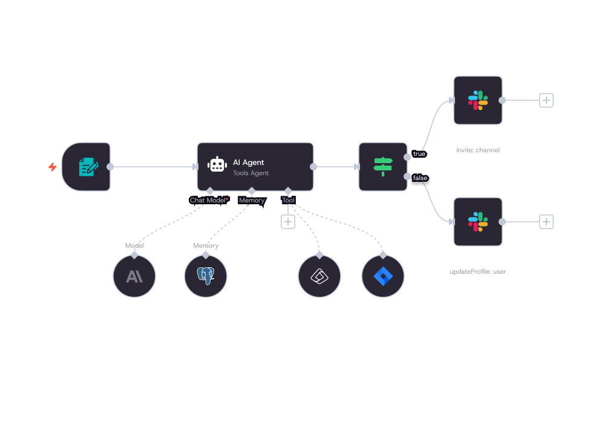
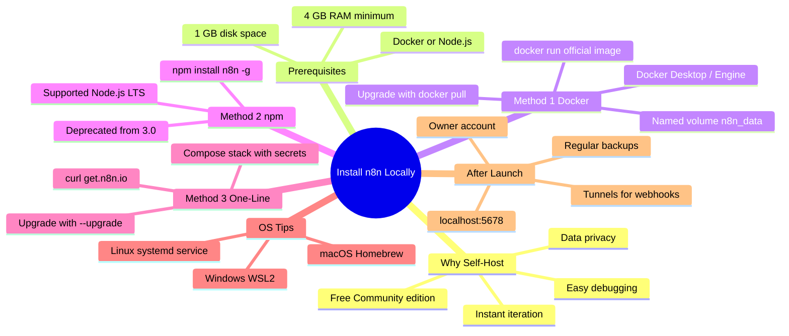

If you build automations, test webhooks, or prototype integrations, running n8n on your own machine is one of the fastest ways to move from idea to working workflow. You keep full control of credentials, avoid cloud rate limits during development, and can experiment without worrying about production impact.

This guide walks through the practical ways to install n8n locally on Windows, macOS, and Linux. We cover the recommended Docker approach, the still-useful npm method, a quick one-line option, common pitfalls, and what to do after the editor opens at localhost:5678. Everything is written for developers who already know their way around a terminal.

<!--more-->

## Why Install n8n Locally?

n8n is a fair-code workflow automation tool with a visual editor, hundreds of integrations, and support for custom nodes and AI agents. Running it on your PC gives you:

- Complete data privacy for credentials and sensitive test data
- Instant iteration without waiting for cloud deployments
- Easy debugging of Code nodes, HTTP requests, and error workflows
- A free Community edition with almost all core features

Self-hosting locally is ideal for development, learning, and building custom nodes. If you plan to wire an AI agent into those workflows, our [AI Coding Agents Explained](/p/ai-coding-agents-explained/) guide covers how this kind of tooling thinks under the hood. For production or team use you will later move to a proper server or n8n Cloud, but the local install is the best place to start.



## Prerequisites

Before you begin, confirm these basics.

### Hardware and OS

| Requirement       | Minimum                  | Recommended                  |
|-------------------|--------------------------|------------------------------|
| RAM               | 2–4 GB                   | 8 GB+                        |
| Disk space        | 1 GB free                | 5 GB+ (for Docker images)    |
| OS                | Windows 10/11, macOS 12+, modern Linux | Same with WSL2 on Windows |
| Internet          | Required for first download | Needed for nodes that call external APIs |

### Software Options

You will choose one of these paths:

1. **Docker** (strongly recommended) – Docker Desktop on Windows/macOS or Docker Engine + Compose on Linux.
2. **Node.js + npm** – Supported Node.js version (check current n8n docs; commonly 20.19 through recent 22/24 LTS). Use nvm if you manage multiple Node versions.
3. **One-line installer** – Requires Docker and works on Linux, macOS, and Windows via WSL.

Also useful: a modern browser, and optionally Git if you plan to version-control workflows or custom nodes.

## Method 1: Install n8n with Docker (Recommended)

Docker keeps n8n and its dependencies isolated. The same commands work across operating systems and you avoid most Node version conflicts. The [official n8n Docker docs](https://docs.n8n.io/deploy/host-n8n/install-options/install-with-docker) are the primary source for everything in this section.

### Step 1: Install Docker

- Windows or macOS: Download and install [Docker Desktop](https://www.docker.com/products/docker-desktop/). Enable WSL 2 backend on Windows for better performance.
- Linux: Install Docker Engine and the Compose plugin following the official Docker docs for your distribution.

Verify:

```bash
docker --version
docker compose version
```

### Step 2: Create a persistent volume

```bash
docker volume create n8n_data
```

This volume stores your workflows, credentials, and settings so they survive container restarts.

### Step 3: Run n8n

Use the official image. Replace the timezone with yours (for example `Asia/Kolkata` or `America/New_York`):

```bash
docker run -it --rm \
  --name n8n \
  -p 5678:5678 \
  -e GENERIC_TIMEZONE="Your/Timezone" \
  -e TZ="Your/Timezone" \
  -e N8N_ENFORCE_SETTINGS_FILE_PERMISSIONS=true \
  -v n8n_data:/home/node/.n8n \
  docker.n8n.io/n8nio/n8n
```

(Some guides still use the shorter `n8nio/n8n` image name; both point to the same official image.)

On first run Docker pulls the image. When you see the ready message, open http://localhost:5678 in your browser.

### Useful Docker variations

- Detached mode (runs in background): add `-d` and remove `--rm`.
- Different host port: change `-p 5679:5678` if 5678 is already taken.
- Basic auth for extra local security: add environment variables such as `N8N_BASIC_AUTH_ACTIVE=true`, `N8N_BASIC_AUTH_USER=admin`, and `N8N_BASIC_AUTH_PASSWORD=yourpassword`.

To stop a foreground container press Ctrl+C. For a detached container use `docker stop n8n`.

### Updating n8n with Docker

```bash
docker pull docker.n8n.io/n8nio/n8n
docker stop n8n
docker rm n8n
# then re-run the docker run command above
```

Your data stays safe in the `n8n_data` volume.

## Method 2: Install n8n with npm (Quick Testing)

Note: Official documentation marks npm-based installs as deprecated from n8n 3.0. Use this method only for short experiments. Prefer Docker for ongoing work.

### Step 1: Install a supported Node.js version

Download the [LTS installer from nodejs.org](https://nodejs.org/) or use nvm:

```bash
# Example with nvm
nvm install 22
nvm use 22
node -v
npm -v
```

### Step 2: Install n8n globally

```bash
npm install n8n -g
```

On Linux/macOS you may need `sudo` if you hit permission errors, though nvm users usually avoid this.

### Step 3: Start n8n

```bash
n8n
# or
n8n start
```

Open http://localhost:5678. Data is stored in `~/.n8n` (or the equivalent on Windows).

### Try without installing (npx)

```bash
npx n8n
```

This downloads and runs n8n temporarily. Good for a one-time look.

### Updating with npm

```bash
npm update -g n8n
```

## Method 3: One-Line Setup (Fastest Docker Path)

If Docker is already installed, the official one-liner sets everything up:

```bash
curl -fsSL https://get.n8n.io | sh
```

It creates an `n8n` folder, writes Compose files, generates secrets, and starts the stack. Access the editor at http://localhost:5678.

On Windows use WSL (with Docker Desktop WSL 2 integration) or a compatible shell such as Git Bash. Everyday commands:

```bash
# stop
docker compose -f ./n8n/compose.yml down

# start again
docker compose -f ./n8n/compose.yml up -d

# upgrade
curl -fsSL https://get.n8n.io | sh -s -- --upgrade
```

## OS-Specific Tips

### Windows

- Prefer Docker Desktop with WSL 2. Pure Windows containers can be slower for volume mounts.
- For npm, run PowerShell or Command Prompt as Administrator if PATH issues appear. Restart the terminal after installing Node.
- Data location with npm: `C:\Users\YourUser\.n8n`.

### macOS

- Homebrew is convenient: `brew install node` or install Docker Desktop.
- Both Intel and Apple Silicon work with the official Docker images.
- Watch CPU usage if you leave many workflows running.

### Linux

- Use your distro's package manager or the official Docker install scripts.
- For systemd-based persistence you can later create a service unit that starts the container on boot.
- Permission errors on Docker volumes are fixed with proper user groups or by running with the correct UID/GID mapping.

## First Launch and Basic Configuration

1. Open http://localhost:5678.
2. Create the owner account (email + password). This is stored locally.
3. Explore the canvas, add a few nodes, and save a simple workflow.
4. Check Settings for timezone, execution data retention, and community nodes if needed.

Environment variables give you fine control. Common ones include `N8N_HOST`, `N8N_PORT`, `WEBHOOK_URL` (important when using tunnels), and database settings if you switch from the default SQLite to PostgreSQL.

## Mind Map: n8n Install Paths at a Glance



```text
Install n8n Locally
  - Why Self-Host
    - Data privacy
    - Instant iteration
    - Easy debugging
    - Free Community edition
  - Prerequisites
    - 4 GB RAM minimum
    - 1 GB disk space
    - Docker or Node.js
  - Method 1 Docker
    - Docker Desktop / Engine
    - Named volume n8n_data
    - docker run official image
    - Upgrade with docker pull
  - Method 2 npm
    - Supported Node.js LTS
    - npm install n8n -g
    - Deprecated from 3.0
  - Method 3 One-Line
    - curl get.n8n.io
    - Compose stack with secrets
    - Upgrade with --upgrade
  - OS Tips
    - Windows WSL2
    - macOS Homebrew
    - Linux systemd service
  - After Launch
    - Owner account
    - localhost:5678
    - Tunnels for webhooks
    - Regular backups
```

## Practical Tips for Developers

- Keep the data volume separate from the container so upgrades never wipe your work.
- Use the official tunnel options or Cloudflare Tunnel / ngrok when you need external services to reach local webhooks.
- For custom node development, the n8n-node tooling and a local instance let you hot-reload changes.
- Back up the `n8n_data` volume or `~/.n8n` folder regularly, especially credentials (they are encrypted, but the encryption key lives with the data).
- If you plan heavier use, move to Docker Compose with PostgreSQL instead of the default SQLite.
- Monitor RAM. Complex workflows with many parallel executions or large binary data can push memory usage.

If you are also setting up AI-assisted development tooling alongside your automations, our [How to Set Up OpenCode TUI](/p/how-to-setup-opencode-tui/) guide and the [OpenCode MCP Servers](/p/opencode-mcp-servers/) walkthrough cover the terminal workflows and MCP integrations that pair well with a local automation stack.

## Watch: Installing n8n with Docker Desktop

The n8n team put together a quick walkthrough covering Docker Desktop, no command line required:



This shows how to get n8n running on your computer with persistent data storage in under five minutes using the simple GUI setup.

## Troubleshooting Common Issues

| Problem                        | Likely Cause                     | Fix                                      |
|--------------------------------|----------------------------------|------------------------------------------|
| Port 5678 already in use       | Another process or old container | Change host port or stop the conflicting service |
| "n8n: command not found"       | PATH or global install issue     | Restart terminal, check npm bin path, or reinstall |
| Permission denied on volume    | Docker user mapping              | Adjust ownership or use named volumes    |
| Node version errors            | Unsupported Node.js              | Switch to a supported LTS with nvm       |
| Slow performance on Windows    | Hyper-V vs WSL 2                 | Switch Docker Desktop to WSL 2 backend   |
| Data lost after restart        | Missing volume mount             | Always include the -v flag               |

Check the terminal logs first. Most startup problems show clear error messages. If you get stuck, the [n8n Community forum](https://community.n8n.io/) is actively maintained and usually has an answer.

## Key Takeaways

- Docker is the preferred and most reliable method for local n8n in 2026. It isolates dependencies and matches production setups closely.
- npm still works for quick tests but is deprecated starting with n8n 3.0. Prefer Docker for anything beyond a short experiment.
- You need Docker Desktop (or Docker Engine) or a supported Node.js version (generally 20.19+ up through recent LTS/current releases).
- Always use a named volume or persistent mount so workflows and credentials survive container restarts.
- Access the editor at http://localhost:5678 after startup. Create your owner account on first launch.
- For external webhooks during local development, set up a tunnel (Cloudflare or similar).
- Hardware baseline: 4 GB RAM minimum, 8 GB recommended if you run many concurrent workflows or Docker Desktop.

## Frequently Asked Questions

### What is the easiest way to install n8n locally?

The official one-line Docker setup (`curl -fsSL https://get.n8n.io | sh`) or a simple `docker run` command. Both require Docker and give you a working instance in minutes.

### Do I need Docker to run n8n on my PC?

No. You can use npm if you have a supported Node.js version. Docker is still the recommended path for reliability and future compatibility.

### Which Node.js version does n8n need?

Current requirements are documented on the [n8n site](https://docs.n8n.io/deploy/host-n8n/). As of recent releases, versions from roughly 20.19 through recent 22/24 LTS are supported. Always verify the official docs before installing via npm.

### Where does n8n store my workflows and credentials?

With Docker: inside the named volume (default `n8n_data`). With npm: in the `.n8n` folder in your home directory.

### Can I use n8n offline after installation?

Yes for the editor and local nodes. Any node that calls an external API still needs network access.

### How do I update my local n8n instance?

Docker: pull the new image and recreate the container. npm: `npm update -g n8n`. One-line installer: re-run the curl command with the `--upgrade` flag.

### Is the local Community edition free?

Yes. You get almost all core features without a license key. Business and Enterprise features require a license.

### How do I expose local webhooks for testing?

Use n8n's built-in tunnel options (requires Docker) or an external tool such as Cloudflare Tunnel or ngrok, then set the `WEBHOOK_URL` environment variable.

## About This Post

The workflow illustration used in this post is from n8n's official site. The article was drafted with the assistance of an AI writing tool, then reviewed, edited, and fact-checked by the F9XR review process. Learn more about how we vet content in our [Editorial Policy](/editorial-policy/). Have a story to share? See the [Contributor Guide](/contribute/).

---

You now have a working local n8n instance. Open the editor, build a simple webhook-to-Slack or HTTP Request workflow, and start exploring. Once you outgrow the local machine you can export workflows and move them to a server or n8n Cloud with almost no changes. Happy automating.