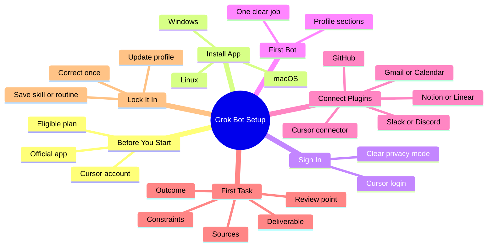

If you build software for a living, you already know the difference between a chatbot that talks and an agent that actually ships work. Grok Bot sits firmly in the second category. It is xAI's agent platform that gives every bot its own persistent cloud computer, browser sessions, terminal, and filesystem. You talk to it like a teammate, and it can open apps, run commands, draft PRs, triage inboxes, or chain specialists while you sleep.

If you are new to the whole category, our guide on [AI Coding Agents Explained](/p/ai-coding-agents-explained/) explains why agents behave differently from plain chatbots — and where they still need supervision.

<!--more-->

This guide walks through the full setup the way a working developer would do it: eligibility check, clean install, first focused bot, plugins in the right order, and the habits that keep agents useful instead of noisy. No fluff, just the steps that get you from zero to a reliable agent in under thirty minutes. If you prefer a terminal-based agent over a desktop platform, our [OpenCode TUI setup guide](/p/how-to-setup-opencode-tui/) covers that path too. And when your agents need clean, typed decisions instead of open-ended prose, our [TypeSafe AI Jev setup guide](/p/how-to-setup-typesafe-ai-jev/) shows how to wire a System One decision model into the same kind of workflow.

## Key Takeaways

- Grok Bot requires an eligible Cursor or SuperGrok plan. There is no free or standalone tier.
- Install the official desktop app from the [x.ai downloads page](https://x.ai/bot) for macOS, Windows, or Linux.
- Create one focused bot first. Broad "do everything" agents drift fast.
- Write a clear profile that covers job, tools, output format, and hard limits.
- Connect core plugins early (GitHub, Slack, Gmail, Notion, etc.) so every bot can use them.
- Start with small real tasks, correct once, then promote stable work into skills or routines.
- Take over the shared computer when auth walls appear. Sessions persist across bots.

## Grok Bot Setup at a Glance

Here is the whole workflow as one map, so you can see where each step fits before we go into detail:



For readers who prefer plain text, the same tree in list form:

```
Grok Bot Setup
  - Before You Start
    - Eligible plan
    - Official app
    - Cursor account
  - Install App
    - macOS
    - Windows
    - Linux
  - Sign In
    - Cursor login
    - Clear privacy mode
  - First Bot
    - One clear job
    - Profile sections
  - Connect Plugins
    - GitHub
    - Slack or Discord
    - Gmail or Calendar
    - Notion or Linear
    - Cursor connector
  - First Task
    - Outcome
    - Sources
    - Constraints
    - Deliverable
    - Review point
  - Lock It In
    - Correct once
    - Update profile
    - Save skill or routine
```

## What You Need Before You Start

Grok Bot is not a free public chatbot. Access is tied to specific paid plans:

| Plan Type              | Eligible Tiers                          | Notes                                      |
|------------------------|-----------------------------------------|--------------------------------------------|
| Cursor                 | Pro+, Ultra, Teams Standard, Teams Premium | Sign in with your Cursor account           |
| SuperGrok              | Plus, Heavy                             | Link through the supported flow            |
| Not supported          | SuperGrok Lite, free tiers, Legacy Privacy Mode | Must switch privacy settings if needed     |

You also need:

- The official desktop app (macOS, Windows, or Linux)
- A Cursor account (required even for SuperGrok users)
- At least one tool or website where the bot can do useful work on day one

Official docs live at the [Grok Bot getting-started guide](https://docs.x.ai/grok-bot/get-started). Always download from the [official x.ai downloads page](https://x.ai/bot) to avoid unofficial builds.

## Step 1: Install the Desktop App

Open the [official x.ai downloads page](https://x.ai/bot) and pick the build that matches your machine.

### macOS

1. Choose Apple silicon or Intel. Check Apple menu → About This Mac (Chip = Apple silicon, Processor = Intel).
2. Open the disk image.
3. Drag Grok Bot into Applications.
4. Launch it. Confirm if macOS asks.

### Windows

1. Choose x64 or Arm64. Check Settings → System → About → System type.
2. Run the installer.
3. Open Grok Bot from the Start menu.

### Linux

1. Grab the x64 or Arm64 package under More downloads (.deb, .rpm, or AppImage).
2. Install with your package manager or make the AppImage executable.
3. Launch from your application menu.
4. Confirm architecture with `uname -m` (x86_64 or aarch64).

The app updates automatically. You can also check for updates under Settings → Beta.

## Step 2: Sign In and Clear Privacy Mode

On first launch:

1. Choose Get started or Sign In with Cursor.
2. Complete any organization SSO flow if required.
3. If your Cursor account is still on Legacy Privacy Mode, switch it. Grok Bot needs cloud data storage. Open Cursor privacy settings and move to a supported option.

Once signed in you land on the main interface. The sidebar will list bots the same way a messaging app lists contacts.

## Step 3: Create Your First Bot the Right Way

Most people create a vague "assistant" and then complain the agent is unfocused. Do the opposite.

1. Click New (or Cmd/Ctrl+N).
2. Choose Create new agent.
3. Open Bot actions → Edit Profile.
4. Give it one clear job. Examples that work well for developers:
   - PR Reviewer
   - Bug Reproduction
   - Release Notes Writer
   - Dependency Watcher
   - CI Failure Triage

Write the profile with four sections:

```
Job: [one sentence, one job only]

Owns:
- [the recurring work this Bot is responsible for]

May use:
- [browser / files / terminal / specific connectors]

Output format:
- [exact shape: list, table, PR description, word count]

Always:
- [preferences that should stick]

Never without approval:
- [changes to production, customer contact, destructive commands]
```

Save the profile. Standing rules belong here, not only in chat. Chat instructions get lost between conversations. The official [create and manage bots](https://docs.x.ai/grok-bot/bots) reference is the source of truth for every field in this editor.

## Step 4: Connect Plugins in a Sensible Order

Plugins live under Settings → Plugins. Install once and every bot on the account can use them.

Recommended first wave for developers:

1. GitHub (PRs, issues, code search)
2. Slack or Discord (team context)
3. Gmail or calendar (if you do any product or support work)
4. Notion or Linear (project memory)
5. Cursor connector if you want the bot to spin up cloud agents

Authenticate each one in the browser. The shared computer keeps the sessions, so later bots inherit the logins when appropriate.

If you are weighing Cursor versus other agents before committing to the ecosystem, our [OpenCode vs Cursor vs Continue](/p/opencode-vs-cursor/) comparison lays out the trade-offs. And if you want to understand how tool connectors work under the hood, the [guide to adding MCP servers to OpenCode](/p/opencode-mcp-servers/) walks through the same kind of tool-integration pattern.

## Step 5: Give It a Real First Task

A strong first task has five parts:

1. Outcome – what finished work looks like
2. Sources – which files, repos, or sites matter
3. Constraints – what it must never do
4. Deliverable – exact format
5. Review point – when to stop and ask you

Example for a developer bot:

> Open the last three failed CI runs on the main branch. Summarize the root cause of each failure in three bullets, link the relevant logs, and draft a one-paragraph fix suggestion. Do not push any commits. Stop and ask if you need additional repo access.

When the bot hits a login wall:

1. Open Agent Computer from the conversation.
2. Take over control.
3. Enter the password, 2FA, or complete the CAPTCHA yourself.
4. Hand control back.

The browser session stays signed in on the shared cloud machine.

## Step 6: Correct Once, Then Lock It In

After the first result:

- Tell the bot exactly what was off and what the right shape looks like.
- Add that preference to the profile so it sticks.
- Once the process is stable, ask the bot to save it as a skill or create a routine.

Routines and triggers let a bot run on a schedule or react to events (new Slack thread, GitHub PR, etc.). Never schedule something you have not proven twice by hand. To see how another agent packages reusable work, read [How to Add New Skills to Your OpenCode](/p/opencode-skills-guide/).

## Practical Tips That Save Hours

- One job per bot. Broad agents guess and drift.
- Keep the roster small at first. Two or three focused bots beat ten vague ones.
- Use group chats when bots need to collaborate. Give one shared outcome, not separate tasks.
- Pin active bots. Hide the ones you are not using.
- Review [approvals, security, and privacy docs](https://docs.x.ai/grok-bot/approvals-security-and-privacy) before letting any bot make external changes.
- Treat the shared computer like a real remote desktop. Clean up files and sessions you no longer need.
- When something fails, check the [official community and troubleshooting guides](https://x.ai/bot/guides) for access errors, missing Linux builds, or over-eager routines.

## Common Setup Mistakes to Avoid

- Creating a catch-all assistant on day one
- Skipping plugin authentication and then wondering why the bot cannot act
- Leaving Legacy Privacy Mode enabled
- Writing task prompts that are pure questions instead of outcome + constraints + deliverable
- Enabling routines before the workflow has been proven twice
- Sharing a bot template that still contains secrets or internal URLs

## FAQ

### What plans include Grok Bot?

Eligible plans are SuperGrok Plus, SuperGrok Heavy, Cursor Pro+, Cursor Ultra, and Cursor Teams Standard or Premium. SuperGrok Lite and free tiers are not supported.

### Do I need a Cursor account even if I have SuperGrok?

Yes. Sign-in always goes through a Cursor account.

### Can I use Grok Bot on mobile?

Yes. There is a mobile path documented in the [official Grok Bot mobile guide](https://docs.x.ai/grok-bot/mobile). Desktop remains the primary setup surface.

### How do I make bots work together?

Put two to six bots in a group chat and give them one shared outcome. They can message each other and hand off work based on their profiles.

### What happens if the bot needs a password or 2FA?

It will ask you to take over the Agent Computer. Complete the auth yourself, then return control. The session persists.

### Is there an official Discord or Telegram bot?

Grok Bot itself is the desktop and mobile agent platform. Third-party Discord or Telegram bridges exist in the community, but they are not official xAI products. Build or install them only if you understand the security implications.

### Can I share a bot with someone else?

Yes. Copy the share link from the bot. The recipient can preview it and add it to their own Grok Bot account. Strip any secrets before sharing.

## Conclusion

Setup is only the first ten minutes. The real leverage comes from focused profiles, proven skills, and letting a small team of specialists handle the repetitive work while you stay on the hard problems. Start with one clean bot today, correct it once, and build from there.

Every article on Dev9b follows a [transparent editorial policy](/editorial-policy/), and if you have a Grok Bot workflow worth sharing, the [contributor guide](/contribute/) explains how to submit your own post.