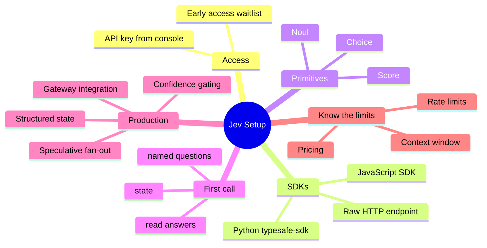

If you have ever tried to force a large language model into making a clean, reliable decision inside your code, you know the pain. You craft a careful prompt, demand JSON, then write a parser that still breaks when the model decides to add a polite sentence or change the key names. TypeSafe AI's Jev was built to end that cycle.

Jev is not another chat model. It is the first public System One model: a frontier-intelligence function that takes unstructured state and typed questions, then returns calibrated choices, scores, or yes/no probabilities your application can branch on directly. No text generation. No parsing. Response times land between 70 ms and 500 ms, and input tokens cost $0.042 per million with free output.

If you are newer to the agent category, our guide to [AI Coding Agents Explained](/p/ai-coding-agents-explained/) covers how such models differ from plain chatbots — and why a decision function like Jev fits inside a larger agent workflow rather than replacing it.

<!--more-->

This guide walks through everything a developer needs to get Jev running in an application: access, API keys, the official SDKs, raw HTTP, real code examples, and the practical patterns that keep decisions reliable in production.

## TypeSafe AI Jev at a Glance

Here is the whole setup as one map, so you can see where each step fits before we dig in:



For plain-text readers, the same tree in list form:

```
Jev Setup
  - Access
    - Early access waitlist
    - API key from console
  - SDKs
    - Python typesafe-sdk
    - JavaScript SDK
    - Raw HTTP endpoint
  - Primitives
    - Choice
    - Score
    - Noul
  - First call
    - state
    - named questions
    - read answers
  - Production
    - Confidence gating
    - Speculative fan-out
    - Structured state
    - Gateway integration
  - Know the limits
    - Pricing
    - Rate limits
    - Context window
```

## What Exactly Is Jev?

Jev belongs to a new class TypeSafe calls System One models. The name borrows from Kahneman's fast, automatic thinking. Where classic LLMs generate prose for humans, Jev evaluates a piece of state against questions you define and returns only structured, typed answers.

Three primitives cover almost every decision you need:

| Primitive | Question shape | What comes back |
|-----------|----------------|-----------------|
| Choice    | Pick one option from a fixed list (up to 255) | Selected option, full probability distribution, confidence |
| Score     | Rate against ordered levels you describe (2–10) | Numeric score (can fall between levels), probabilities, confidence |
| Noul      | Yes/no statement | Probability the answer is yes (0–1) |

You can mix any number of these questions in a single request. Every question is evaluated in parallel against the same state, so adding more questions barely increases latency or cost.

Jev cannot hallucinate outside the options you supply. That constraint is the entire point. Your code never has to recover a value from free-form text.

## Prerequisites

Before you write any integration code:

- A TypeSafe AI account (early access via waitlist at typesafe.ai or through supported gateways such as Vercel AI Gateway, Netlify AI Gateway, LiteLLM, or Cloudflare)
- An API key from the TypeSafe console
- Python 3.10+ or Node.js 20+ if you plan to use the official SDKs
- Basic familiarity with environment variables and HTTP clients

## Step 1: Get Access and Create an API Key

1. Visit the [TypeSafe AI home page](https://typesafe.ai/) and join the early-access waitlist, or use an existing gateway that already supports Jev.
2. Once approved, open the TypeSafe console and navigate to Settings → API Keys (or console.typesafe.ai/keys).
3. Create a new key and store it securely.

Set the environment variable:

```bash
export TYPESAFE_API_KEY="sk-your-key-here"
```

Never hard-code the key in source. Use your platform's secret manager or a .env file that stays out of version control.

## Step 2: Choose Your Integration Path

You have three practical options.

### Option A: Official Python SDK

```bash
pip install typesafe-sdk
# or
uv add typesafe-sdk
```

### Option B: Official JavaScript / TypeScript SDK

```bash
npm install @typesafe-ai/sdk
```

### Option C: Raw HTTP

Any language that can POST JSON works. The single endpoint is:

```
POST https://api.typesafe.ai/v1/systemone
```

Headers required:

- `Authorization: Bearer $TYPESAFE_API_KEY`
- `Content-Type: application/json`

## Step 3: Your First Working Call

### Python Example

```python
from typesafe_sdk import Choice, Noul, Score, TypeSafeClient

client = TypeSafeClient()

ticket = (
    "Hi, I've been trying to connect my Stripe account for 3 days "
    "and the integration keeps failing. I'm losing sales. Please help ASAP."
)

response = client.system_one(
    state=ticket,
    questions={
        "department": Choice(
            instructions="Which team should handle this",
            criteria={
                "billing": "Payment or subscription issues",
                "technical": "Bugs or integration problems",
                "sales": "Pricing or account questions",
            },
        ),
        "frustration": Score(
            instructions="How frustrated the customer appears",
            criteria=[
                "Calm, just stating facts",
                "Frustrated but civil",
                "Very angry, strong language",
            ],
        ),
        "is_urgent": Noul(
            instructions="The message conveys urgency or time-sensitivity",
        ),
    },
)

print(response.answers["department"].choice)      # e.g. "technical"
print(response.answers["frustration"].score)      # e.g. 1.0
print(response.answers["is_urgent"].noul)         # e.g. 1.0
print(response.answers["department"].confidence)  # e.g. 0.78
```

### JavaScript / TypeScript Example

```typescript
import { choice, noul, score, TypeSafeClient } from "@typesafe-ai/sdk";

const client = new TypeSafeClient();

const response = await client.systemOne({
  state: "Hi, I've been trying to connect my Stripe account for 3 days and the integration keeps failing. I'm losing sales. Please help ASAP.",
  questions: {
    department: choice("Which team should handle this", {
      billing: "Payment or subscription issues",
      technical: "Bugs or integration problems",
      sales: "Pricing or account questions",
    }),
    frustration: score("How frustrated the customer appears", [
      "Calm, just stating facts",
      "Frustrated but civil",
      "Very angry, strong language",
    ]),
    is_urgent: noul("The message conveys urgency or time-sensitivity"),
  },
});

console.log(response.answers.department.choice);
console.log(response.answers.frustration.score);
console.log(response.answers.is_urgent.noul);
```

### Raw cURL Example

```bash
curl -X POST https://api.typesafe.ai/v1/systemone \
  -H "Authorization: Bearer $TYPESAFE_API_KEY" \
  -H "Content-Type: application/json" \
  -d '{
    "model": "jev-latest",
    "state": "Hi, I've been trying to connect my Stripe account for 3 days and the integration keeps failing. I'm losing sales. Please help ASAP.",
    "questions": {
      "department": {
        "type": "choice",
        "instructions": "Which team should handle this",
        "criteria": {
          "billing": "Payment or subscription issues",
          "technical": "Bugs or integration problems",
          "sales": "Pricing or account questions"
        }
      },
      "is_urgent": {
        "type": "noul",
        "instructions": "The message conveys urgency or time-sensitivity"
      }
    }
  }'
```

The model field defaults to `jev-latest` (currently `jev-1.13.0`). You can pin a specific version if you need deterministic behavior across deploys.

## Understanding State and Questions

**State** is whatever context the model should judge. It can be a plain string, a JSON object, or an array of text. When the state is structured, reference specific fields in your instructions with backtick paths such as `` `ticket.messages[0].text` ``.

**Questions** are named. The name becomes the key under which you read the answer. Write the full question in the `instructions` field even if the name seems obvious. Keep each question atomic: one focused judgment a knowledgeable person could make in a couple of seconds.

Good practice:

- Prefer many small questions over one complex multi-factor prompt.
- Compose the answers in your own code with thresholds, weights, and business logic.
- Ask speculative questions (ones you might not need) in the same request. The extra tokens are cheap and the latency cost is near zero.

## Production Patterns That Work

### Confidence Gating

Choice and Score answers include a confidence value derived from the probability distribution. Use it:

```python
if response.answers["department"].confidence > 0.85:
    route_to(response.answers["department"].choice)
else:
    escalate_to_human()
```

In the F9XR Team's own docs workflow, the first rule we apply to any decision model is the same: gate it behind a labeled test set before it touches live traffic. When a confidence value sits near a threshold, default to routing the work to a person rather than trusting the model.

### Speculative Fan-Out

Send every question your downstream logic might need in one call. Ignore the answers that turn out irrelevant. This pattern is both faster and cheaper than sequential calls.

### Structured State for Complex Domains

```python
state = {
    "ticket": {
        "subject": "Duplicate charge",
        "messages": [
            {"from": "customer", "text": "I was charged twice for order A-104. Please refund the duplicate."}
        ]
    },
    "order": {"id": "A-104", "charges": [{"amount_usd": 49, "status": "captured"}] * 2},
    "refund_policy": "Duplicate charges are eligible for a refund."
}

questions = {
    "refund_requested": Noul(
        instructions="Does `ticket.messages[0].text` request a refund?"
    ),
    "policy_supports": Noul(
        instructions="Does `refund_policy` support the refund requested in `ticket.messages[0].text`, given `order.charges`?"
    ),
}
```

### Integration via Gateways

If you already use LiteLLM, Vercel AI Gateway, Netlify AI Gateway, or Cloudflare Workers AI, Jev is available under names such as `typesafe/jev` or `typesafe-ai/jev`. Authentication and billing are handled by the gateway in most cases, which can simplify secrets management.

Pairing Jev with a terminal-based agent is a natural fit too: our [OpenCode TUI setup guide](/p/how-to-setup-opencode-tui/) shows how decision calls slot into an agent loop, while the [guide to adding new OpenCode skills](/p/opencode-skills-guide/) explains how TypeSafe's Jev agent skill packages the SDK so agents write the integration correctly the first time.

## Rate Limits, Pricing, and Limits to Know

- Pricing: $0.042 per million input tokens. Output tokens are free.
- Context: roughly 64k tokens total per request; 32k for state plus the longest question.
- Rate limits: 250,000 tokens per second and 1,200 requests per minute (subject to account tier).
- Input is text only. No images, audio, or video yet.
- The model is not fine-tuned on customer data. You shape behavior through state and carefully written instructions and criteria.

Always test on your own labeled data before letting Jev drive irreversible actions. Calibration is strong on average, but individual answers still carry uncertainty. If you want another angle on the discipline this requires, the [vibe coder vs vibe engineer](/p/vibe-coder-vs-vibe-engineer/) breakdown covers how we separate measured integrations from blind automation.

## FAQ

### What is TypeSafe AI's Jev?

Jev is TypeSafe AI's first public System One model. It takes a state and typed questions and returns structured answers (choice, score, or noul probability) that software can use directly, without any text parsing.

### How do I get a TypeSafe AI API key?

Sign up or join the waitlist at typesafe.ai, then create a key in the TypeSafe console under Settings → API Keys. Store it as the environment variable `TYPESAFE_API_KEY`.

### Can I use Jev without the official SDK?

Yes. Send a POST request to `https://api.typesafe.ai/v1/systemone` with a Bearer token and a JSON body containing `state`, optional `model`, and a `questions` object.

### What languages are officially supported?

TypeSafe provides first-party SDKs for Python (typesafe-sdk) and JavaScript/TypeScript (@typesafe-ai/sdk). Any language that can make HTTP requests can call the same endpoint.

### How is Jev different from JSON mode or structured outputs on LLMs?

JSON mode still generates text that must be parsed and can contain invalid or out-of-schema values. Jev never generates free text; its answers are constrained to the exact options or levels you declare and include calibrated probabilities. The [official TypeSafe SDK reference](https://docs.typesafe.ai/sdk) and [System One concepts doc](https://docs.typesafe.ai/concepts/system-one) cover the details.

### How fast and cheap is Jev in practice?

End-to-end latency is typically 70–500 ms. Input pricing is $0.042 per million tokens with free output, which is substantially lower than frontier LLMs for the same class of decision tasks. The full details are in the [TypeSafe AI quickstart](https://docs.typesafe.ai/introduction/quickstart).

## Key Takeaways

- Jev is a System One model built for typed decisions, not text generation.
- Install the Python or JavaScript SDK, set `TYPESAFE_API_KEY`, and call `system_one` / `systemOne` with a state and named questions.
- Use Choice for routing and classification, Score for ordered ratings, and Noul for yes/no probabilities.
- Batch multiple questions in one request; they run in parallel and stay independent.
- Gate actions on the confidence value and keep business logic in your own code.

## Conclusion

Jev collapses the messy middle of LLM decision-making: no prose, no parsing, just typed answers your code can branch on. For teams like F9XR, patterns such as confidence gating and speculative fan-out make it a dependable building block inside larger agent workflows — the same way a quality gate keeps a blog's publishing pipeline honest.

Every article on Dev9b follows a [transparent editorial policy](/editorial-policy/), and if you have a Jev integration pattern worth sharing, the [contributor guide](/contribute/) explains how to submit your own post. You can also read the [System One announcement](https://typesafe.ai/blog/introducing-system-one-models-and-jev) for the full background on the model.