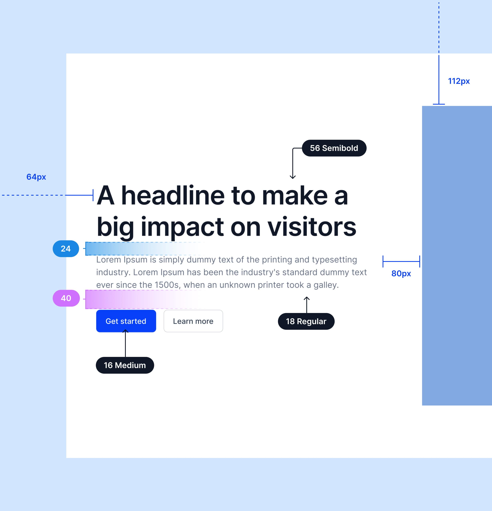
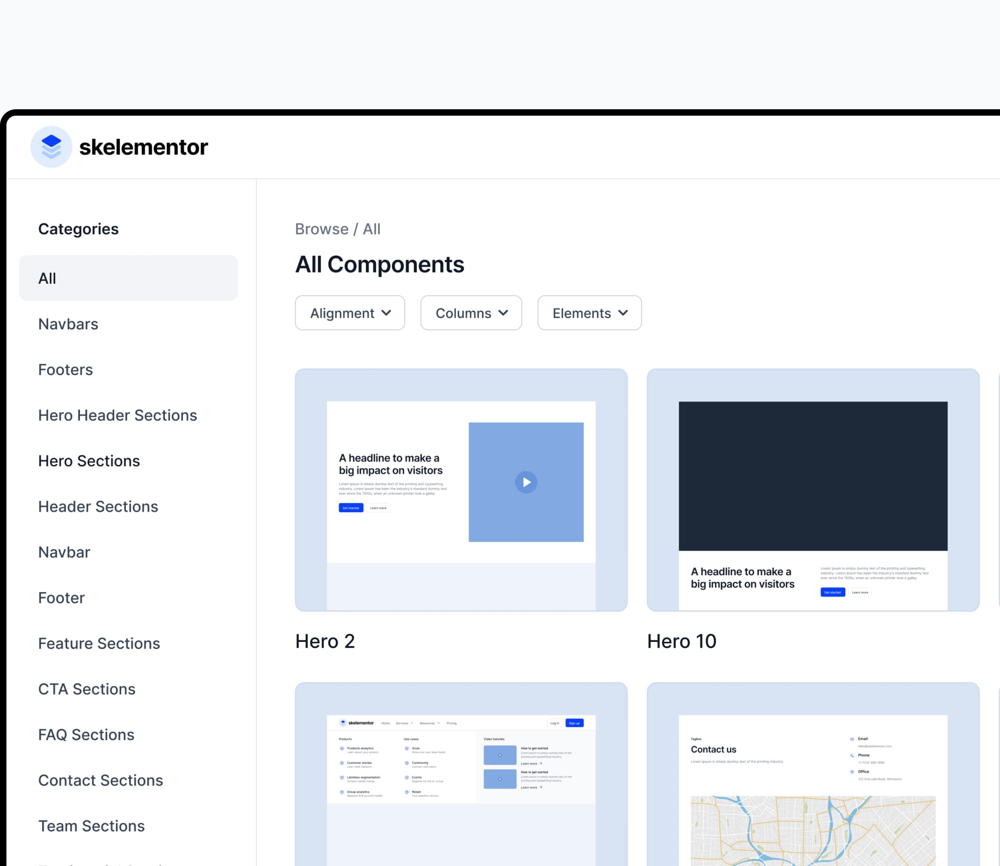
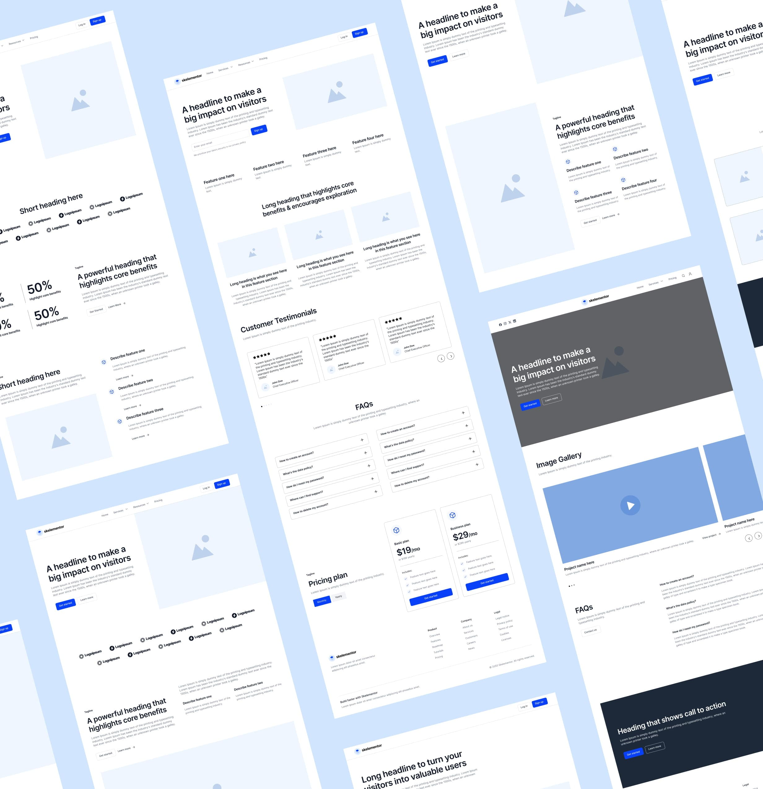
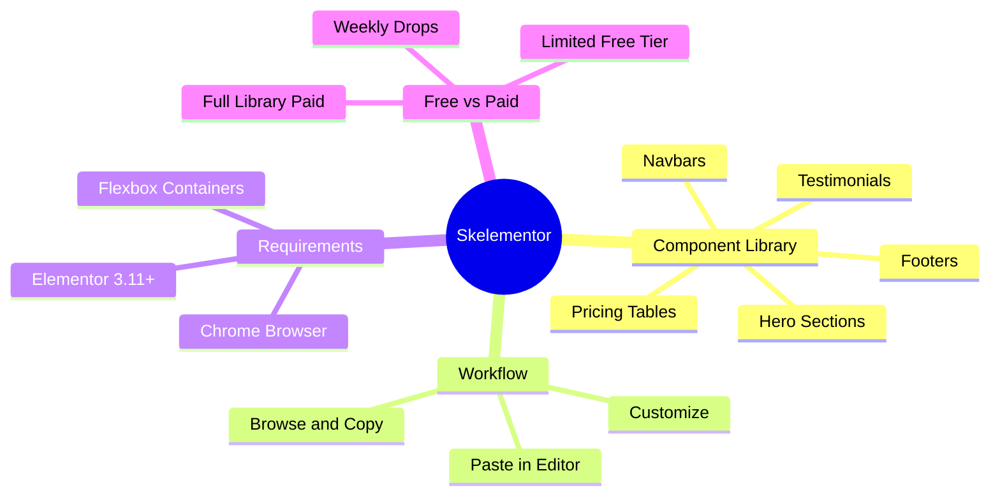
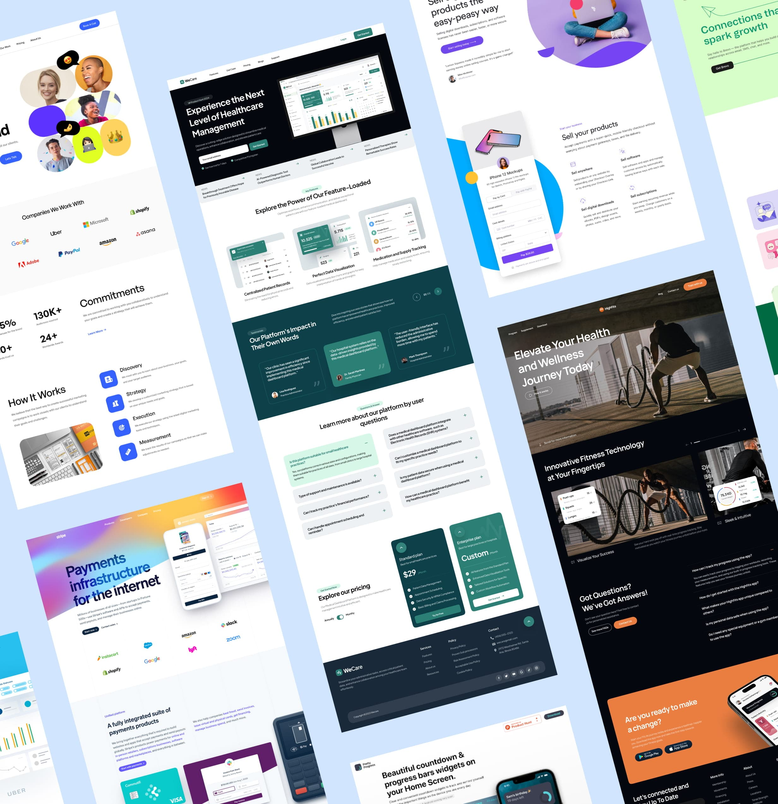

Every Elementor developer has been there: staring at a blank canvas, rebuilding the same hero section, footer, or pricing table you've built a dozen times before. It's not hard work, it's just repetitive work, and repetitive work is exactly what eats into billable hours. [Skelementor](https://skelementor.com/?via=f9xr) exists to close that gap. It's a growing library of pre-built, ready-to-use Elementor components you can drop straight into a page instead of designing every section from scratch.

This guide covers what Skelementor actually is, how the copy-paste workflow works inside the Elementor editor, what to expect from the free versus paid tiers, and the practical habits that'll get you the most out of it as a working developer or designer. If you build websites on WordPress with Elementor, this is the kind of tool that quietly saves you hours every single week.

> **Disclosure:** Some links in this guide are affiliate links. If you buy through them, F9XR may earn a commission at no extra cost to you. We only recommend tools we actually use and test.

<!--more-->

## What Is Skelementor?

[Skelementor](https://skelementor.com/?via=f9xr) is a component library built specifically for [Elementor](https://elementor.com/?via=f9xr) and Elementor Pro. Instead of a full theme or page builder plugin, it's a browsable collection of individual sections and blocks, things like navbars, hero sections, pricing tables, testimonials, FAQ blocks, and footers, organized by category so you can find what you need quickly and drop it directly into your layout.

The library covers a wide range of categories including:

* Navbars and header sections
* Hero sections and CTA blocks
* Feature and stats sections
* Pricing and testimonial sections
* Team, portfolio, and gallery sections
* Blog archives and single blog layouts
* Contact, login, and signup sections

New components are added on a regular cadence, so the library keeps growing rather than sitting static after you sign up.

### Who Skelementor Is Built For

Skelementor targets a fairly broad slice of the WordPress ecosystem:

| User type | Main benefit |
|---|---|
| Freelance developers | Faster turnaround per client project |
| Agencies | Standardized components across a team |
| Designers | Skip the groundwork, focus on customization |
| Beginners | A structured starting point without design experience |
| Marketers | Quick, on-brand landing pages for campaigns |

If your job involves building Elementor pages repeatedly, whether for clients or your own projects, there's a good chance a chunk of your workflow can be shortened here.

## How Skelementor Works: The Copy-Paste Workflow

Skelementor doesn't install as a traditional WordPress plugin. Instead, it uses Elementor's built-in cross-site copy and paste feature, the same mechanism that lets you move Elementor content between two different WordPress installs. Here's the general flow.

### Step 1: Create an Account and Browse Components

Sign up for a [free account on the Skelementor site](https://skelementor.com/free-components?via=f9xr), then browse the component library by category. Each component has a live preview so you can see exactly how it'll look and behave at desktop, tablet, and mobile widths before you commit to using it.

### Step 2: Copy the Component

Click the copy button on the component you want. This copies the section's Elementor data to your clipboard, the same way copying a section directly inside the Elementor editor would. Wait for the confirmation message before switching tabs, since jumping away too early can result in an incomplete copy.

### Step 3: Paste It Into Your Elementor Editor

Open the page you're working on in the Elementor editor, right-click where you want the new section to go, and choose **Paste from other site**. While that dialog is open, press Ctrl+V (or Cmd+V on Mac) to complete the paste. Closing the dialog before pasting is the most common reason this step fails, so keep it open until the paste actually registers.

### Step 4: Customize to Match Your Brand

Once pasted, the component behaves like any other Elementor section: fully editable text, images, colors, spacing, and responsive settings. Swap in your own copy and imagery, adjust the color scheme to match your brand, and tweak spacing if needed. The structural and layout work is already done; you're just skinning it.

### Quick Reference Table

| Action | Where it happens |
|---|---|
| Browse and copy components | [Skelementor library](https://skelementor.com/?via=f9xr) |
| Paste into a page | Elementor editor, "Paste from other site" |
| Confirm the paste | Ctrl+V / Cmd+V while the paste dialog is open |
| Customize content | Standard Elementor editing panel |

## Requirements and Compatibility Notes

Before you rely on Skelementor for a live project, a few compatibility points are worth checking ahead of time:

* **Elementor version.** Cross-site paste generally requires a reasonably current version of Elementor (3.11 or later is the commonly cited baseline for this feature across similar component libraries). Keep Elementor updated to avoid paste failures.
* **Flexbox containers.** If a component uses Elementor's container-based layout system, make sure Flexbox containers are enabled in Elementor's feature settings on the destination site.
* **Browser choice.** Cross-domain clipboard copying is most reliable in Chrome. Safari in particular has known issues with this kind of cross-site paste, so switch browsers if you hit a wall.
* **Elementor Pro.** Some component categories and interactions (dynamic content, certain widgets) may depend on Elementor Pro rather than the free version, so double-check a component's requirements if you're running a free Elementor install.

## Free vs Paid: What to Expect

Skelementor runs on a freemium model. There's a [dedicated free components section](https://skelementor.com/free-components?via=f9xr) you can use without paying anything, which is enough to get a feel for the workflow and cover basic sections like simple heroes or footers. The paid tiers unlock the full library, including the higher-volume categories like feature sections and blog layouts, plus the weekly component drops.

Pricing structures for tools like this tend to change over time, so rather than quoting figures that may be outdated by the time you read this, check the [current pricing page directly](https://skelementor.com/?via=f9xr) before committing. The same goes for refund policy specifics, license terms for agency use, and whether a plan is a one-time purchase or a recurring subscription.

## Practical Tips for Getting the Most Out of Skelementor

* **Standardize a component "kit" per project type.** If you regularly build the same kind of site (SaaS landing pages, local service sites, portfolios), save a shortlist of go-to components for that category so you're not rebrowsing the whole library every time.
* **Always wait for the copy confirmation.** Pasting too early is the number one cause of "it didn't work" reports with this kind of copy-paste workflow, not a bug in the component itself.
* **Check Flexbox container settings first if a paste fails.** This single setting causes more paste errors than almost anything else when moving container-based Elementor content between sites.
* **Customize typography and spacing immediately after pasting.** Components are built with balanced defaults, but they're designed to be a foundation, not a finished product. Matching them to your site's type scale early avoids inconsistent-looking pages later.
* **Keep an eye on weekly drops if you're on a paid plan.** New components get added regularly, and building a habit of browsing what's new can save you from building something from scratch that already exists in the library.
* **Test responsiveness after pasting, not just visually in the library preview.** Live editing in your actual theme can behave slightly differently than the library's preview environment, especially if your site has custom CSS.

## Common Issues and How to Fix Them

**Paste does nothing or throws an error.** Confirm you're using Chrome, confirm Elementor is updated, and confirm Flexbox containers are enabled if the component uses them. Try the copy step again and wait for the full confirmation before switching tabs.

**Component looks broken after pasting.** This is almost always a mismatched feature setting between the source component and your Elementor install, most commonly around container versus legacy section layouts. Check Elementor's Settings > Features panel.

**Styles look off-brand after pasting.** Expected behavior. Components come with neutral, balanced default styling on purpose so they don't fight with whatever theme you're building on top of. Budget a few minutes per component for typography and color adjustments.

**Can't find a specific type of section.** The library is organized by category, but it's not infinite. If something isn't there yet, it may show up in a future weekly drop, or you may need to lightly adapt the closest matching component instead of waiting.

## Key Takeaways

* Skelementor is a component library for Elementor, not a full plugin or theme, and it works through Elementor's native cross-site copy-paste feature.
* The core workflow is copy a component from the library, paste it with "Paste from other site" inside the Elementor editor, then customize.
* Chrome is the most reliable browser for this workflow; Safari has known cross-site paste limitations.
* Flexbox containers need to be enabled in Elementor for container-based components to paste correctly.
* A free components tier exists for testing the workflow, with paid tiers unlocking the full, regularly-updated library.
* Components ship with neutral default styling on purpose, so budget time to match typography, color, and spacing to your brand after pasting.

## Frequently Asked Questions

### What is Skelementor?

[Skelementor](https://skelementor.com/?via=f9xr) is a component library for Elementor, offering hundreds of pre-built, ready-to-use sections like navbars, hero sections, pricing tables, and footers that you can copy directly into your Elementor pages.

### How do I use Skelementor with Elementor?

Copy a component from the [Skelementor library](https://skelementor.com/?via=f9xr), then in your Elementor editor right-click where you want it placed and choose "Paste from other site." Press Ctrl+V or Cmd+V while that dialog is open to complete the paste, then customize the content, colors, and spacing to match your site.

### Is Skelementor free to use?

Skelementor offers a free tier with a limited selection of components you can use at no cost, along with paid plans that unlock the full library and regular weekly component drops. Check the [current pricing page](https://skelementor.com/?via=f9xr) for exact plan details.

### Do I need Elementor Pro to use Skelementor components?

Basic sections generally work with the free version of Elementor, but some components rely on features or widgets that require Elementor Pro. Check each component's requirements before relying on it for a client project.

### Why does pasting a Skelementor component fail or show an error?

The most common causes are using a browser other than Chrome, an outdated version of Elementor, or Flexbox containers not being enabled on the destination site. Confirm all three before assuming the component itself is broken.

### Can I use Skelementor components for client projects and agency work?

Yes, this is a common use case for the tool, but license terms can vary by plan. Review [Skelementor's license page](https://skelementor.com/?via=f9xr) for specifics on commercial and agency use before deploying components across multiple client sites.

---

Looking for a faster way to ship content sites, too? See how we deploy this blog automatically with [Hugo on GitHub Pages](/p/hugo-github-pages-setup/) and how we keep it [Google-friendly](/p/hugo-seo-guide/) with a verified checklist.

*This guide was researched and drafted with the assistance of an AI coding assistant, then reviewed by the F9XR Review Board before publishing. Have feedback or want to contribute your own article? See our [Contributor Guide](/contribute/) and [Editorial Policy](/editorial-policy/).*
