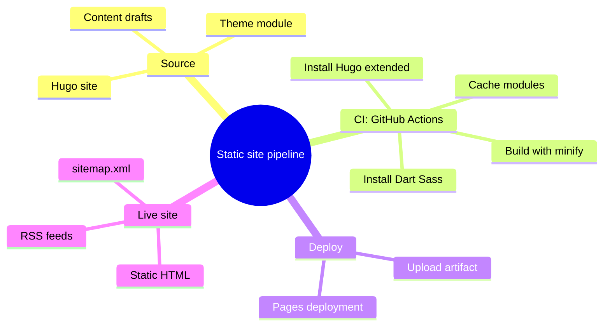

Running your own static site without paying for hosting or keeping a server online is still one of the most underrated setups in web development. Hugo plus GitHub Pages gives you exactly that: a site that builds in under two seconds, deploys automatically on every commit, and costs nothing to host.

This guide walks through the same setup that runs this site. You will leave with a working Hugo blog on GitHub Pages, an automated deploy pipeline, and a clear picture of how the pieces fit together.

<!--more-->

## How Hugo and GitHub Pages Fit Together

Hugo is a static site generator. It turns Markdown and templates into plain HTML files. GitHub Pages is a static host with a build-and-deploy pipeline built in. The two mix well because there is no server to bolt together — Hugo produces files, Pages serves them.

GitHub Actions is the glue. A workflow runs on every push, installs the exact Hugo version that built the site locally, generates the HTML, and hands it to Pages.

## Prerequisites

- A GitHub account
- Git installed on your machine
- Hugo extended edition installed locally (`hugo version` should show `extended`)
- A text editor

## Step 1: Create the Hugo Site

```bash
hugo new site my-site
cd my-site
```

Add a theme. This site uses the Hugo Theme Stack v4 module, but any theme works. To add a theme as a Hugo module:

```bash
hugo mod init github.com/yourname/my-site
printf '[[module.imports]]\n\tpath = "github.com/CaiJimmy/hugo-theme-stack/v4"\n' >> hugo.toml
```

Then create a first post and test locally:

```bash
hugo new content/post/hello/index.md
hugo server
```

## Step 2: Push to GitHub

Create a repository on GitHub, then:

```bash
git init
git add .
git commit -m "Initial Hugo site"
git remote add origin https://github.com/yourname/my-site.git
git push -u origin main
```

## Step 3: The Deploy Workflow

GitHub Pages has two deployment paths. The modern one uses the `actions/deploy-pages` action, which uploads a built artifact that Pages serves directly. Create `.github/workflows/deploy.yml`:

```yaml
name: Build and deploy
on:
  push:
    branches:
      - main
permissions:
  contents: read
  pages: write
  id-token: write
concurrency:
  group: pages
  cancel-in-progress: false
jobs:
  build:
    runs-on: ubuntu-latest
    env:
      HUGO_VERSION: 0.154.2
    steps:
      - name: Checkout
        uses: actions/checkout@v6
        with:
          submodules: recursive
          fetch-depth: 0
      - name: Setup Pages
        id: pages
        uses: actions/configure-pages@v6
      - name: Setup Hugo
        uses: peaceiris/actions-hugo@v3
        with:
          hugo-version: '${{ env.HUGO_VERSION }}'
          extended: true
      - name: Build
        run: |
          hugo --gc --minify --cleanDestinationDir \
            --baseURL "${{ steps.pages.outputs.base_url }}/"
      - name: Upload artifact
        uses: actions/upload-pages-artifact@v5
        with:
          path: ./public
  deploy:
    needs: build
    runs-on: ubuntu-latest
    environment:
      name: github-pages
      url: ${{ steps.deployment.outputs.page_url }}
    steps:
      - name: Deploy to GitHub Pages
        id: deployment
        uses: actions/deploy-pages@v5
```

Then in the repository settings, set Pages to "GitHub Actions" as the source. On the next push, Actions builds the site and Pages publishes it.

## Step 4: Serving From a Project Subpath

If your site lives at `https://yourname.github.io/site-name/` — not the account root — set the baseURL in your Hugo config to the full URL. Hugo then prefixes all internal links with that path. This is the part people forget, and it produces broken assets, misdirected canonicals, and feeds that point to nothing.

```toml
baseURL = "https://yourname.github.io/site-name/"
```

## The Full Pipeline at a Glance



Prefer pure Markdown? The same map as a tree:

```
Static site pipeline
  - Source
    - Hugo site
    - Theme module
    - Content drafts
  - CI: GitHub Actions
    - Install Hugo extended
    - Install Dart Sass
    - Build with minify
    - Cache modules
  - Deploy
    - Upload artifact
    - Pages deployment
  - Live site
    - Static HTML
    - sitemap.xml
    - RSS feeds
```

## Speeding Up Builds With Caching

Two things slow fresh Hugo builds down: downloading theme modules and compiling Dart Sass. Cache both in CI and deploys drop from minutes to seconds.

```yaml
- name: Cache restore
  id: cache-restore
  uses: actions/cache/restore@v5
  with:
    path: ${{ runner.temp }}/hugo_cache
    key: hugo-${{ github.run_id }}
    restore-keys:
      hugo-
- name: Build
  run: |
    hugo --cacheDir "${{ runner.temp }}/hugo_cache"
```

Point Hugo at a `--cacheDir` inside the cached folder and restore it before every build.

## Debugging a Broken Deploy

Most "deploy failed" reports on this stack share four causes:

- **Source not set to GitHub Actions.** The workflow runs and publishes nothing until Settings → Pages → Source is set to "GitHub Actions".
- **Wrong baseURL.** On a subpath site, a missing trailing slash or a root `baseURL` produces a page full of broken links. Check the rendered HTML's first `<link>` and the canonical.
- **Empty artifact.** If `upload-pages-artifact` points at a missing folder, the deploy shows a blank site. Confirm the build actually emitted files into `public/`.
- **Module or theme errors.** A typo in `hugo.toml` module imports fails the build with a clear error — but only if you read the full log, not the last line.

When in doubt, reproduce the CI steps locally:

```bash
rm -rf public
hugo --gc --minify --cleanDestinationDir --baseURL "https://yourname.github.io/site-name/"
```

Then open `public/index.html` in a browser. If it renders and the links resolve, Pages will serve the same thing.

## Adding a Custom Domain

A plain Pages URL is fine for side projects, but production sites usually want their own domain. The complete walkthrough — A records, CNAME flattening, SSL settings, and the redirect loop fix — is in our [Cloudflare domain guide](/p/github-pages-custom-domain-cloudflare/).

The short version: add a `CNAME` file to your static output (or set it under Pages settings), point DNS at GitHub's Pages addresses, and switch your provider's SSL/TLS mode to Full (strict). Keep the `baseURL` in Hugo pointing at the custom domain this time, or the canonical tags will still claim the `.github.io` URL.

## Keeping the Deploy Healthy

The workflow is the contract between your content and the live site. A few habits keep it green:

- **Pin versions you can reproduce.** Set `HUGO_VERSION` explicitly in the environment block instead of tracking "latest". A Hugo minor bump has quietly changed rendered output on this very site — pinning means your deploys only change when you change them, never because upstream did.
- **Lint the built site, not just the source.** Run `hugo --gc --minify --cleanDestinationDir` locally and check the `public/` output before pushing: no leaked drafts, no dead internal links, no missing images. Our [SEO checklist](/p/hugo-seo-guide/) turns that pass into a proper crawl of the published folder.
- **Treat the workflow file as code.** Every edit to `deploy.yml` gets the same review as a content change. A broken environment override won't error loudly — it deploys a stale or wrong site and calls it success.
- **Watch the "Pages build and deployment" run after each push.** It is ground truth. A green Actions run is only half the story; the Pages run carries the actual publish.

Rolling back is a redeploy away: check out the last known-good commit, push, and GitHub Pages rewrites the live site on the next successful run. A bad deploy on this setup is never more than minutes old. Content publishing on this pipeline follows the same review standards we apply across the site via the [editorial policy](/editorial-policy/).

## Key Takeaways

- Hugo and GitHub Pages combine into a free, fully automated static site setup.
- The `actions/deploy-pages` path is the modern way to publish Pages sites from CI.
- With a subpath site, `baseURL` must match the full Pages URL or links break.
- Caching Hugo modules and Dart Sass keeps deploy times in the single digits.
- When a deploy "fails", check the Pages source, baseURL, artifact, and full build log first.

## Conclusion

A static site that deploys itself frees you to write. This very site runs the pipeline above — the workflow file in this article is a trimmed copy of ours. When you are ready to move past Hugo for this site, check the [contributor guide](/contribute/) or see how we turn the whole process into a [Google-friendly checklist](/p/hugo-seo-guide/). Every change we publish is reviewed against the standards in our [editorial policy](/editorial-policy/).