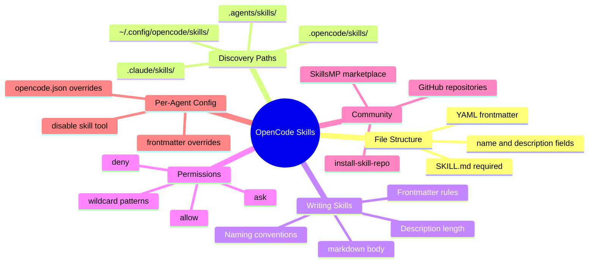

OpenCode skills are reusable instruction files that teach your AI agent how to handle specific tasks — from generating git releases to running TDD workflows. They sit in your repo or home directory as plain `SKILL.md` files and load on-demand when the agent needs them.

If you have ever wished your coding agent knew your team's conventions, deployment process, or documentation style, skills are how you encode that knowledge. In this guide, we will cover exactly how to create, install, and manage them.

<!--more-->

## What Are OpenCode Skills

Skills are markdown files with YAML frontmatter that define reusable behavior for OpenCode agents. When a user asks the agent to do something that matches a skill's description, the agent loads the full content and follows the instructions.

Think of them as prompt templates that persist across sessions. Instead of re-explaining your workflow every time, you write it once as a skill and the agent discovers it automatically.

## How Skills Are Discovered

OpenCode searches multiple locations for `SKILL.md` files. It checks both project-local and global paths:

**Project-local paths** (walk up from your working directory to the git root):

- `.opencode/skills/<name>/SKILL.md`
- `.claude/skills/<name>/SKILL.md`
- `.agents/skills/<name>/SKILL.md`

**Global paths** (available in all projects):

- `~/.config/opencode/skills/<name>/SKILL.md`
- `~/.claude/skills/<name>/SKILL.md`
- `~/.agents/skills/<name>/SKILL.md`

The agent sees all discovered skills listed in its `skill` tool description. It loads a skill on-demand by calling `skill({ name: "skill-name" })`.

## Creating Your First Skill

### Step 1: Choose a Location

For project-specific skills, create a directory under `.opencode/skills/`:

```bash
mkdir -p .opencode/skills/my-skill
```

For global skills available everywhere:

```bash
mkdir -p ~/.config/opencode/skills/my-skill
```

### Step 2: Write the SKILL.md File

Every skill needs a `SKILL.md` file with YAML frontmatter. Here is the minimum required structure:

```markdown
---
name: my-skill
description: Short description of what this skill does
---

## What I do

- Step-by-step instructions for the agent
- Use markdown headers, lists, and code blocks
- Be specific about tools, commands, and expected outputs

## When to use me

Describe the triggers that should activate this skill.
Include example phrases the user might say.
```

### Step 3: Follow the Naming Rules

The `name` field has strict requirements:

- 1 to 64 characters
- Lowercase alphanumeric with single hyphen separators
- Cannot start or end with `-`
- No consecutive `--`
- Must match the directory name containing `SKILL.md`

Valid examples: `git-release`, `tdd`, `code-review`, `api-docs`

Invalid examples: `Git-Release`, `my--skill`, `-invalid`, `invalid-`

The `description` field must be 1 to 1024 characters. Write it clearly enough that the agent can decide when to load the skill.

## A Real-World Example

Here is a practical skill for automating git releases:

```markdown
---
name: git-release
description: Create consistent releases and changelogs from merged PRs
license: MIT
compatibility: opencode
metadata:
  audience: maintainers
  workflow: github
---

## What I do

- Draft release notes from merged PRs since the last tag
- Propose a version bump following semantic versioning
- Provide a copy-pasteable `gh release create` command

## When to use me

Use this when you are preparing a tagged release.
Ask clarifying questions if the target versioning scheme is unclear.

## Process

1. Run `git describe --tags --abbrev=0` to find the last tag
2. List commits since that tag with `git log --oneline`
3. Group changes by type: features, fixes, breaking changes
4. Suggest the next version number
5. Generate the release notes in markdown
```

Place this at `.opencode/skills/git-release/SKILL.md` and the agent will discover it in your project.

## Installing Skills from Repositories

The community maintains skill collections on GitHub. You can install them directly.

### Manual Install

Clone or copy a skill directory into one of the search paths:

```bash
# Example: install a skill from a community repo
git clone https://github.com/user/opencode-skills.git /tmp/skills
cp -r /tmp/skills/skills/tdd .opencode/skills/tdd
```

### Using the install-skill-repo Skill

Some skill repos include an `install-skill-repo` skill that automates the process. Once loaded, it handles downloading and placing files in the correct location.

### From SkillsMP

The [SkillsMP marketplace](https://skillsmp.com) catalogs community skills. Browse by category — software development, writing, project management — and copy the `SKILL.md` content into your own skill directory.

## Configuring Permissions

Control which skills agents can access through `opencode.json`:

```json
{
  "permission": {
    "skill": {
      "*": "allow",
      "pr-review": "allow",
      "internal-*": "deny",
      "experimental-*": "ask"
    }
  }
}
```

| Permission | Behavior |
|------------|----------|
| `allow` | Skill loads immediately without prompting |
| `deny` | Skill is hidden from the agent entirely |
| `ask` | User is prompted for approval before loading |

Wildcard patterns work: `internal-*` matches `internal-docs`, `internal-tools`, and so on.

### Per-Agent Overrides

Give specific agents different permissions than the global defaults.

For custom agents, add permissions in the agent's frontmatter:

```markdown
---
permission:
  skill:
    "documents-*": "allow"
---
```

For built-in agents, configure in `opencode.json`:

```json
{
  "agent": {
    "plan": {
      "permission": {
        "skill": {
          "internal-*": "allow"
        }
      }
    }
  }
}
```

### Disabling Skills for Specific Agents

If an agent should never load skills:

```json
{
  "agent": {
    "plan": {
      "tools": {
        "skill": false
      }
    }
  }
}
```

When disabled, the available skills section is omitted entirely from that agent's context.

## Mind Map: OpenCode Skills at a Glance



```text
OpenCode Skills
  - File Structure
    - SKILL.md required
    - YAML frontmatter
    - name and description fields
  - Discovery Paths
    - .opencode/skills/
    - ~/.config/opencode/skills/
    - .claude/skills/
    - .agents/skills/
  - Writing Skills
    - Frontmatter rules
    - Naming conventions
    - Description length
    - markdown body
  - Permissions
    - allow
    - deny
    - ask
    - wildcard patterns
  - Community
    - SkillsMP marketplace
    - GitHub repositories
    - install-skill-repo
  - Per-Agent Config
    - frontmatter overrides
    - opencode.json overrides
    - disable skill tool
```

## Troubleshooting

If a skill does not appear in the agent's available list:

1. **Check the filename.** It must be `SKILL.md` — all caps, exact spelling.
2. **Verify frontmatter.** Both `name` and `description` are required.
3. **Confirm the name matches the directory.** If the folder is `my-skill`, the frontmatter name must be `my-skill`.
4. **Check permissions.** Skills with `deny` are hidden from agents entirely.
5. **Ensure uniqueness.** Skill names must be unique across all search locations.

To debug, run OpenCode with verbose logging or check the output panel in VS Code if you are using the extension.

## Key Takeaways

- Skills are `SKILL.md` files with YAML frontmatter placed in `.opencode/skills/` or `~/.config/opencode/skills/`.
- The `name` field must match the directory name and follow lowercase-hyphen naming rules.
- Skills are discovered automatically — no registration step required.
- Permissions in `opencode.json` control which skills agents can load.
- The community maintains reusable skill collections on GitHub and SkillsMP.

## Conclusion

Skills are the simplest way to make OpenCode work the way your team works. Write your conventions once, drop the file in the right directory, and the agent picks it up from there. Teams like F9xr use skills to enforce code review standards and deployment checklists without repeating instructions in every session.

Have a skill to share? Check the [Contributor Guide](/contribute/) to submit your article to Dev9b.
