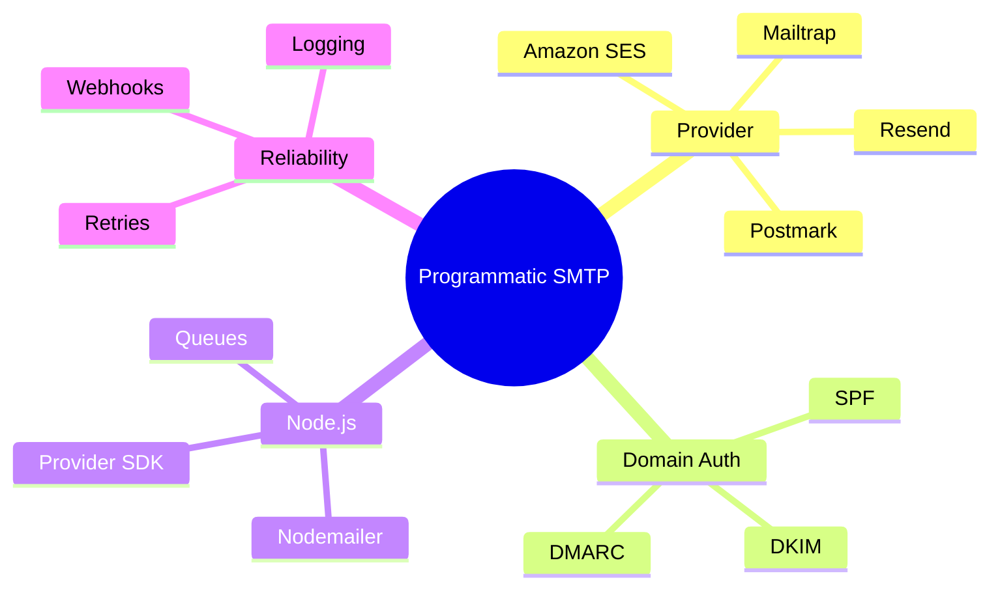

Password resets that never arrive, order confirmations that land in spam, and silent failures on signup emails kill user trust faster than almost any other bug. If you are building a Node.js app in 2026, you need a real transactional email path, not a Gmail account or a random free SMTP relay.

This guide shows you how to set up programmatic transactional SMTP the way production teams actually do it. You will pick a proper provider, authenticate your domain, wire Nodemailer (or a modern SDK), handle errors cleanly, and keep deliverability high. Everything here is written for developers who ship code, not marketing pages.

<!--more-->

We run this exact pattern across client projects on the F9XR team, and the failures are almost never in the code. They are unauthenticated domains, credentials baked into a repo, and sends fired inline on a request that should have gone through a queue. The map below sketches the whole path before we walk it step by step. If you are still wiring the domain layer, our [Cloudflare Email Routing guide for custom addresses](/p/cloudflare-email-routing-custom-addresses/) shows how inbound mail and DNS records fit together first.



## What Is Programmatic Transactional SMTP?

Transactional email is any message triggered by a user action or system event: welcome emails, magic links, password resets, invoices, shipping updates, security alerts. These are not newsletters.

**Programmatic** means your Node.js backend sends them through code, usually through one of two transports:

- SMTP credentials handed to a library like Nodemailer, or
- A provider HTTP API or official SDK

Most modern providers give you both. SMTP is useful when you already have Nodemailer in the stack or need a portable transport. The API is usually better for webhooks, structured errors, templates, and high volume. Many teams use the API as primary and keep SMTP as a simple fallback.

| Approach | Best for | Trade-offs |
|----------|----------|------------|
| Nodemailer plus provider SMTP | Existing codebases, quick portability | You manage connection pooling and retries |
| Provider SDK or REST API | New apps, webhooks, analytics | Slightly more vendor-specific code |
| Self-hosted MTA | Full control, compliance isolation | High operational cost and reputation risk |

For almost every Node.js SaaS or product app, a managed transactional provider plus Nodemailer or the official SDK is the sweet spot.

## Why You Should Not Use Gmail or a Personal SMTP Account

Gmail, Outlook, and generic shared SMTP services are fine for personal mail. They are a bad idea for application email:

- Strict daily sending limits
- No proper bounce and complaint handling
- Shared reputation that tanks when volume spikes
- Frequent blocks on cloud hosts, especially on port 25
- No clean webhooks for delivery events

Use a dedicated transactional service. The providers that consistently show up for Node.js developers in 2026 are Postmark, Resend, Amazon SES, Mailtrap, SendGrid, Mailgun, and SMTP2GO. Pick based on volume, budget, and whether you care more about pure deliverability or developer experience.

Gmail's own SMTP still has a place for low-volume sending as a person, and the [Gmail send-as trick with Cloudflare](/p/gmail-send-as-cloudflare-email-routing/) covers that side. Just do not build a product's password-reset flow on it.

## Choosing a Provider for Node.js

A quick decision guide:

- **Postmark** is best for pure transactional deliverability and message streams
- **Resend** offers excellent developer experience, React Email support, and a modern TypeScript feel
- **Amazon SES** is cheapest at scale if you already live in AWS
- **Mailtrap** combines strong analytics, a testing sandbox, and production sending
- **SendGrid** has a large ecosystem and is good when you also need marketing later
- **Mailgun** has a flexible API and validation features that suit multi-domain setups

Most of these expose both SMTP credentials and a Node.js SDK. You can start with SMTP through Nodemailer and switch to the SDK later without changing your domain authentication. Read the [Nodemailer documentation](https://nodemailer.com/) for transport options and the [Amazon SES developer guide](https://docs.aws.amazon.com/ses/) if you are heading down the AWS path.

## Step-by-Step: Set Up Programmatic Transactional SMTP

### 1. Create an account and verify your sending domain

Sign up with your chosen provider. Add and verify the domain you will send from, for example `mail.yourapp.com` or the root domain.

You will receive DNS records to publish:

- **SPF** authorizes the provider servers to send for your domain
- **DKIM** adds a cryptographic signature so receivers can verify the message
- **DMARC** is the policy that tells receivers what to do with failed checks. Start with `p=none`, then move to quarantine or reject

Add the records at your DNS provider such as Cloudflare or Route 53. Wait for propagation, then click verify in the provider dashboard. Do not skip this. Unauthenticated domains have terrible inbox placement.

### 2. Create SMTP credentials or an API key

In the provider dashboard generate:

- SMTP host and port. Usually 587 with STARTTLS or 465 with SSL
- Username and password, or an API token used as the password
- Or a dedicated API key if you prefer the SDK path

Store these in environment variables. Never hard-code them.

```bash
SMTP_HOST=smtp.yourprovider.com
SMTP_PORT=587
SMTP_USER=your-smtp-user
SMTP_PASS=your-smtp-password
EMAIL_FROM="Your App <noreply@yourapp.com>"
```

### 3. Install Nodemailer or the provider SDK

For the classic SMTP route:

```bash
npm install nodemailer
# TypeScript
npm install -D @types/nodemailer
```

For a modern API-first path, install the official package instead, for example the Resend or Postmark SDK. The rest of this guide focuses on Nodemailer because it works with any SMTP provider and is still the most portable option.

### 4. Create a reusable transporter

```js
// lib/mailer.js
import nodemailer from "nodemailer";

const transporter = nodemailer.createTransport({
  host: process.env.SMTP_HOST,
  port: Number(process.env.SMTP_PORT) || 587,
  secure: false, // true for 465
  auth: {
    user: process.env.SMTP_USER,
    pass: process.env.SMTP_PASS,
  },
  // Optional but recommended for production
  pool: true,
  maxConnections: 5,
  maxMessages: 100,
});

// Verify connection on startup (optional)
transporter.verify().then(() => {
  console.log("SMTP transporter ready");
}).catch(console.error);

export default transporter;
```

### 5. Send a transactional email

```js
// services/email.js
import transporter from "../lib/mailer.js";

export async function sendPasswordReset({ to, resetUrl, name }) {
  const info = await transporter.sendMail({
    from: process.env.EMAIL_FROM,
    to,
    subject: "Reset your password",
    text: `Hi ${name},\n\nReset your password here: ${resetUrl}\n\nIf you did not request this, ignore this email.`,
    html: `
      <p>Hi ${name},</p>
      <p><a href="${resetUrl}">Reset your password</a></p>
      <p>If you did not request this, you can safely ignore this email.</p>
    `,
    headers: {
      "X-Entity-Ref-ID": "password-reset",
    },
  });

  return info.messageId;
}
```

Call this from your route or background job after generating a secure token. Always send both text and HTML versions.

> [!TIP] Store the message ID
> Log the `info.messageId` the provider returns on every successful send. When support asks whether an email went out, you can answer in seconds instead of digging through dashboards.

### 6. Add basic error handling and retries

SMTP and network failures happen. Wrap sends in try and catch, and decide whether to retry:

```js
export async function sendWithRetry(options, attempts = 3) {
  let lastError;
  for (let i = 0; i < attempts; i++) {
    try {
      return await transporter.sendMail(options);
    } catch (err) {
      lastError = err;
      // Simple backoff
      await new Promise((r) => setTimeout(r, 500 * (i + 1)));
    }
  }
  throw lastError;
}
```

For higher reliability, push the send job onto a queue such as BullMQ or Inngest so a temporary provider outage does not break the user-facing request. You can see the same queue-first idea in our [local n8n install guide](/p/how-to-install-n8n-locally-on-pc/), where deferred jobs and retries keep automation from blocking the caller.

### 7. Wire delivery webhooks

Most providers let you register a webhook URL for bounce, complaint, delivery, and open events. Point it at an endpoint in your app, verify the signature, and update your user or log tables. This is how you know a password-reset email actually bounced instead of guessing.

## Domain Authentication Checklist

- [ ] SPF record published and verified
- [ ] DKIM record or records published and verified
- [ ] DMARC record present, starting with `p=none; rua=mailto:dmarc@yourapp.com`
- [ ] From address uses a domain you control
- [ ] Separate subdomain for transactional mail if you also send marketing
- [ ] Test with a deliverability checker or the provider's own testing tools

The [DMARC.org overview](https://dmarc.org/) is a good reference for choosing the right policy as your sending volume grows.

## Practical Tips for Node.js Developers

- Prefer environment variables and a secrets manager. Rotate SMTP credentials or API keys periodically.
- Use a dedicated From address such as `noreply@` or `notifications@`. Keep personal names out of the From field for pure system mail.
- Keep transactional and marketing traffic on separate streams or providers when possible. A marketing campaign should never tank the reputation of your password-reset emails.
- In serverless environments such as Vercel, Lambda, or Cloudflare Workers, prefer the provider HTTP API over long-lived SMTP connections. Connection pooling behaves differently in short-lived functions.
- Log the provider message ID on every successful send.
- For HTML templates, consider React Email or MJML so the markup stays maintainable and responsive.
- Test the full path in staging with a real inbox. Provider dashboards are not a substitute for seeing the actual message.
- If a domain change is part of the migration, keep your analytics in sync with the [GA4 multi-stream domain guide](/p/change-domain-ga4-multiple-data-streams-guide/) so reporting does not silently split.
- If you automate parts of the email or deploy pipeline with an AI coding agent, the [OpenCode skills guide](/p/opencode-skills-guide/) shows how to encode team conventions the agent will follow.

## Key Takeaways

- Programmatic transactional SMTP for Node.js means using a real provider such as Postmark, Resend, SES, or Mailtrap with Nodemailer or an official SDK, not Gmail.
- Authenticate your domain with SPF, DKIM, and DMARC before you send real user email.
- Nodemailer plus SMTP credentials is the most portable starting point. Switch to the provider SDK later if you need richer webhooks and templates.
- Always send both text and HTML, handle errors with retries or a queue, and subscribe to bounce and complaint webhooks.
- Separate transactional reputation from marketing traffic whenever you can.
- Store credentials in environment variables and verify the transporter on startup in long-running processes.

## Frequently Asked Questions

### What is the best transactional SMTP for a Node.js app?

There is no single winner. Postmark is excellent for pure transactional deliverability. Resend is popular for modern TypeScript and React Email workflows. Amazon SES is the cheapest at high volume if you already use AWS. Mailtrap and SMTP2GO are strong all-rounders. Choose based on volume, budget, and how much you value developer experience versus raw inbox placement.

### Should I use Nodemailer or a provider SDK?

Use Nodemailer when you want a portable SMTP transport that works with any provider. Use the official SDK when you want first-class webhooks, templates, idempotency keys, and structured errors. Many teams start with Nodemailer and migrate critical paths to the SDK later.

### Do I need SPF, DKIM, and DMARC for transactional email?

Yes. Without them, major inbox providers treat your messages with suspicion. Publish the records your transactional provider gives you, verify them in the dashboard, and set a DMARC policy. Even a soft `p=none` policy is better than nothing.

### Can I use the same domain for transactional and marketing email?

You can, but it is risky. A poor marketing campaign can damage the reputation that your password-reset and receipt emails rely on. Prefer separate subdomains or completely separate providers and streams when volume grows.

### Is Amazon SES good for Node.js transactional email?

Yes, especially at scale. It is very cheap and reliable once configured. The trade-off is more setup work around IAM, sandbox exit, configuration sets, and CloudWatch. Nodemailer works with SES both through SMTP credentials and through the official AWS SDK transport.

### How do I test transactional email in development?

Use the provider sandbox or a tool like Mailtrap testing inbox so messages never reach real users. In staging, send to real addresses you control and inspect headers, spam scores, and rendering across clients.

## Conclusion

Setting up programmatic transactional SMTP is less about a clever library and more about the layers around it. Authenticate the domain first, keep credentials in environment variables, choose a provider that matches your volume, and treat every transactional send as a reliability-critical path. Once SPF, DKIM, and a solid provider are in place, Nodemailer or the provider SDK becomes a thin, reliable layer instead of a source of production incidents. Read the [Postmark developer docs](https://postmarkapp.com/developer) and the [Resend documentation](https://resend.com/docs) when you are ready to compare their APIs against plain SMTP.

This article was written with AI assistance on the F9XR Team and reviewed against the [Nodemailer documentation](https://nodemailer.com/) and the [Amazon SES developer guide](https://docs.aws.amazon.com/ses/) before publishing. Every post on Dev9b passes review against our [editorial policy](/editorial-policy/); if you spot an edge case we missed, open an edit with the **Suggest changes** button or read the [contributor guide](/contribute/) to submit your own article.
