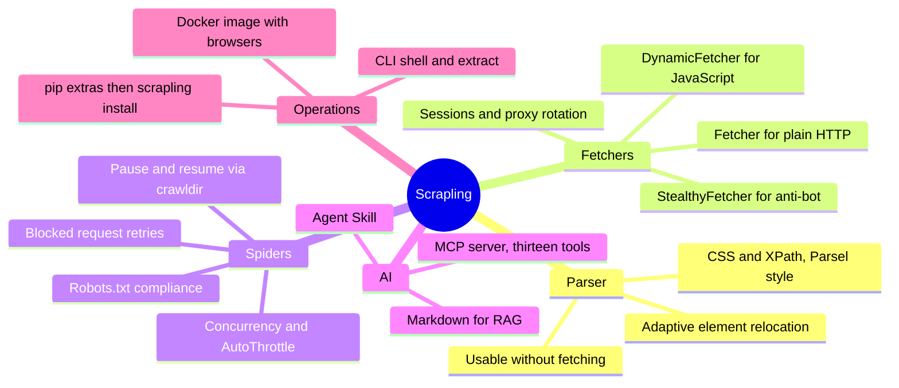

You write a scraper on a Tuesday. It pulls forty thousand rows, the pipeline goes green, everybody moves on. Then somebody on the target site ships a redesign on a Friday, your selectors start returning empty lists, and the job keeps exiting zero while writing a file that contains headers and nothing else.

Add a Cloudflare interstitial to the same afternoon and you have the three problems that make Python web scraping a chore: brittle selectors, hostile networks, and the grind of scaling past a few pages.

Scrapling is an open-source framework built around exactly those three problems. It comes from Karim Shoair, who publishes as D4Vinci on GitHub, is BSD-3-Clause licensed, and at the time of writing has passed 85,000 GitHub stars. It is one library rather than five: a parser that can find your elements again after a redesign, fetchers for plain HTTP and for protected pages, a Scrapy-style spider framework, and an MCP server so coding agents can drive it. The full source lives in the [D4Vinci/Scrapling](https://github.com/D4Vinci/Scrapling) repository, so nothing here is hidden behind a binary.

This guide covers what Scrapling is, how to install it cleanly, how to choose between the three fetchers, and how to run a real crawl. Every command, flag, and version number here was checked against the official documentation and the PyPI record on 2 October 2026, against release 0.4.15.

<!--more-->

## What Scrapling Actually Is

Two parts, and it pays to keep them separate in your head. The **parser** turns HTML into a queryable tree. The **fetchers** get the HTML for you. That split is not academic: it is still visible in how the library installs.

Selection uses CSS and XPath with the same pseudo-elements you already know from Scrapy and Parsel, so `.text::text` and `a::attr(href)` behave the way your fingers expect. On top of that, the parser records a signature of each element it returns, built from that element's own text, attributes, and position, so a later query with `adaptive=True` can go hunting for something similar when the exact selector stops matching.

The fetchers are three classes that differ mainly in cost and stubbornness:

| | Fetcher | DynamicFetcher | StealthyFetcher |
|---|---|---|---|
| Transport | HTTP requests, can impersonate a browser TLS fingerprint | Playwright Chromium or Chrome | Stealth-patched Playwright browser |
| Runs JavaScript | No | Yes | Yes |
| Anti-bot handling | TLS and header impersonation | Standard browser behaviour | Fingerprint spoofing, Cloudflare Turnstile and interstitial solving |
| Memory cost | Lowest | High | Highest |
| Reach for it when | The data is already in the HTML | The data appears after JS runs | The site actively fights back |

That table is the real decision. Start at the left and only move right when the left one fails, because the jump from an HTTP request to a real browser is the difference between milliseconds and seconds per page. A browser fetcher is a data centre of its own, and running one for a page that did not need it is how a scraping bill doubles.

The rest of the framework is the spider system: concurrency limits globally and per domain, checkpoint-based pause and resume, an on-disk response cache for development, proxy rotation, blocked-request detection with retries, and an AutoThrottle mode that tunes each domain's delay from how fast it actually responds.



<details>
<summary>Text version of the diagram</summary>

```
Scrapling
  - Parser
    - CSS and XPath, Parsel style
    - Adaptive element relocation
    - Usable without fetching
  - Fetchers
    - Fetcher for plain HTTP
    - DynamicFetcher for JavaScript
    - StealthyFetcher for anti-bot
    - Sessions and proxy rotation
  - Spiders
    - Concurrency and AutoThrottle
    - Pause and resume via crawldir
    - Robots.txt compliance
    - Blocked request retries
  - AI
    - MCP server, thirteen tools
    - Agent Skill
    - Markdown for RAG
  - Operations
    - pip extras then scrapling install
    - Docker image with browsers
    - CLI shell and extract
```

</details>

## How to Set Up Scrapling

### Prerequisites

- Python 3.10 or newer. The PyPI metadata for 0.4.15 declares `requires_python >=3.10`.
- A virtual environment. Not optional in practice, because the browser step writes a lot of platform files outside your Python packages.

On Windows in PowerShell that is `python -m venv .venv` followed by `.venv\Scripts\activate`. Everywhere else it is `python3 -m venv .venv` and `source .venv/bin/activate`.

### The install that trips everybody up

```bash
pip install scrapling
```

This installs the parser only. The documentation is explicit that importing `scrapling.fetchers` or `scrapling.spiders` afterwards raises `ModuleNotFoundError`, and that is the single most common first-run error with this library. If your only job is parsing HTML you already have on disk, this install is complete and correct.

For anything that touches the network, take the fetchers extra and then download the browsers:

```bash
pip install "scrapling[fetchers]"
scrapling install
```

The `scrapling install` step is separate on purpose. It fetches the Chromium binaries, their system dependencies, and the fingerprint-manipulation packages. Use `scrapling install --force` when you need to repair an install or after a major upgrade, which is the answer to "it worked last week".

### The extras, and when you need each

| Extra | Command | What it adds |
|---|---|---|
| Fetchers | `pip install "scrapling[fetchers]"` | All three fetchers and their session classes |
| AI | `pip install "scrapling[ai]"` | The MCP server and the `scrapling-mcp` command |
| RAG | `pip install "scrapling[rag]"` | The `page.markdown()` conversion |
| Shell | `pip install "scrapling[shell]"` | `scrapling shell` and `scrapling extract` |
| Everything | `pip install "scrapling[all]"` | All of the above |

The `rag` extra is also bundled inside `ai`, `shell`, and `all`. After any of these extras you still need `scrapling install` for the browsers, unless you already ran it.

### Docker instead

```bash
docker pull pyd4vinci/scrapling
```

The same image is on GitHub Container Registry as `ghcr.io/d4vinci/scrapling:latest`. Both are rebuilt on every release with the browsers already inside, which is the cleanest route to a working `StealthyFetcher` on a machine where native browser dependencies are a fight.

### Verify the install

```python
from scrapling.fetchers import Fetcher

page = Fetcher.get("https://example.com")
print(page.status)               # 200
print(page.css("h1::text").get())
```

If that prints a status and a heading, the parser and the HTTP fetcher both work. If it raises `ModuleNotFoundError` on the import, you are still on the parser-only install.

## How to Use Scrapling

### Plain HTTP with Fetcher

`Fetcher` is a class you call directly, with no instance to build. It can impersonate a browser's TLS fingerprint and header set, which is often enough to get past servers that block on header order alone.

```python
from scrapling.fetchers import Fetcher

page = Fetcher.get("https://quotes.toscrape.com/", impersonate="chrome")

for quote in page.css(".quote"):
    print(quote.css(".text::text").get(), "-", quote.css(".author::text").get())
```

When you make more than one request to the same domain, move to a session. A session keeps cookies, connections, and your impersonation choice alive across calls, which is both faster and closer to how a real browser behaves:

```python
from scrapling.fetchers import FetcherSession

with FetcherSession(impersonate="chrome", stealthy_headers=True) as session:
    page_one = session.get("https://quotes.toscrape.com/")
    page_two = session.get("https://quotes.toscrape.com/page/2/")
```

Every fetcher returns a `Response`, which is the `Selector` class plus the transport details: `status`, `reason`, `headers`, `cookies`, `history`, `body` as bytes, and `meta`. Because the response is also the selector, `page.css(...)` is literally the same call whether the HTML came from a plain request or a rendered browser.

### JavaScript pages with DynamicFetcher

When the content is not in the initial HTML, you need a real browser. `DynamicFetcher.fetch()` opens Playwright's Chromium (or real Chrome), waits, hands you the rendered DOM, and closes:

```python
from scrapling.fetchers import DynamicFetcher

page = DynamicFetcher.fetch(
    "https://quotes.toscrape.com/js/",
    headless=True,
    network_idle=True,
)
print(len(page.css(".quote")))
```

`network_idle=True` waits for the network to go quiet, which beats a fixed sleep on almost every site. When you already know which element holds the data, `wait_selector` is faster still. For many pages, use `DynamicSession` so you pay for one browser launch instead of one per page:

```python
from scrapling.fetchers import DynamicSession

with DynamicSession(headless=True, network_idle=True, disable_resources=True) as session:
    for url in urls:
        page = session.fetch(url)
        ...
```

`disable_resources=True` skips images, fonts, and media, which cuts both bandwidth and render time noticeably.

### Anti-bot sites with StealthyFetcher

`StealthyFetcher` runs a fingerprint-spoofed browser, and Cloudflare Turnstile and interstitial challenges are its main target. The documented pattern enables adaptive parsing for the class, then saves element signatures during the first successful run:

```python
from scrapling.fetchers import StealthyFetcher

StealthyFetcher.adaptive = True

page = StealthyFetcher.fetch("https://example.com", headless=True, network_idle=True)
products = page.css(".product", auto_save=True)
```

When the site is later redesigned, the same selector with `adaptive=True` asks the parser to relocate the element from the stored signature instead of following the now-wrong CSS path:

```python
products = page.css(".product", adaptive=True)
```

`auto_save=True` is what writes the signature in the first place, and adaptive parsing is disabled by default, so this has to be deliberate. A session version exists too, where `solve_cloudflare=True` is the explicit switch for the challenge:

```python
from scrapling.fetchers import StealthySession

with StealthySession(headless=True, solve_cloudflare=True) as session:
    page = session.fetch("https://example.com")
```

Debug headful first. When a stealth fetch returns an empty or challenge page, run the same call with `headless=False` and watch what the browser actually sees. That single habit separates "I am blocked" from "my selector is wrong" in under a minute.

### Two features worth knowing early

**Capture the site's own API.** Most modern storefronts load their data from a JSON endpoint the page already calls. Pass `capture_xhr` with a URL pattern and every matching XHR or fetch response the page makes is collected for you as `Response` objects on `page.captured_xhr`, which is far more stable to parse than the rendered HTML:

```python
page = DynamicFetcher.fetch("https://shop.example.com/collection", capture_xhr="/products.json")
for captured in page.captured_xhr:
    print(captured.status, len(captured.body))
```

**Hand a model clean text.** `page.markdown(main_content_only=True)` returns sanitised Markdown with scripts, styles, and hidden content stripped. It needs the `rag` extra.

## Going Multi-Page With Spiders

The fetcher classes handle one page. The `Spider` class handles thousands, and it is a Scrapy-shaped async framework: `start_urls`, an async `parse()` generator, and `response.follow()` for the next hop.

```python
from scrapling.spiders import Spider, Response

class QuotesSpider(Spider):
    name = "quotes"
    start_urls = ["https://quotes.toscrape.com"]
    concurrent_requests = 10
    concurrent_requests_per_domain = 5
    download_delay = 0.5
    allowed_domains = {"quotes.toscrape.com"}

    async def parse(self, response: Response):
        for quote in response.css("div.quote"):
            yield {
                "text": quote.css("span.text::text").get(""),
                "author": quote.css("small.author::text").get(""),
            }

        next_page = response.css("li.next a::attr(href)").get()
        if next_page:
            yield response.follow(next_page, callback=self.parse)

result = QuotesSpider().start()
print(result.stats.items_scraped, result.stats.requests_count, result.completed)
result.items.to_json("quotes.json")
```

Two details are worth memorising. Callbacks are async generators, so every one needs `async def` and `yield`. And `result.items` is an `ItemList` exposing `to_json()`, `to_jsonl()`, `to_csv()`, and `to_xml()`, each of which creates missing parent directories for you.

Long crawls should never start from zero. Pass a `crawldir` and the engine writes periodic checkpoints holding pending requests and seen URLs, plus a final one when you press Ctrl+C. Run the same spider with the same directory and it resumes where it stopped:

```python
QuotesSpider(crawldir="./crawl_data").start()
```

Then let the spider manage its own manners:

- `autothrottle_enabled = True` tunes each domain's delay from its observed response time and backs off when it starts blocking, instead of you hardcoding `download_delay` and hoping.
- `robots_txt_obey = True` pre-fetches robots.txt for every domain in `start_urls`, drops disallowed requests, and honours `Crawl-delay` and `Request-rate`. It is off by default so it never surprises you.
- Blocked responses are detected out of the box. Statuses 401, 403, 407, 429, 444, 500, 502, 503, and 504 count as blocked, and the request is retried up to `max_blocked_retries`, which defaults to 3. Override `is_blocked()` and `retry_blocked_request()` to change the rules.
- `ProxyRotator` cycles proxies across all session types and records which one was used in `response.meta["proxy"]`. With browser sessions it opens a separate browser context per proxy, because a browser cannot switch proxies per tab.

The most useful trick here is a two-tier strategy: cheap datacenter proxies for normal traffic, then escalate to a stealthy session only after a block. Overriding `retry_blocked_request()` to change the session id on the retried request gets you that in about six lines.

If you would rather not write crawling logic at all, there are ready-made templates: `CrawlSpider` for rule-based link following, `SitemapSpider` for sitemap-driven crawls, `XMLFeedSpider` and `CSVFeedSpider` for feeds, `ShopifySpider` to pull a whole store's catalogue through its JSON API, and `SiteToMarkdownSpider` to turn a site into a Markdown corpus.

## CLI, MCP, and Agent Workflows

Not everything needs a Python file. The `shell` extra gives you an IPython-based scraping shell plus an `extract` command:

```bash
scrapling shell
scrapling extract get "https://example.com" content.md
scrapling extract fetch "https://example.com" content.md --css-selector "#main"
scrapling extract stealthy-fetch "https://example.com" page.html --solve-cloudflare
```

The output extension decides the format: `.md` for Markdown, `.txt` for text, `.html` for the raw HTML. The `--css-selector` flag is the one that matters, because it keeps the output to the part you actually wanted.

For AI workflows, Scrapling ships an MCP server with thirteen tools: plain HTTP requests, browser fetches, stealth fetches, their bulk async variants, persistent session management, and screenshots. Install it with the `ai` extra, then register the executable with your client:

```bash
pip install "scrapling[ai]"
scrapling install
claude mcp add ScraplingServer "$(which scrapling-mcp)"
```

On Windows, run `where scrapling-mcp` in PowerShell and hand that full path to `claude mcp add` instead. The client config wants the executable path, not a bare command name, so a virtual environment that is not on your `PATH` is the usual reason a local MCP server appears to start and then does nothing.

If you want the reasoning behind wiring scraping into an agent, [how to add MCP servers to OpenCode](/p/opencode-mcp-servers/) covers the configuration format in detail, and [AI coding agents explained](/p/ai-coding-agents-explained/) covers what the agent is doing with the result afterwards.

Two design choices make this server worth the setup. You can pass a CSS selector so the agent receives only the matched elements rather than an entire page, which cuts both tokens and latency. And responses are stripped of content that could be used for prompt injection: CSS-hidden elements, `aria-hidden` nodes, template tags, HTML comments, and zero-width characters. That is a real defence rather than a marketing line, and worth knowing about before you point an agent at arbitrary URLs.

> [!WARNING] The HTTP transport changed in 0.4.15
> `scrapling-mcp --http` now refuses to start without a token. Pass `--auth-token` or set `SCRAPLING_MCP_AUTH_TOKEN`, or opt out explicitly with `--no-auth`. It also binds to `127.0.0.1` by default instead of `0.0.0.0`, and the `get` tool was renamed to `make_request`. If a config you copied last month stopped working, that is why.

There is also an official [Agent Skill](https://scrapling.readthedocs.io/en/latest/ai/agent-skill.html) that teaches a coding agent the library's current API, so the code it writes stops guessing at method names. Our [guide to adding skills to your OpenCode setup](/p/opencode-skills-guide/) covers the mechanism on the client side.

Once the data exists, the next question is what runs it. A local n8n workflow consuming CSV exports is the usual answer, and [installing n8n locally on PC](/p/how-to-install-n8n-locally-on-pc/) covers that half of the pipeline.

## What We Verified, and What We Did Not

Being straight about where a guide like this comes from matters more than the guide itself.

- Checked against the official documentation and the PyPI record on 2 October 2026: version 0.4.15, `requires_python >=3.10`, the extras list, the separate `scrapling install` step, the fetcher comparison table, and the MCP breaking changes in 0.4.15.
- Every code block here comes from the documented API rather than from memory, and the CLI flag names were read off the CLI documentation rather than guessed.
- We did not reproduce the project's benchmarks on our own hardware. The published text-extraction figures across 5,000 nested elements are the project's own, and the compared parsers are not all doing identical work, so treat those ratios as a reason to try the library rather than a promise about your pages.

The honest weak spot is adaptive relocation. It is a similarity search, not a proof. It is very good at surviving a renamed class or a moved container, and it will not save you from a site that replaces the whole component. Keep a fallback selector and an alert on item counts, so a silent empty scrape becomes a visible failure.

## When Scrapling Is the Wrong Tool

- **There is a public API or an RSS feed.** Use it. Scrapling is the fallback, not the first choice.
- **You need guaranteed long-term reliability on one hard target.** This is a fast-moving project with a single primary maintainer. Pin a version you have tested.
- **You are collecting personal data at scale.** Anti-bot capability is not a licence. The project ships with a disclaimer limiting itself to educational and research use, and both the law and each site's terms still apply.
- **You already run Scrapy and it works.** Scrapling does have a drop-in bridge: decorate a Scrapy callback with `scrapling_response` and you get Scrapling's parser over responses you are already fetching. Rewriting the project is rarely worth it.

## FAQ

### What is Scrapling used for?

Scrapling is a Python web scraping and crawling framework. It covers single-page extraction with a CSS and XPath parser, anti-bot bypass through a stealth browser, concurrent multi-page crawls with a Scrapy-style spider class, and agent-driven scraping through its built-in MCP server.

### Which Python version does Scrapling need?

Python 3.10 or higher. The PyPI metadata for Scrapling 0.4.15 declares `requires_python >=3.10`, and the documentation states the same minimum.

### How do I install Scrapling with browser support?

Run `pip install "scrapling[fetchers]"` and then `scrapling install` as a separate step. The pip extra installs the fetcher code, while the install command downloads the Chromium binaries, system dependencies, and fingerprint packages. Use `scrapling install --force` to repair or refresh that browser layer.

### Does Scrapling handle Cloudflare?

Yes. The `StealthyFetcher` and `StealthySession` classes run a fingerprint-spoofed Playwright browser and are designed to handle Cloudflare Turnstile and interstitial challenges, with `solve_cloudflare=True` as the explicit switch. It is not a universal bypass, so verify the results against your own target.

### Can I use Scrapling with Scrapy?

Yes, through a drop-in integration. Decorate any Scrapy callback with `scrapling_response` and the responses you are already fetching get parsed with Scrapling's parser, so you do not have to rewrite the spider.

### Is Scrapling free and open source?

Yes. Scrapling is released under the BSD-3-Clause licence and its full source is published in the [D4Vinci/Scrapling](https://github.com/D4Vinci/Scrapling) repository on GitHub. The project ships with a disclaimer limiting use to educational and research purposes, so you still have to follow the law and each site's terms.

## Key Takeaways

- Scrapling is one BSD-3-Clause library covering a parser, three fetchers, a spider framework, and an MCP server, rather than a stack you assemble yourself.
- `pip install scrapling` alone gives you the parser only, and importing `scrapling.fetchers` after it raises `ModuleNotFoundError`. Use `pip install "scrapling[fetchers]"` plus `scrapling install` for anything that makes requests.
- Choose in cost order: `Fetcher` for HTML you already have, `DynamicFetcher` when JavaScript builds the page, `StealthyFetcher` only when the site fights back. A browser per page is an expensive default.
- Adaptive selection stores element signatures on `auto_save=True` and relocates them later with `adaptive=True`, which softens redesigns without pretending to eliminate them.
- The spider layer adds what a real crawl needs: per-domain concurrency, `crawldir` checkpoints for pause and resume, `autothrottle_enabled`, `robots_txt_obey`, blocked-request retries, and `ProxyRotator`.
- The MCP server narrows pages with CSS selectors and strips hidden content that could be used for prompt injection, but its HTTP transport now requires a token.

## Conclusion

What Scrapling contributes is not a new way to select elements. It is the unglamorous plumbing: sessions, throttling, checkpoints, proxy rotation, and a parser that has a memory of what it found last week. That is exactly the work that makes production scrapers painful, and having it in one dependency with 85,000 stars behind it is a reasonable bet.

Start with `Fetcher` and `auto_save=True`. Add a browser only when a request genuinely fails, and add AutoThrottle the first time a crawl runs longer than a coffee break. Pin the version, because this project moves fast, and keep a fallback selector next to every adaptive one.

Teams like F9XR take the practical view: pin dependency versions, keep a monitoring hook on record counts so a silent empty scrape pages somebody, and treat scraped data as untrusted input until it has been validated. That last point matters more than usual with an AI in the loop, which is why the prompt-injection sanitising in the MCP server is worth understanding rather than assuming.

Ready to contribute? The [Contributor Guide](/contribute/) explains how to submit an article to Dev9b, and everything we publish is reviewed against the standards in our [Editorial Policy](/editorial-policy/).

---

*Scrapling is created by Karim Shoair, published under the BSD-3-Clause licence, and is not affiliated with F9XR. Version numbers, flags, and the fetcher comparison in this guide were verified against the official documentation and PyPI on 2 October 2026; the performance figures quoted are the project's own and were not reproduced on our hardware. The project ships with a disclaimer limiting use to educational and research purposes, and you are responsible for following the law and each site's terms. This guide was drafted with the assistance of an AI coding assistant, then reviewed by the F9XR Review Board before publishing. Always re-read the changelog before upgrading, because this API moves quickly.*
