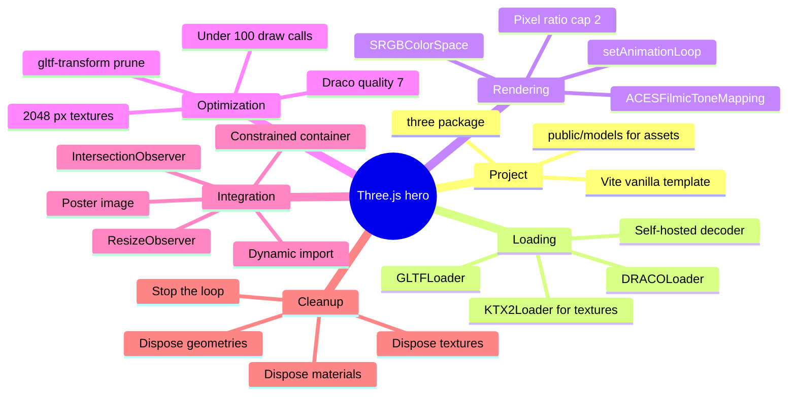

Most landing pages compete on three things: a headline, a screenshot, and a button. A few add a real-time 3D object to the hero, and those are the ones people remember. The catch is that a 3D hero is also the fastest way to destroy a performance budget.

Adding Three.js models to a landing page is a small job with a long tail. File format, decoder choice, pixel ratio, draw calls, disposal, lazy loading. Get all six right and the canvas is invisible infrastructure. Get one wrong and Largest Contentful Paint falls off a cliff on the exact devices that matter.

This is the setup we use for production hero scenes: Vite, a compressed GLB, a constrained container, and an intersection observer that keeps the render loop asleep until someone can actually see it.

<!--more-->

## Why Three.js for a Landing Page Hero

Three.js gives you direct control over the WebGL pipeline, and now WebGPU as well. You can load a compressed GLB, light it, spin it, and keep the whole payload in the low hundreds of kilobytes if you treat asset size as a design constraint rather than an afterthought.

React Three Fiber is excellent when the 3D is the product. For a single marketing hero it is usually the wrong amount of machinery. Vanilla Three.js, or a lazy-loaded chunk that hydrates one container, gives you the same picture with a fraction of the JavaScript.

The reasons teams keep coming back to it:

- A mature ecosystem with loaders, controls, and post-processing already solved.
- Documentation and examples good enough to debug from.
- Fine-grained control over draw calls, memory, and material count.
- It builds cleanly with Vite and needs no plugin or app download.

If you have never touched the library, the [Three.js Journey course](https://threejs-journey.com/) is the fastest way to get past the first week of confusion. Otherwise the rest of this guide is self-contained.

## Set Up the Project with Vite

Vite is the cleanest starting point: instant dev server, code splitting for free, and a production build that hashes assets for long-lived caching.

```bash
npm create vite@latest threejs-landing -- --template vanilla
cd threejs-landing
npm install three
```

Keep the scene in one module and the model out of the bundler graph:

```text
src/
  main.js        # scene, loader, render loop
  style.css
public/
  models/
    product.glb
index.html
```

Anything in `public/` is copied verbatim, which is what you want for a binary asset you will re-upload independently of the JavaScript bundle. The markup stays boring on purpose:

```html
<div id="hero-3d"></div>
```

## Load a GLB the Right Way

glTF 2.0 is the industry standard, and the binary `.glb` variant is what you ship because it collapses the whole model into a single request. When the geometry is heavy, pair `GLTFLoader` with `DRACOLoader`.

```js
import * as THREE from 'three';
import { GLTFLoader } from 'three/addons/loaders/GLTFLoader.js';
import { DRACOLoader } from 'three/addons/loaders/DRACOLoader.js';
import { OrbitControls } from 'three/addons/controls/OrbitControls.js';

const container = document.getElementById('hero-3d');
const scene = new THREE.Scene();
const camera = new THREE.PerspectiveCamera(
  45,
  container.clientWidth / container.clientHeight,
  0.1,
  100
);
camera.position.set(0, 1.5, 4);

const renderer = new THREE.WebGLRenderer({ antialias: true, alpha: true });
renderer.setSize(container.clientWidth, container.clientHeight);
renderer.setPixelRatio(Math.min(window.devicePixelRatio, 2));
renderer.outputColorSpace = THREE.SRGBColorSpace;
renderer.toneMapping = THREE.ACESFilmicToneMapping;
container.appendChild(renderer.domElement);

const ambient = new THREE.AmbientLight(0xffffff, 0.6);
scene.add(ambient);

const key = new THREE.DirectionalLight(0xffffff, 1.2);
key.position.set(5, 10, 7);
scene.add(key);

const controls = new OrbitControls(camera, renderer.domElement);
controls.enableDamping = true;
controls.enablePan = false;
controls.minDistance = 2;
controls.maxDistance = 8;
controls.target.set(0, 0.8, 0);

const dracoLoader = new DRACOLoader();
// Self-hosted decoders. Point this at a copy of the draco decoder files
// served from your own origin (or a CDN you control).
dracoLoader.setDecoderPath('/draco/');
dracoLoader.preload();

const loader = new GLTFLoader();
loader.setDRACOLoader(dracoLoader);

loader.load(
  '/models/product.glb',
  (gltf) => {
    const model = gltf.scene;
    model.traverse((child) => {
      if (child.isMesh) {
        // Flags are harmless while shadowMap.enabled is false. Turn the shadow
        // map on only if the design needs it, then measure on a real phone.
        child.castShadow = true;
        child.receiveShadow = true;
      }
    });
    scene.add(model);
  },
  undefined,
  (error) => console.error('Model load failed', error)
);

function animate() {
  controls.update();
  renderer.render(scene, camera);
}
renderer.setAnimationLoop(animate);
```

Two details in that block matter more than they look.

`outputColorSpace = SRGBColorSpace` is the default in current releases, but setting it explicitly means your scene does not silently shift if you upgrade across a major version. Tone mapping is the other one: without it, physically-based materials clip to white the moment you add a strong key light.

`renderer.setAnimationLoop` replaces the classic `requestAnimationFrame` loop. It is the API the library expects, it keeps the door open for WebXR, and it gives you one obvious place to stop the loop with `setAnimationLoop(null)` when the canvas scrolls away.

### The Decoder Is a Second Request

Draco compression means the browser downloads a small WASM decoder before it can decompress a single vertex. Self-host those decoder files. The convenience of pointing `setDecoderPath` at a Google-hosted version is fine for a prototype, but it adds a third-party origin to your critical path and a failure mode you do not control.

The same logic applies to textures. `KTX2Loader` transcodes textures into a GPU-friendly compressed format at load time, which removes the biggest single cost in most 3D heroes. The [GLTFLoader documentation](https://threejs.org/docs/#examples/en/loaders/GLTFLoader) walks through wiring up both.

## Shrink the Model Before the Browser Sees It

Compression settings on the renderer cannot save you from a 40 MB export. Fix it at the source.

| Optimization | Impact | Recommendation |
|---|---|---|
| Draco or Meshopt compression | High | Always on for geometry-heavy models |
| Texture resolution | High | 2048 px ceiling, 1024 px on mobile |
| KTX2 textures | High | Worth the setup for photo-quality materials |
| Draw calls | Medium-High | Under 100 on mobile |
| Device pixel ratio | Medium | Cap at 2.0 |
| Lazy loading | Medium | Only start when the hero nears the viewport |
| Disposal | Medium | Free geometries, materials, textures on teardown |

The practical version of that list:

1. Export from Blender with the official glTF exporter. Draco quality 7 is a good default for web geometry.
2. Run the result through `gltf-transform` to prune unused nodes, quantize attributes, and confirm what is left. The [gltf-transform CLI](https://gltf-transform.donmccurdy.com/) is the tool we reach for first; Khronos publishes a set of [glTF sample models](https://github.com/KhronosGroup/glTF-Sample-Models) that are useful as size-reference baselines.
3. Consolidate materials where you can. Every extra material is a draw call, and draw calls are what mobile GPUs run out of first.
4. Log `renderer.info` in development and look at `render.calls`, `render.triangles`, and `memory.geometries` on a real device profile in DevTools, not just on your workstation.

```js
function reportSceneStats(renderer) {
  const { render, memory } = renderer.info;
  console.table({
    drawCalls: render.calls,
    triangles: render.triangles,
    geometries: memory.geometries,
    textures: memory.textures,
  });
}
```

And when the scene goes away, take its GPU memory with it. This matters most on single-page sites, where a visitor who browses three product pages ends up holding three scenes:

```js
function disposeScene(root, renderer, controls, dracoLoader) {
  root.traverse((child) => {
    if (!child.isMesh) return;
    child.geometry.dispose();
    const materials = Array.isArray(child.material) ? child.material : [child.material];
    materials.forEach((material) => {
      for (const value of Object.values(material)) {
        if (value && value.isTexture) value.dispose();
      }
      material.dispose();
    });
  });
  controls.dispose();
  dracoLoader.dispose();
  renderer.dispose();
}
```

Here is the whole path an asset takes, from the artist's export to the frame on screen:

```mermaid
flowchart LR
  A[Blender export] --> B[gltf-transform prune]
  B --> C[Draco compress]
  C --> D[Texture resize to 2048]
  D --> E[GLB in public/models]
  E --> F[GLTFLoader + DRACOLoader]
  F --> G[Self-hosted decoder]
  G --> H[Scene graph + lights]
  H --> I[renderer.setAnimationLoop]
  I --> J[Frame on screen]
  J --> K[Dispose on teardown]
```



## Wire the Scene Into a Real Landing Page

A canvas without a container discipline will stretch, fight the layout, and eat the whole viewport. Constrain it in CSS and let CSS own the space:

```css
#hero-3d {
  width: 100%;
  height: 60vh;
  max-height: 600px;
  position: relative;
  overflow: hidden;
}

#hero-3d canvas {
  display: block;
  width: 100% !important;
  height: 100% !important;
}
```

Then keep the JavaScript off the critical path. Dynamic import means Three.js itself is a separate chunk, and an intersection observer means the chunk is only requested when the hero is close to visible:

```js
const container = document.getElementById('hero-3d');
let stop = null;

const observer = new IntersectionObserver(
  async ([entry]) => {
    if (!entry.isIntersecting) {
      stop?.();
      stop = null;
      return;
    }
    if (stop) return;

    const { mountHero } = await import('./hero-scene.js');
    stop = await mountHero(container);
  },
  { rootMargin: '200px' }
);

observer.observe(container);
```

The `rootMargin` of 200px is deliberate: it starts the download slightly before the canvas is on screen so the scene is usually ready by the time it is visible. Pausing when it leaves the viewport matters more than people expect, because a backgrounded `requestAnimationFrame` loop still burns battery and keeps the GPU busy on a page the visitor is trying to read.

For sizing, prefer a `ResizeObserver` on the container over a window resize listener. It fires when the layout actually changes, including sidebar collapses and font swaps that never trigger a window resize:

```js
const ro = new ResizeObserver(([entry]) => {
  const { width, height } = entry.contentRect;
  if (!width || !height) return;
  camera.aspect = width / height;
  camera.updateProjectionMatrix();
  renderer.setSize(width, height, false);
});
ro.observe(container);
```

Finally, ship a poster image. A compressed WebP of the first frame, set as the container background, gives you a real Largest Contentful Paint candidate while the GLB is still in flight. Loading a 3D scene this way is a Core Web Vitals exercise as much as a graphics one, and the same fundamentals show up in the [Hugo SEO checklist](/p/hugo-seo-guide/) we built from a real audit of this site.

## The Whole Setup at a Glance



<details>
<summary>Same map as a text outline</summary>

```text
Three.js hero
  - Project
    - Vite vanilla template
    - three package
    - public/models for assets
  - Loading
    - GLTFLoader
    - DRACOLoader
    - Self-hosted decoder
    - KTX2Loader for textures
  - Rendering
    - SRGBColorSpace
    - ACESFilmicToneMapping
    - Pixel ratio cap 2
    - setAnimationLoop
  - Optimization
    - Draco quality 7
    - gltf-transform prune
    - 2048 px textures
    - Under 100 draw calls
  - Integration
    - Constrained container
    - Dynamic import
    - IntersectionObserver
    - ResizeObserver
    - Poster image
  - Cleanup
    - Dispose geometries
    - Dispose materials
    - Dispose textures
    - Stop the loop
```

</details>

## Common Mistakes That Sink a 3D Hero

- **Shipping an uncompressed GLB.** Anything over 5 to 8 MB should never reach production. Compress it or cut the geometry.
- **Forgetting color space.** Textures loaded with the wrong color space look washed out or muddy, and nothing in the code tells you why.
- **Enabling shadows by default.** Shadow maps are a second render pass. Use them when they carry the design, and test the cost on a mid-range phone.
- **Unlimited OrbitControls.** Full pan and unlimited zoom on a marketing page lets visitors drag the camera into a broken angle and stay there.
- **No resize handling.** The classic symptom is a stretched or pixelated canvas that only appears on mobile.
- **Leaving the loop running off-screen.** Invisible or not, it is still drawing frames.

None of these are Three.js bugs. They are the normal failure modes of putting a real-time renderer inside a document that was designed for text and images.

## FAQ

### What is the best file format for Three.js models on a landing page?

GLB, the binary form of glTF 2.0, is the practical choice. It packs geometry, materials, textures, and animations into one file that loads in a single request. Pair it with Draco or Meshopt compression for production.

### How do I reduce Three.js model load time?

Compress geometry with Draco or Meshopt, resize textures to a 2048 px maximum, convert them to KTX2 where you can, serve the file from a CDN with long cache headers, and lazy-load the model until the hero is close to the viewport. Serving assets from a CDN edge is where the [Cloudflare subdomain setup](/p/how-to-create-cloudflare-subdomain-github-pages/) pays off, since a hero GLB cached close to the visitor is worth more than any micro-optimization in your scene code.

### Can I use Three.js with React or Next.js?

Yes. React Three Fiber is the usual pick for component-driven apps. For a single landing page hero, a plain canvas with a dynamic import keeps the initial JavaScript bundle far smaller, which matters more on a marketing page than on an app the visitor is already committed to.

### Does Three.js work well on mobile devices?

Yes, when the scene is budgeted. Keep triangle counts sane, stay under roughly 100 draw calls, cap device pixel ratio at 2, and test on a mid-range Android device rather than your laptop. WebGPU support keeps improving across mobile browsers, but WebGL is still the portable baseline for a hero that has to work everywhere.

### Should I use OrbitControls on a marketing landing page?

Only when interaction earns its place. For most product heroes a slow auto-rotate or a subtle mouse-follow reads as more polished and stops visitors from dragging the camera somewhere ugly. If you do ship `OrbitControls`, lock down the distance and turn off panning as shown earlier.

### How do I handle responsive canvas sizing?

Observe the container with a `ResizeObserver`, then update `camera.aspect`, call `camera.updateProjectionMatrix()`, and resize the renderer to the container box. Use the container size, never `window.innerWidth`, when the canvas is not full-bleed.

## Key Takeaways

- Vite plus vanilla Three.js is the cleanest setup for a single hero, and keeps the bundle small compared to a full R3F app.
- Ship a compressed GLB, self-host the decoder, and treat the model file as a measured asset.
- Cap pixel ratio at 2, keep textures at or below 2048 px, and watch draw calls on a real device.
- Lazy-load the chunk, pause the loop when the hero scrolls away, and dispose everything on teardown.
- Give the canvas a constrained container and a poster image so the page has a paint candidate before WebGL takes over.

## Conclusion

A 3D hero is a performance problem wearing a design costume. The picture is the easy part; the discipline is deciding what the browser downloads, when it downloads it, and when it stops working. Get those three answers right and the model becomes the fastest thing on the page.

Teams like F9XR treat that as a budget conversation, not a graphics one: the model file gets measured and compressed before anyone opens a text editor, and the canvas gets a hard ceiling on pixels and draw calls.

Once the scene is live, the rest of the pipeline is familiar: publish it with the [Hugo on GitHub Pages guide](/p/hugo-github-pages-setup/), put the model files behind a CDN, and if the landing page itself is built in a page builder rather than in code, the [Skelementor and Elementor walkthrough](/p/how-to-use-skelementor/) covers that side. Working on something larger? Debugging a 3D scene with an agent is a good fit for the workflow described in [AI coding agents explained](/p/ai-coding-agents-explained/).

Ready to contribute? The [Contributor Guide](/contribute/) explains how to submit an article to Dev9b, and everything we publish is reviewed against the standards in our [Editorial Policy](/editorial-policy/).

---

*This guide was researched and drafted with the assistance of an AI coding assistant, then reviewed by the F9XR Review Board before publishing. Have feedback or want to contribute your own article? See our [Contributor Guide](/contribute/) and [Editorial Policy](/editorial-policy/).*
