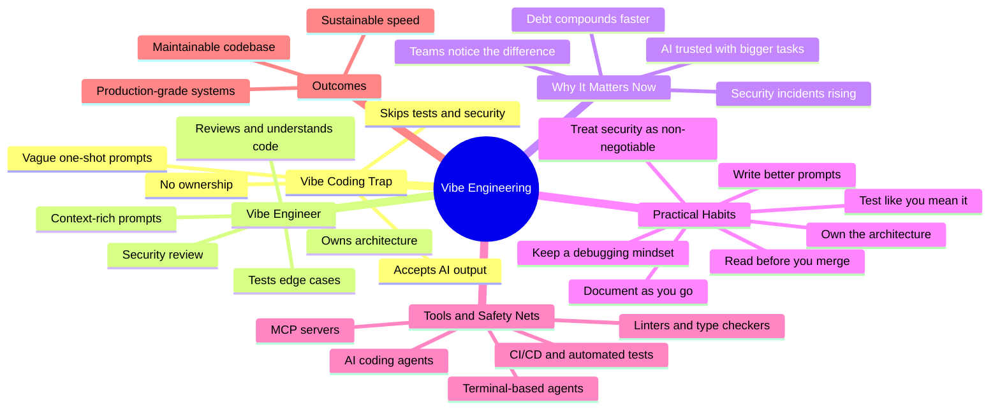

If you've spent any time on developer Twitter (or X, or wherever we're arguing about tabs vs spaces this week), you've seen the term "vibe coding" everywhere. You paste a prompt into Cursor, Claude, or ChatGPT, the AI spits out working code, you copy it in, it runs, and you move on. No deep understanding of what happened under the hood. Just vibes.

It's fast. It's fun. It's also a quiet liability sitting in your codebase, waiting for the wrong moment to show up.

Here's the uncomfortable truth: AI coding assistants like Claude, Cursor, GitHub Copilot, and OpenCode have made it possible to build things faster than ever before. But speed without understanding isn't engineering, it's gambling with a nicer UI. The developers who will actually thrive in this AI-assisted era aren't the ones who blindly accept every suggestion. They're the ones who've learned to direct AI with intention, verify its output, and own the architecture behind it.

That's the shift from vibe coding to **vibe engineering**. Same tools, same speed, completely different mindset. This article breaks down what that actually means, why it matters for your career and your codebase, and how to make the switch starting today.

<!--more-->

## What Is Vibe Coding, Really?

The term "vibe coding" was popularized to describe a workflow where a developer (or even a non-developer) describes what they want in plain English and lets an AI model generate the entire implementation, often without reading through the code line by line. You prompt, you accept, you ship.

For quick prototypes, weekend hackathon projects, or throwaway scripts, this is genuinely useful. Nobody needs to review a one-off Python script that renames 200 files. But problems start appearing when this same "accept and move on" habit creeps into production systems, client work, or anything that touches real users and real data.

Common signs you've slipped into pure vibe coding mode:

* You can't explain why a piece of code works, only that it does.
* You've never questioned whether the AI's suggested library or pattern is the right fit.
* Error handling, edge cases, and security checks are missing because the AI didn't mention them and you didn't ask.
* You paste stack traces back into the chat and accept whatever fix comes back, without understanding the root cause.
* Your commit messages are basically "fixed it" because you're not entirely sure what "it" was.

None of this makes you a bad developer. It makes you a developer who hasn't yet adapted their workflow to the new reality of AI-assisted coding. That adaptation is exactly what vibe engineering is about.

## Vibe Engineer vs Vibe Coder: What's the Actual Difference?

The gap between the two isn't about which tools you use. Both a vibe coder and a vibe engineer might use the same AI coding agent, the same terminal, the same editor. The difference is in process, intent, and accountability.

| Aspect | Vibe Coder | Vibe Engineer |
|---|---|---|
| Understanding | Accepts AI output without reading it closely | Reads and understands generated code before merging |
| Prompting | Vague, one-shot prompts ("fix my app") | Precise, context-rich prompts with constraints and goals |
| Testing | Assumes it works because it ran once | Writes or requests tests, checks edge cases |
| Architecture | Lets AI decide structure ad hoc | Defines architecture, uses AI within that structure |
| Debugging | Copy-pastes errors back to AI repeatedly | Diagnoses root cause, uses AI to accelerate the fix |
| Security | Rarely checked, assumed fine | Actively reviewed, especially for auth, input, and secrets |
| Ownership | "The AI wrote it" | "I directed the AI and I own the result" |
| Long-term outcome | Fragile, hard-to-maintain codebase | Maintainable, scalable, production-grade system |

The vibe engineer still moves fast. They still lean on AI heavily, maybe even more than the vibe coder does, because they trust their own review process to catch mistakes. Speed isn't the enemy here. Unchecked speed is.

## Mind Map: Vibe Engineering at a Glance

Here's the shift from vibe coder to vibe engineer, mapped out:



```text
Vibe Engineering
  - Vibe Coding Trap
    - Accepts AI output
    - Vague one-shot prompts
    - Skips tests and security
    - No ownership
  - Vibe Engineer
    - Reviews and understands code
    - Context-rich prompts
    - Tests edge cases
    - Owns architecture
    - Security review
  - Why It Matters Now
    - AI trusted with bigger tasks
    - Debt compounds faster
    - Security incidents rising
    - Teams notice the difference
  - Practical Habits
    - Write better prompts
    - Read before you merge
    - Own the architecture
    - Test like you mean it
    - Treat security as non-negotiable
    - Keep a debugging mindset
    - Document as you go
  - Tools and Safety Nets
    - AI coding agents
    - Terminal-based agents
    - MCP servers
    - CI/CD and automated tests
    - Linters and type checkers
  - Outcomes
    - Sustainable speed
    - Maintainable codebase
    - Production-grade systems
```

## Why This Shift Matters Right Now

AI coding agents have gotten remarkably capable — if the internals still feel like a black box, our explainer on [how AI coding agents work](/p/ai-coding-agents-explained/) walks through the plan-act-check loop and the parts that decide capability and safety. Tools like Claude Code, Cursor, GitHub Copilot, and terminal-based agents such as OpenCode can scaffold entire features, refactor modules, and even write test suites in minutes. That capability is exactly why the vibe coder approach is becoming riskier, not safer.

A few reasons this matters more today than it did a year ago:

1. **AI is being trusted with bigger tasks.** It's one thing to auto-generate a CSS snippet. It's another to let an AI agent modify your authentication flow or database schema without review.
2. **Technical debt compounds faster with AI.** When code is generated in seconds, it's tempting to generate ten more variations before understanding the first one. That debt piles up quietly.
3. **Security incidents from AI-generated code are rising.** Hardcoded secrets, missing input validation, and insecure defaults are common in unreviewed AI output because models optimize for "it runs," not "it's safe."
4. **Hiring managers and teams are noticing.** Engineers who can explain their architecture decisions and reasoning stand out in interviews and code reviews. Ones who can only say "the AI did it" don't.
5. **Maintainability is a team sport.** Code you don't understand is code your teammates can't maintain either, especially six months from now when the AI chat history is long gone.

None of this means AI coding tools are bad. It means the developer's role has shifted from "writer of every line" to "director, reviewer, and architect" of what gets written. That's a more senior skill, not a lesser one.

In our own work at F9XR, the teams that get the most out of OpenCode and similar agents are the ones treating the tool as a fast, tireless pair programmer with memory problems, not as an oracle. Same speed, far fewer surprises.

## How to Become a Vibe Engineer: Practical Habits

Switching from vibe coding to vibe engineering isn't about slowing down to a crawl. It's about adding a handful of disciplined habits around the AI-assisted workflow you already have — the same habits engineers have sworn by since [The Pragmatic Programmer](https://en.wikipedia.org/wiki/The_Pragmatic_Programmer), updated for an AI world.

### 1. Write Better Prompts, Not Just Faster Ones

A vague prompt gets you a vague answer. Instead of "build me a login system," give the AI real constraints: the framework, the database, the auth method, rate limiting requirements, and how errors should be handled. Treat prompting like writing a technical spec — for the techniques, [Anthropic's prompt engineering guide](https://docs.claude.com/en/docs/build-with-claude/prompt-engineering/overview) is a practical reference.

Good prompt engineering habits:

* Specify the tech stack and versions explicitly.
* State non-functional requirements: performance, security, accessibility.
* Ask the AI to explain its reasoning, not just output code.
* Break large features into smaller, reviewable chunks instead of one giant generation.

### 2. Always Read Before You Merge

This sounds obvious, but it's the single most skipped step in vibe coding. Before accepting AI-generated code, read it the same way you'd review a pull request from a colleague — [Google's engineering practices documentation](https://google.github.io/eng-practices/) is a solid review standard to borrow from. Ask yourself:

* Do I understand what every function does?
* Are there hidden dependencies or side effects?
* Does this match the existing architecture and style of the codebase?
* What happens if this input is empty, malformed, or malicious?

If you can't answer these, don't merge yet. Ask the AI to walk you through it, or research the unfamiliar parts yourself.

### 3. Own the Architecture, Let AI Fill the Blanks

A vibe engineer decides the shape of the system: how services communicate, how data flows, what patterns the team follows. AI is excellent at implementing within that structure but shouldn't be the one deciding it wholesale, especially on larger projects. Sketch your architecture first, even briefly, then bring AI in to build inside those lines.

### 4. Test Like You Mean It

AI-generated code often "works" for the happy path and quietly breaks everywhere else. Ask your AI assistant to generate unit tests alongside the implementation, then actually run them and add your own edge cases. Testing is one of the highest-leverage habits for catching the mistakes vibe coding tends to hide.

### 5. Treat Security as Non-Negotiable

Never accept AI-suggested code involving authentication, payments, file uploads, or database queries without a security pass. Check for hardcoded credentials, missing input sanitization, and overly permissive defaults against the [OWASP Top 10](https://owasp.org/www-project-top-ten/). A five-minute review can prevent a very expensive incident later.

### 6. Keep a Debugging Mindset, Not a Retry Mindset

When something breaks, resist the urge to just paste the error back and accept the next suggestion on repeat. Take a moment to understand what actually failed. Use the AI as a thinking partner to explore the root cause, not as a vending machine for fixes.

### 7. Document as You Go

Future you (and your teammates) won't have access to your AI chat history. Write clear commit messages, comments for non-obvious logic, and short notes on why a particular approach was chosen. This is what separates a maintainable project from one that only makes sense to the person who built it last week.

## Tools That Support Vibe Engineering (Used the Right Way)

The good news is that the same tools associated with vibe coding can absolutely be used the vibe engineer way. It really comes down to how you use them.

* **AI coding agents** (Claude Code, Cursor, GitHub Copilot) work best when given context files, style guides, and clear instructions rather than one-line prompts. Weighing up the options? Our [OpenCode vs Cursor vs Continue](/p/opencode-vs-cursor/) comparison covers pricing, privacy, and lock-in.
* **Terminal-based coding agents** like OpenCode let you stay closer to your actual dev environment, git history, and file system, which naturally encourages more review than a black-box chat window. See the [OpenCode TUI setup guide](/p/how-to-setup-opencode-tui/) to get started, and encode your review standards as reusable [OpenCode skills](/p/opencode-skills-guide/).
* **MCP (Model Context Protocol) servers** let AI agents pull real project context, like your issue tracker or documentation, instead of guessing, which reduces hallucinated assumptions. Here's how to [wire MCP servers into OpenCode](/p/opencode-mcp-servers/), with the [protocol documentation](https://modelcontextprotocol.io/) as background.
* **CI/CD pipelines and automated testing** catch what manual review misses, especially useful as a safety net when AI is generating a large volume of code quickly.
* **Linters, type checkers, and static analysis tools** give you an automated second opinion on AI output before it ever reaches a human reviewer.

The pattern across all of these: use AI to increase throughput, but keep human judgment in the loop at every meaningful decision point.

## Key Takeaways

* Vibe coding means accepting AI-generated code without deeply understanding it. It's fine for throwaway scripts, risky for production systems.
* Vibe engineering means using AI just as aggressively, but with intentional prompting, code review, testing, and architectural ownership layered on top.
* The difference isn't about the tools you use, it's about your process and how much accountability you take for the output.
* Security, testing, and documentation are the three habits most commonly skipped in vibe coding and most valuable to add back in.
* Developers who can explain their AI-assisted decisions will stand out more in code reviews, interviews, and team environments than those who can't.
* Becoming a vibe engineer doesn't slow you down. It just makes your speed sustainable.

## Frequently Asked Questions

### What does "vibe coding" mean?

Vibe coding refers to a development style where a person prompts an AI model to generate code and accepts the output largely as-is, often without deeply reviewing or understanding the underlying logic. It prioritizes speed and momentum over deep comprehension.

### What is a "vibe engineer"?

A vibe engineer is a developer who uses AI coding tools just as heavily as a vibe coder, but adds engineering discipline on top: reviewing generated code, writing precise prompts, testing thoroughly, and owning the system's architecture and security.

### Is vibe coding bad for beginners?

Not inherently. Vibe coding can help beginners build confidence and see working results quickly. The risk appears when it becomes the only approach used for real, production-facing projects without ever building the underlying understanding.

### How do I stop vibe coding and start vibe engineering?

Start by reading every piece of AI-generated code before merging it, writing more detailed and specific prompts, adding tests for edge cases, and doing a quick security review on anything touching auth, payments, or user data.

### Does vibe engineering slow down development speed?

Not significantly. Most vibe engineering habits, like better prompting and quick code reviews, take minutes and prevent hours of debugging or incident response later. The net effect is usually faster, more sustainable development, not slower.

### Can AI coding tools be trusted for production code?

AI coding tools can absolutely be used in production when paired with human review, automated testing, and clear architectural boundaries. The tools themselves aren't the risk; using them without oversight is.

## About This Post

Cover photo by [Bernd Dittrich](https://unsplash.com/@hdbernd?utm_source=unsplash&utm_medium=referral&utm_content=creditCopyText) on [Unsplash](https://unsplash.com/photos/computer-screen-displays-vibe-vibe-coding-text-15M-8mMskd4?utm_source=unsplash&utm_medium=referral&utm_content=creditCopyText).

This article was drafted with the assistance of an AI writing tool, then reviewed, edited, and fact-checked by the F9XR review process. Learn more about how we vet content in our [Editorial Policy](/editorial-policy/). Have a story to share? See the [Contributor Guide](/contribute/).