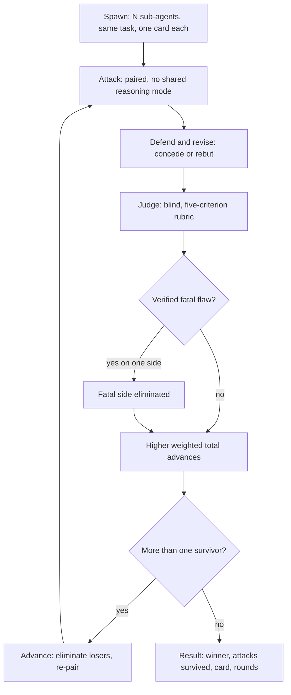
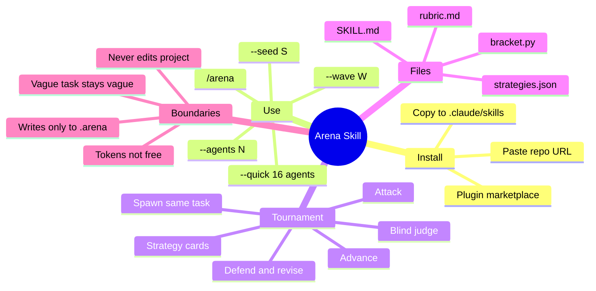

You ask Claude for something important. The answer comes back flat, incomplete, or subtly wrong. You rephrase. You add constraints. You try again. Still not there.

That loop is expensive and it is exactly what a single sample from a probability distribution does when it lands badly. One more prompt is one more draw from the same distribution.

The Arena skill breaks the loop by brute force. Instead of a better prompt, you run a single-elimination tournament. Up to 100 sub-agents get the exact same task, each with a different strategy card covering how it reasons, how it works, and what it optimizes for. They attack each other, defend, revise, and get scored by a judge that never sees their cards. One answer survives.

It is free, MIT licensed, needs no signup and no extra API keys, and it never touches your project files. Everything lives in a local `.arena/` folder and you decide whether to apply the winner.

This guide covers what the Arena skill is, how the tournament works under the hood, how to install it, and when it is actually worth the tokens.

<!--more-->

## What the Arena Skill Actually Is

The Arena skill is a [Claude Code skill](https://support.claude.com/en/articles/12512180-using-skills-in-claude) that turns one disappointing answer into a structured competition between many differently instructed copies of the same model. It was built by Jake Schincariol and released as open source at [`Jakeschincariol/arena-skill`](https://github.com/Jakeschincariol/arena-skill).

The idea in one sentence: hand the same task to many differently instructed copies of the model, force them to critique and revise each other under a fixed rubric, and keep the solution that survives every match.

Here is the part that trips people up. It is not a different model, and it is not a panel of external LLMs. Every competitor is a sub-agent of the Claude model you are already running. The diversity comes entirely from the strategy cards. If you have been assuming that "100 agents" means 100 different opinions from a mixed-model jury, you are off by the entire premise.

Four properties make it practical rather than a demo:

- **Sub-agents write only inside `.arena/`.** Your repository is untouched until you choose to apply the result.
- **The main session never loads hundreds of solution files.** Every sub-agent writes its work to disk and replies with a single line, so your context holds bookkeeping, not content. The state is driven by a small standard-library Python file, `bracket.py`.
- **State is durable.** If the conversation gets compacted mid-tournament, `bracket.py next` picks up from the JSON file on disk.
- **It shows its work.** You get the attacks the winner survived, its strategy card, the round count, and a blind comparison against your rejected answer when you started from one.

If you want the underlying mental model of why sub-agents behave differently from a single agent, [AI coding agents explained](/p/ai-coding-agents-explained/) covers the plan-act-check loop that all of this sits on top of.

## How the Arena Tournament Works

Six phases, and each one is a separate `bracket.py` command.



### 1. Spawn

N sub-agents, one Agent tool call each. Every one receives the task text byte for byte, which the repo's tests actually assert, plus one unique strategy card. Diversity comes from three stacked dimensions in `strategies.json`:

| Dimension | Count | Examples |
|---|---|---|
| Reasoning modes | 15 | first principles, inversion, analogy, adversarial, constraint first, worked example, Socratic, contrarian, systems thinking |
| Workflows | 12 | draft-critique-rewrite, outline first, test first, research then synthesise, three drafts then pick one |
| Strategies | 12 | simplest thing that works, maximal rigour, user empathy first, edge cases first, speed |

That is 2,160 possible cards. The dealer guarantees no two agents get the same one, spreads each component as evenly as possible, and keeps every reasoning mode, workflow and strategy dealt as evenly as it can.

We read the shipped file while writing this, so these are the actual IDs rather than marketing copy. The reasoning deck runs from `first-principles` through `expert-panel`. The strategy deck includes `defensive`, `fewest-moving-parts` and `built-to-last`, which are the ones most likely to win a real engineering match.

### 2. Attack

Solutions are paired, and the pairing deliberately avoids putting two agents with the same reasoning mode against each other, so every match is a genuine disagreement rather than an echo. Each side attacks the other's solution through its own card: what is wrong, what requirement it missed, the exact input that breaks it. Up to seven attacks per match, each labelled FATAL, MAJOR or MINOR.

The rubric requires attacks to be specific and checkable. "This could be clearer" is not an attack. "This returns 200 for a request with a missing `id` field, and the task says it should be 400" is.

### 3. Defend and revise

Each competitor answers every attack it received, conceding or rebutting with evidence, then rewrites its solution to fix whatever it conceded. This is the phase that actually improves the answer. A model that has to explain its weakness out loud and then patch it produces a different artifact than one that never got challenged.

### 4. Judge

A separate judge sub-agent, blind to the strategy cards, reads both revised solutions, re-checks every attack itself, and scores both:

| Criterion | Weight | The question the judge asks |
|---|---|---|
| Correctness | 30 | Is it right? No false claims, no logic errors, no bugs |
| Completeness vs task | 25 | Does it meet every requirement the task actually states? |
| Robustness to attacks | 20 | Does it hold up against the attacks raised in this match? |
| Specificity | 15 | Could you act on it right now without guessing? |
| Clarity | 10 | Is it easy to read and use, at a length that fits the task? |

Each criterion is scored 0 to 10 with written anchors, and the weighted total gives a number from 0 to 100. The higher total goes through. A solution with a verified fatal flaw cannot advance past one without, whatever the totals say, and if both are fatal the totals decide. There are no draws: an exact tie goes to the side with fewer attacks still standing, then to higher correctness.

The full rubric is a plain markdown file in the repo, which means you can edit it. That is the single highest-leverage change you can make, because it defines what "best" means for your team.

### 5. Advance and repeat

Losers are eliminated, survivors carry their revised solutions forward, and odd numbers get a bye, never twice to the same agent while others are still waiting. The loop runs until exactly one solution remains.

### 6. Result

You get the winning solution, the attacks it survived, its strategy card, and the round count. If you started from an answer you rejected, one final blind judge compares the champion against that baseline, and the skill reports the score even when the old answer wins.

## Install the Arena Skill

Three practical options.

### Option 1: paste the repository URL

In a Claude Code session, paste:

```text
https://github.com/Jakeschincariol/arena-skill

Install this skill, then confirm /arena works.
```

Claude pulls the skill and sets it up. This is the fastest path if you do not want to think about paths.

### Option 2: clone and copy the folder

```bash
git clone https://github.com/Jakeschincariol/arena-skill.git
cp -r arena-skill/skills/arena ~/.claude/skills/
```

For a project-local install that only applies inside one repository:

```bash
cp -r arena-skill/skills/arena .claude/skills/
```

On Windows, `~/.claude` is `%USERPROFILE%\.claude`, so the global path is `$env:USERPROFILE\.claude\skills\`.

### Option 3: plugin marketplace

```text
/plugin marketplace add Jakeschincariol/arena-skill
/plugin install arena-skill@arena-skill
```

Claude Code namespaces plugin-installed skills, so the command becomes `/arena-skill:arena` rather than plain `/arena`. If the bare slash command matters to you, use the folder copy instead.

After any of the three, start a new Claude Code session and type `/` to confirm `arena` appears. Skills that do not show up are almost always a naming or location problem, and the same diagnosis applies to the broader pattern in our [guide to adding skills to your coding agent](/p/opencode-skills-guide/).

## Use the Arena Skill

Basic invocations:

```text
/arena
/arena --quick write the headline for our pricing page
/arena --agents 32 fix the flaky test in tests/test_api.py
/arena --seed 7 plan my launch week, I have 6 hours a day
```

| Flag | Meaning |
|---|---|
| `--agents N` | Number of competitors. Default 100. |
| `--quick` | 16 competitors. The everyday setting. |
| `--seed S` | Fixes the strategy cards and the pairings. Random by default, and recorded. |
| `--wave W` | Sub-agents per wave. Default 10. Only raise it if you raised Claude Code's concurrency limit. |

Run `/arena` with no task text and the skill takes your most recent request as the task and your previous answer as the baseline to beat. That is the flow the skill is actually designed around: you are not reaching for it from a blank prompt, you are reaching for it because you just rejected an answer.

Claude can also activate it from natural language. Say "that's a bad answer, make them compete" and the skill will reach for the arena on its own. In that case it asks before spending anything and offers you the full run, `--quick`, or an ordinary retry.

### Get the task file right

This is the step that decides the result, and it is the one people skip. Sub-agents cannot see your conversation. Every competitor, attacker and judge knows only what is in the task file the skill writes to `.arena/task.md`.

So put every requirement into it: absolute paths of files that matter, what "done" looks like, what must not change, and if there is an earlier answer you disliked, what exactly you disliked about it in your own words. The skill is explicit that you should not add requirements the user never gave, because that pushes 100 agents in the same direction, which is the opposite of the point.

Vague task in, 100 flavors of vague out. Arena amplifies the quality of the task you actually wrote.

## Cost and Performance Reality Check

The skill is free. The tokens are yours. We ran the planner in the repo at each size rather than quoting the table, and these are its actual output:

| Agents | Rounds | Sub-agent calls | Waves of 10 |
|---|---|---|---|
| 100 (default) | 7 | 595 | 70 |
| 64 | 6 | 379 | 49 |
| 32 | 5 | 187 | 28 |
| 16 (`--quick`) | 4 | 91 | 16 |
| 8 | 3 | 43 | 10 |

Add one more call when there is a rejected answer to beat, for the final blind comparison. Every call re-reads the task plus one or two solution files, so the bill scales with how big your task is, not just how many agents you run.

Check the numbers any time before committing:

```bash
python3 skills/arena/bracket.py plan --agents 32
```

The 100-agent bracket looks like this:

```text
  round  alive  matches  bye  sub-agent calls  waves
  spawn    100        -    -              100     10
      1    100       50    -              250     25
      2     50       25    -              125     13
      3     25       12  yes               60      8
      4     13        6  yes               30      5
      5      7        3  yes               15      3
      6      4        2    -               10      3
      7      2        1    -                5      3
  total                                 595     70

  alive per round: 100 -> 50 -> 25 -> 13 -> 7 -> 4 -> 2 -> 1
```

Claude Code runs at most 10 tool calls concurrently by default, so the arena executes in waves. That is the entire reason a 100-agent run is slow. If you raise `CLAUDE_CODE_MAX_TOOL_USE_CONCURRENCY` in your [Claude Code settings](https://docs.claude.com/en/docs/claude-code/settings), pass `--wave` to match or you will just queue.

## What the State Machine Actually Does

We cloned the repo and initialized a real run to check the operational claims, and the shape on disk is worth understanding because it is what makes the whole thing resumable.

```text
.arena/
├── LATEST
└── run-20260929-212818-s7/
    ├── arena.json
    ├── rubric.md
    ├── task.md
    └── prompts/
        └── r0/
            ├── a001.spawn.md
            └── a002.spawn.md
```

`init` copies the task into the run folder, deals every competitor a different card, pairs round one, and writes `arena.json`. Output from an 8-agent run with seed 7:

```text
arena ready: ...\run-20260929-212818-s7
seed 7. 8 agents, 8 distinct cards dealt from 2160, no repeats.
3 rounds (8 -> 4 -> 2 -> 1). 43 sub-agent calls in 10 waves of 10.
```

Each prompt file is one Agent call. The sub-agent is told to read the prompt path and follow it exactly, and to reply with a single `DONE <id> <word count>` line. That single-line contract is why the main session survives a 595-call run without filling up.

A spawn brief looks like this, with the card inline:

```text
You are competitor a001 in an arena of 8. All 8 competitors got the exact
same task, word for word. The only thing that makes you different is the
strategy card below.

=== YOUR STRATEGY CARD ===
Reasoning mode: Expert panel. Answer the task as three different experts
would, picking roles that fit it. Take the strongest idea from each and
settle every point where they disagree.
Workflow: Write, then restructure. Write freely and fast. Then outline what
you actually wrote, fix the structure, and rewrite it to the new outline.
Strategy: Completeness. Leave out nothing the task asks for or clearly
implies. Cover every requirement explicitly.
=== END OF THE CARD ===
```

Notice the last instruction: say nothing about the arena, your card, or your competitor number, because the judges score blind.

Every phase runs through one of these commands:

```bash
python3 bracket.py plan --agents 100
python3 bracket.py init --agents 100 --seed 7 --task-file task.md
python3 bracket.py next
python3 bracket.py prompts attack
python3 bracket.py pairings
python3 bracket.py collect
python3 bracket.py advance
python3 bracket.py status
python3 bracket.py winner
```

`next` is the one you actually drive the loop with. It reads the state on disk and tells you the next step and the exact command, which is why a compacted conversation is a non-event.

We also ran the test suite, since a tournament harness that quietly loses an agent is worse than no harness. Twenty-seven tests pass in about 38 seconds, including a full 100-agent tournament with random winners that has to end with exactly one survivor, plus 16, 7 and 1 agent runs, the dealer's guarantees, and every phase from spawn to final check.

## Practical Advice for Good Results

1. **Write a self-contained task file.** Sub-agents cannot see your chat history. Every requirement, constraint, path and definition of done goes in the task file.
2. **Prefer `--quick` for routine work.** Sixteen agents is the everyday setting. Save the full 100 for decisions that matter.
3. **Switch to accept-edits mode first.** Hit Shift+Tab before a large run. Every sub-agent writes a file into `.arena/`, and in the default permission mode that is one approval per file, which is hundreds of prompts.
4. **Check the plan before you start** if you are cost-conscious. It writes nothing.
5. **Expect the same seed to give different answers.** The seed fixes the cards and the bracket, not the output. The model is not deterministic.
6. **Never let it edit your project automatically.** Code changes come back as a diff or as full files inside the winning answer. Applying them is your call.
7. **Edit the rubric.** If your team cares about migration safety more than brevity, rewrite the weights in `rubric.md`. The judges follow that file.

## When Arena Helps, and When It Does Not

Good fits:

- Architecture and design decisions where single-model overconfidence is genuinely risky
- Hard bugs and flaky tests that need several angles
- Non-trivial writing or planning under real constraints
- Any task where you already rejected one answer and want a stronger alternative

Poor fits:

- Simple factual lookups
- Formatting and trivial edits
- Tasks so vague that 100 agents will all miss the same unspoken requirement

The last one is the real limitation. Arena cannot invent requirements you never stated. It amplifies the quality of the task you actually gave it, so if the task is thin, you get 100 confident variations on thin.

It is also not independent verification in the sense a security reviewer would mean. Every competitor and every judge is the same model. Debating a model against itself reduces the blast radius of a single bad sample; it does not give you a second opinion from a different model family. If you need that, you need a genuinely heterogeneous panel, which is a different tool and a different article.

## Arena Skill in One Diagram



## FAQ

### What is the Arena skill for Claude Code?

The Arena skill is a free, MIT-licensed Claude Code skill that runs a single-elimination tournament of sub-agents on one shared task. Up to 100 sub-agents receive the identical task with a different strategy card each, attack and defend each other's solutions, get scored by a blind judge on a fixed rubric, and the last one standing becomes the answer you receive.

### How do I install the Arena skill?

Paste the repository URL `https://github.com/Jakeschincariol/arena-skill` into a Claude Code session and ask it to install the skill, or clone the repo and copy `skills/arena` into `~/.claude/skills/`. It also installs as a plugin through `/plugin marketplace add`, though plugin installs are namespaced and appear as `/arena-skill:arena`.

### Does the Arena skill change my project files?

No. Every sub-agent is instructed to write only inside a `.arena/` folder, and it returns code changes as a diff or as full files inside the winning answer. Applying them is always your decision, and the skill asks before doing anything.

### How many agents should I use in an arena run?

Start with `--quick`, which is 16 agents and 91 sub-agent calls. Use 32 or 64 agents for work that matters, and reserve the default 100 agents, at 595 sub-agent calls, for answers that genuinely justify the token spend.

### Can I resume an arena after the session gets compacted?

Yes. The entire tournament lives in a JSON state file at `.arena/<run>/arena.json`, located through a `.arena/LATEST` pointer. Running `bracket.py next` reads that file and resumes the loop from wherever it stopped.

### Is the Arena skill free?

The skill itself is MIT licensed, needs no signup, and requires no extra API keys. The model calls are not free. A 100-agent run makes 595 sub-agent calls, and each call re-reads the task plus one or two solution files.

## Key Takeaways

- The Arena skill runs a single-elimination tournament of Claude sub-agents on one shared task, and diversity comes from strategy cards rather than from different models.
- Install it by pasting the GitHub URL, copying `skills/arena` into `~/.claude/skills/`, or using the plugin marketplace. The folder copy is what gives you a plain `/arena`.
- The deck is 15 reasoning modes, 12 workflows and 12 strategies, which is 2,160 cards dealt with no repeats.
- Everything stays inside `.arena/`. State lives in JSON, so a compacted session is recoverable with `bracket.py next`.
- It is free and MIT licensed. You pay for the tokens: 595 sub-agent calls at the default 100 agents, 91 at `--quick`.
- The task file is the contract. Sub-agents cannot see your conversation, so a vague task in means 100 flavors of vague out.

## Conclusion

What the Arena skill actually adds is not intelligence. It is adversarial pressure and a fixed rubric, applied to enough independent samples that a bad answer has to survive being attacked to stay in the running. For high-stakes work where you already know a single pass feels brittle, that is a meaningfully different tool from rephrasing the prompt.

The honest limits matter as much as the mechanism. Every competitor and every judge is the same model, so this is variance reduction, not independent verification. It cannot rescue a task you did not write down. And the bracket is a place to spend tokens, so size it honestly.

For teams like F9XR, the practical version is to keep an edited `rubric.md` that matches how the team actually judges work, run `--quick` by default, and reserve the full bracket for the decisions where being wrong is expensive. If you are still deciding whether you want an agent in the terminal at all, the [OpenCode TUI setup guide](/p/how-to-setup-opencode-tui/) is the place to start, and the same reasoning about reviewing agent output shows up in [Vibe Coder vs Vibe Engineer](/p/vibe-coder-vs-vibe-engineer/).

This guide was researched with hands-on verification of the repository, planner output, and test suite, then reviewed by the F9XR Review Board before publishing. The Arena skill is the work of Jake Schincariol and MIT licensed, and is not affiliated with Anthropic.

Ready to contribute? The [Contributor Guide](/contribute/) explains how to submit an article to Dev9b, and everything we publish is reviewed against the standards in our [Editorial Policy](/editorial-policy/).

---

*The Arena skill is created by Jake Schincariol and MIT licensed. This guide was researched and drafted with the assistance of an AI coding assistant, then reviewed by the F9XR Review Board before publishing. Always verify the latest README, since install paths and flags can change.*
