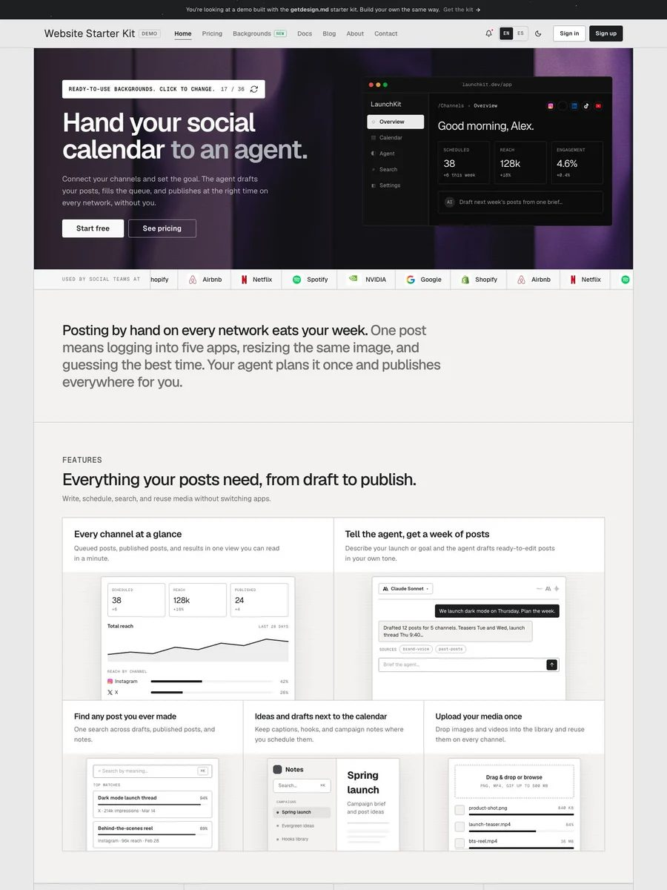

Ask an agent for "a clean landing page" and thirty seconds later you are looking at the same rounded card, the same soft gradient, the same slightly-too-friendly blue button. It works. It also looks like every other AI-generated site shipped this month.

Developers have started naming that look. It is not really a model problem. It is a missing-context problem. Your agent has never seen your brand's colors, never read your type scale, never been told how a button should feel on hover. So it guesses, and it guesses the same way every time.

The fix is almost embarrassingly simple: a markdown file called `DESIGN.md`. And [`getdesign.md`](https://getdesign.md/r/F9XRTEAM10) is a catalog plus CLI that installs one for you in a single command.

> [!NOTE] Disclosure
> The getdesign.md links in this post go through a referral URL. That makes them affiliate links. We use them because the tool is genuinely useful, and we would rather tell you than hide it. The Google reference CLI in this guide is open source under Apache-2.0 and has no referral program.

<!--more-->

## What DESIGN.md Actually Is

`DESIGN.md` is a plain text file, usually at the root of your repository, that describes a visual language in a structure models read natively. No JSON schema to fight, no plugin to install, no Figma export pipeline.

One file answers the questions an agent would otherwise re-guess on every prompt: what should this feel like, which colors are surface and which are ink, what is the type scale, how much space goes around a card, how should a modal behave, and what should the agent explicitly avoid doing.

Because it is markdown, it diffs in a pull request like any other source file, and a human teammate can read the whole thing in under a minute.

### The two layers: tokens and prose

The part that makes this format work is that it is not only a token dump. A `DESIGN.md` has two layers:

```markdown
---
name: Heritage
colors:
  primary: "#1A1C1E"
  secondary: "#6C7278"
  tertiary: "#B8422E"
  neutral: "#F7F5F2"
typography:
  h1:
    fontFamily: Public Sans
    fontSize: 3rem
  body-md:
    fontFamily: Public Sans
    fontSize: 1rem
rounded:
  sm: 4px
  md: 8px
spacing:
  sm: 8px
  md: 16px
---

## Overview

Architectural minimalism meets journalistic gravitas. The UI evokes a
premium matte finish, like a high-end broadsheet.

## Colors

- **Primary (#1A1C1E):** Deep ink for headlines and core text.
- **Tertiary (#B8422E):** Boston Clay, the sole driver for interaction.
```

YAML front matter holds the normative values. The markdown body holds the *reasons*, which is what stops an agent from applying your accent color to a heading because both are technically valid.

Sections are `##` headings in a canonical order: Overview, Colors, Typography, Layout, Elevation & Depth, Shapes, Components, and Do's and Don'ts. A file can omit sections, but the ones present have to appear in that order.

## Where the Format Came From

This is where most write-ups get it wrong, so it is worth being precise. `DESIGN.md` is not a folk convention that several tools invented independently. It is an open format specification published by Google Labs at [`google-labs-code/design.md`](https://github.com/google-labs-code/design.md), Apache-2.0 licensed, with a full token schema, a linter, and a reference CLI.

Google's [Stitch documentation](https://stitch.withgoogle.com/docs/design-md/overview) describes the same idea from the product side, and Stitch can export a `DESIGN.md` for you from a canvas.

What that means in practice: the format is young, it is currently marked `alpha`, and the schema will change. But there is a spec, a versioned token schema, and a linter, which is a very different situation from "no formal spec and no committee."

## What getdesign.md Adds

[`getdesign.md`](https://getdesign.md/r/F9XRTEAM10) is a catalog and CLI for installing pre-built `DESIGN.md` files. Rather than reverse-engineering a design system from scratch, you pick a direction and install it.

The public catalog lists roughly 550 designs, spanning productivity and SaaS, developer tools, AI and ML, fintech, design and creative, and media and consumer. Every entry has light and dark previews plus the raw markdown behind it, so you can read the file before you commit to it.

Each template is an original, independently authored synthesis of a visual style. The site states plainly on every page that these are independent analyses of publicly observable patterns, not affiliated with or endorsed by the brand in question. That framing is the right one, and it is why you can safely use a Stripe-shaped template on a product that has nothing to do with Stripe.

Inside a typical template you will find color tokens with the role each one plays, a type scale with line heights and tracking, spacing and layout rules, component patterns described in prose, motion with durations and easings, and a responsive strategy. Here is what one of the SaaS landing page designs looks like when you preview it:



*Catalog preview courtesy of [getdesign.md](https://getdesign.md/r/F9XRTEAM10).*

> [!TIP] Naming collisions to watch for
> There are several unrelated things called "getdesign" or "designmd". `getdesign.md` is the VoltAgent-maintained catalog and the `getdesign` npm package. `getdesign.app` is a completely different project that scrapes a live URL and generates a `design.md` from it. `designmd.sh` and `designmd.ai` are separate registries. Check the package name, not the logo, before you install anything.

## Install a Template With the CLI

The whole setup takes under five minutes the first time.

### Step 1: List the available templates

```bash
npx getdesign list
```

That prints every slug in the catalog with a one-line description.

### Step 2: Add the file to your project

```bash
npx getdesign add <slug>
```

This writes `DESIGN.md` at your project root. There is no install step; `npx` is the recommended entry point. If you run it constantly, `npm install -g getdesign` puts it on your `PATH` instead. The [package on npm](https://www.npmjs.com/package/getdesign) is MIT licensed, has zero dependencies, and needs Node.js 18 or newer.

One detail worth knowing: the CLI will not clobber your work. If a `DESIGN.md` already exists at the root, the new template is saved into a nested folder such as `<slug>/DESIGN.md`. You can override that with `--force` or redirect the output with `--out`:

```bash
npx getdesign add <slug> --out ./docs/design.md
```

### Step 3: Tell your agent to read it

This is the step people skip, and it is the one that actually changes output. Before any UI work, say:

> Read `DESIGN.md` before writing any UI. Match the tokens, type scale, and component patterns defined there.

Claude Code, Cursor, Windsurf, GitHub Copilot, v0, Lovable, and Bolt all read plain markdown in context with no special configuration. Once the agent has ingested the file, new pages pull from the same visual language instead of defaulting to generic grays. If you are still deciding which terminal agent to use, [OpenCode vs Cursor vs Continue](/p/opencode-vs-cursor/) covers the tradeoffs before you get to tooling details.

### Step 4: Pin the instruction so it survives

Some agents, and some long sessions, drift back toward defaults once the file falls out of the active context window. The fix is to put the read-first instruction in your agent's system prompt, project rules file, or `AGENTS.md`, so it is re-applied automatically instead of retyped. Extending an agent with structured files is the same idea covered in our [OpenCode skills guide](/p/opencode-skills-guide/); if you want the reasoning behind why context files matter at all, start with [AI coding agents explained](/p/ai-coding-agents-explained/).

## Lint It: The Part Most People Skip

Installing a template is the easy half. The reference CLI from the format spec lets you verify and reuse the file, which is where the real leverage is.

```bash
npx @google/design.md lint DESIGN.md
```

That checks structural correctness, flags token references like `{colors.prmary}` that resolve to nothing, and computes WCAG contrast ratios for component background and text pairs. It exits non-zero on errors and returns structured JSON that an agent can act on directly, so you can add "run the linter before you claim the UI is done" to your project rules.

You can also diff two versions to catch regressions:

```bash
npx @google/design.md diff DESIGN.md DESIGN-v2.md
```

And export the tokens into your actual build, which removes the hand-transcription step entirely:

```bash
npx @google/design.md export --format css-tailwind DESIGN.md > theme.css
npx @google/design.md export --format json-tailwind DESIGN.md > tailwind.theme.json
npx @google/design.md export --format dtcg DESIGN.md > tokens.json
```

`css-tailwind` emits a Tailwind v4 `@theme` block using CSS custom properties, `json-tailwind` gives you a v3 `theme.extend` object, and `dtcg` produces tokens in the W3C Design Token Community Group format.

> [!WARNING] Windows
> On PowerShell, `npx @google/design.md ...` can produce no output or open the file in your Markdown editor, because the `.md` suffix in the bin name collides with the Windows file association. Use the dot-free alias instead:
>
> ```bash
> npx -p @google/design.md designmd lint DESIGN.md
> ```

## What Running This Actually Looked Like

Our own repo is a decent test case. Dev9b runs on Hugo Theme Stack v4, and our entire visual language lives in CSS custom properties: `--accent-color`, `--card-border-radius`, `--card-padding`, `--card-text-color-secondary`, `--article-line-height`, `--body-background`.

An agent opening this repository sees those names. What it does not see is that `--card-text-color-tertiary` is only ever for metadata, that the reader toolbar is meant to feel like a reading utility rather than a toolbar, or that the accent color needs to hold contrast against both the light and dark scheme. None of that is in the stylesheet, and none of it is in the code comments.

That gap is the entire argument for `DESIGN.md`. A file that says *why* a value exists, in language a model can act on, closes it. The linter then catches the mechanical half, like a button whose text color fails contrast on the background you specified.

The honest caveat: this only works if the file reflects the design you actually shipped. A stale `DESIGN.md` is worse than none, because it will confidently steer an agent toward a look you have already abandoned.

If you would rather watch the idea in motion first, this third-party walkthrough from the This Week in AI channel shows a similar flow with a different toolchain. It is independent of getdesign.md and not an endorsement of it.



## DESIGN.md vs. Re-typing Design Instructions

| | Design details in every prompt | A DESIGN.md file |
|---|---|---|
| Consistency across pages | Low, varies by prompt wording | High, one source of truth |
| Time to set up | None upfront, repeated every session | About five minutes, once per project |
| Version control | Not tracked | Tracked in Git like any source file |
| Onboarding a teammate | Verbal or scattered notes | One readable file |
| Agent compatibility | Works, inconsistently | Works across Cursor, Claude Code, v0, Windsurf, Copilot, Lovable, Bolt |
| Changing the look | Rewrite the prompt | Edit one file, diffable in a PR |

## Common Mistakes to Avoid

- **Dropping the file in and never mentioning it.** Most agents will not read `DESIGN.md` on their own. Say so explicitly in your prompt or project rules.
- **Expecting it to invent taste.** `DESIGN.md` does not manufacture a design direction. You still choose the template; the file just makes the decision repeatable.
- **Treating it as an official brand system.** These are original interpretations, not extracted brand assets, and each one carries a non-affiliation disclaimer. Do not ship one claiming it is a company's real design tokens.
- **Letting it go stale.** When the product's visual direction shifts, update the file and run `diff` to see what actually changed.
- **Skipping the responsive and dark-mode sections.** Check them in whichever template you pick. That omission is how inconsistencies creep back in over three or four pages.
- **Blowing away your own file.** The CLI nests rather than overwrites by default. Use `--force` only when you mean it.

## FAQ

### What is a DESIGN.md file used for?

A `DESIGN.md` file gives an AI coding agent a consistent visual reference: colors, typography, spacing, component behavior, and motion. The agent reads it before generating UI, so output follows one design language instead of defaulting to a generic Tailwind look.

### What does the getdesign.md CLI do?

The `getdesign` CLI installs a ready-made `DESIGN.md` at your project root. Run `npx getdesign list` to see every template slug, then `npx getdesign add <slug>` to write the file. It requires Node.js 18 or newer, has no dependencies, and is MIT licensed.

### Does DESIGN.md work with Claude Code and Cursor?

Yes. Both read a `DESIGN.md` at the project root as plain markdown. The part people skip is telling the agent to read it, so put that instruction in your project rules file or system prompt rather than retyping it per session.

### Is a DESIGN.md template an official brand design system?

No. Templates from getdesign.md are original, independently authored analyses of publicly observable visual patterns. They are not affiliated with or endorsed by the brands they are inspired by, and each page carries that disclaimer.

### How is DESIGN.md different from AGENTS.md?

`AGENTS.md` is a general instruction file about how an agent should work in a codebase: commands, conventions, project structure. `DESIGN.md` is the visual counterpart, holding design tokens, type scale, spacing, and component patterns for UI generation. They are meant to sit side by side at the project root, next to your `README.md`.

### Can I validate a DESIGN.md file automatically?

Yes. The reference CLI from the format spec runs `npx @google/design.md lint DESIGN.md` to check structure, unresolved token references, and WCAG contrast ratios, `diff` to catch regressions between versions, and `export` to emit Tailwind or W3C DTCG tokens. On Windows, use the `designmd` alias via `npx -p`.

## Key Takeaways

- `DESIGN.md` is a plain markdown file at your project root combining machine-readable tokens in YAML front matter with design rationale in prose.
- It is a real open specification from Google Labs under Apache-2.0, currently at `alpha` version, with a reference CLI for linting, diffing, and exporting.
- `getdesign.md` installs a ready-made template with `npx getdesign add <slug>`, so you skip writing one from a blank page.
- Telling your agent to read the file is the step that changes output quality. Pin it in project rules so it survives context drift.
- Treat templates as starting points, not brand assets. Edit them, keep them current, and lint them.

## Conclusion

`DESIGN.md` turns a repeated instruction into a durable artifact that lives next to your code. It is the cheapest fix for the most recognizable failure mode of agent-built UI, and the format is young enough that the tooling is still catching up. For the visual side of that same failure mode — the purple gradients and gray icon grids agents keep shipping — see our guide to [de-AI slopping your website design](/p/how-to-de-ai-slop-website-design/).

Practicing this is a workflow change more than a tooling change, which is the same distinction we make in [Vibe Coder vs Vibe Engineer](/p/vibe-coder-vs-vibe-engineer/): the agent is not the bottleneck, the context you give it is. For teams like F9XR, the practical version is to keep one reviewed file, lint it in CI, and export tokens to the framework instead of retyping hex values by hand.

If you want to see how agent context files behave in a real project setup first, [OpenCode MCP servers](/p/opencode-mcp-servers/) covers the other half of the same problem, where tools rather than tokens are what an agent is missing.

Ready to contribute? The [Contributor Guide](/contribute/) explains how to submit an article to Dev9b, and everything we publish is reviewed against the standards in our [Editorial Policy](/editorial-policy/).

---

*Cover image and catalog preview courtesy of [getdesign.md](https://getdesign.md/r/F9XRTEAM10). This guide was researched and drafted with the assistance of an AI coding assistant, then reviewed by the F9XR Review Board before publishing. Have feedback or want to contribute your own article? See our [Contributor Guide](/contribute/) and [Editorial Policy](/editorial-policy/).*
