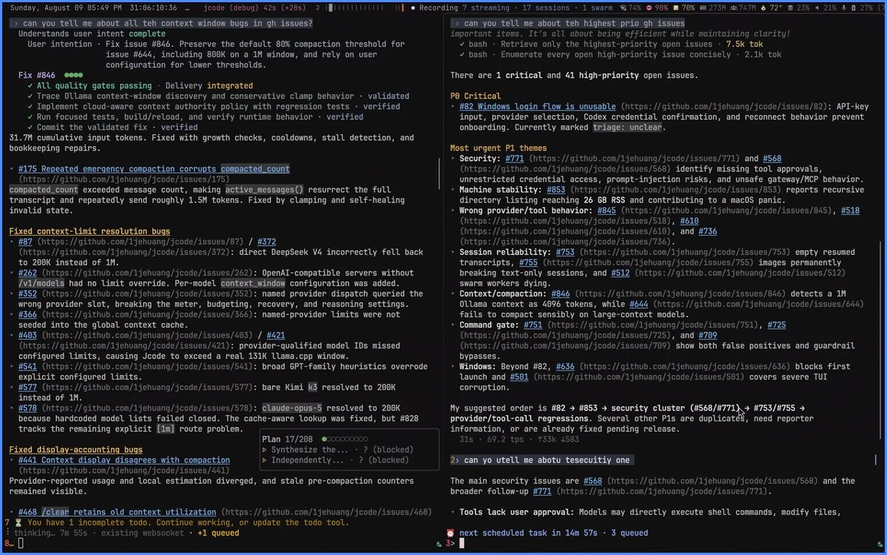
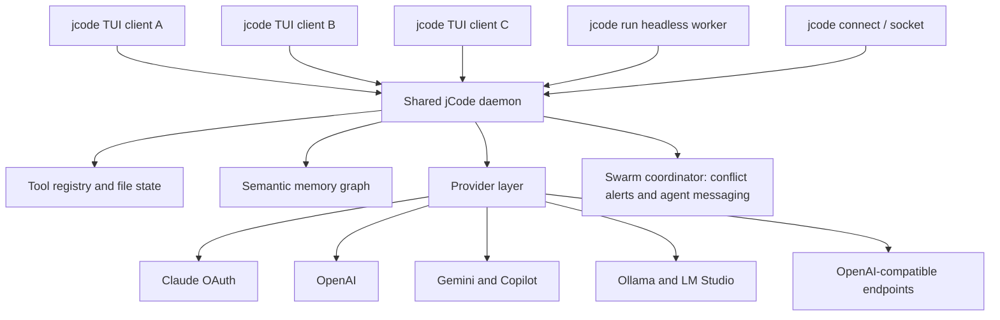
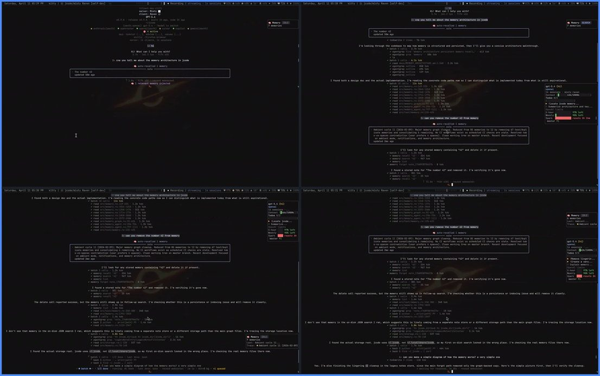

You spin up four coding agents to handle four tickets at once, and within a minute the machine is thrashing. The laptop is swapping. Fans are loud. One agent gets OOM-killed mid-refactor and you have lost its context.

That is the normal failure mode of parallel agent work today, and it is not a model problem. It is a memory problem. Each terminal coding agent ships its own runtime, its own process, its own copy of the world, and after four of them you are out of RAM. So most people quietly run one agent at a time and accept the serial workflow.

jCode is a terminal coding agent harness built specifically to break that limit. It is written in Rust, MIT licensed, published by Jeremy Huang (`1jehuang`) out of a YC Summer 2026 batch company called Solo Systems, and it has passed 20,000 GitHub stars. Its whole design centres on one idea: many agents must be cheap.

This guide covers what jCode actually is, where the memory numbers come from, how to install it on macOS, Linux or Windows, how to connect a model, and how to run a real multi-agent swarm. Every command and figure here was checked against the project repository and documentation rather than copied from a landing page.

<!--more-->

## What jCode Actually Is

A coding agent is a loop. It reads files, plans, calls tools, checks its own work, and repeats until the task is done. If you want the mechanics of that loop and why agents fail the way they do, [AI coding agents explained](/p/ai-coding-agents-explained/) covers the plan-act-check cycle in detail.

The word that trips people up in "jCode" is *harness*. A harness is everything around the model: the tool implementations, the context management, the file editing, the permissions, the memory, the coordination between agents, and the terminal interface. The model is a rented commodity that changes every few months. The harness is the part you actually own.

jCode is that harness for a terminal, and it is opinionated in one direction only: minimise per-session cost so that fan-out becomes the default rather than a trick.

What you get concretely:

- A ratatui terminal UI that renders its first frame in roughly 14 ms and accepts typed input in roughly 49 ms.
- A shared background daemon. Sessions, tools and provider calls live in the daemon, and each TUI is just a client on a socket.
- A semantic memory graph that embeds every turn and recalls related context passively, so the agent remembers without you paying tokens to ask.
- Swarm coordination: agents in the same repository are tracked, they are warned when another agent edits a file they have already read, and they can message each other.
- Native Mermaid diagram rendering through a custom Rust renderer, with no browser and no Node.js in the loop.
- A side panel, diff views, info widgets, and a `/review` and `/test` command pair for one-shot verification.

> [!NOTE] Image credit
> The screenshots in this article are frames from the official demo recordings published with the jCode project, MIT licensed and created by Jeremy Huang. Originals are in the [jCode GitHub releases](https://github.com/1jehuang/jcode/releases).



That is the project's YC launch demo, and the whole product is on screen: a terminal, a model, a set of tools, and no browser window anywhere.

## Why Memory Efficiency Is the Whole Point

RAM, not tokens, is the hard ceiling on how much agent work you can dispatch. The project publishes proportional set size measurements, which is the right metric because it counts only the pages a process actually owns rather than shared library pages counted repeatedly.

Here is the per-session scaling table from the repository, reproduced as published:

| Tool | Extra PSS per added session | Versus jCode |
|---|---|---|
| jCode | ~10.4 MB | baseline |
| Codex CLI | ~21.6 MB | 2.2x more |
| pi | ~76.5 MB | 7.7x more |
| Antigravity CLI | ~86.4 MB | 8.7x more |
| Cursor Agent | ~157.5 MB | 15.9x more |
| GitHub Copilot CLI | ~158.1 MB | 16.0x more |
| Claude Code | ~212.7 MB | 21.5x more |
| OpenCode | ~318.4 MB | 32.2x more |

Now the total picture at ten concurrent sessions, which is the number that actually decides whether you can fan out on a 16 GB laptop:

| Tool | PSS with 10 sessions | Versus jCode |
|---|---|---|
| jCode | 260.8 MB | baseline |
| Codex CLI | 334.8 MB | 2.9x more |
| pi | 833.0 MB | 7.1x more |
| Antigravity CLI | 1021.2 MB | 8.7x more |
| Cursor Agent | 1632.4 MB | 14.0x more |
| GitHub Copilot CLI | 1756.5 MB | 15.0x more |
| Claude Code | 2300.6 MB | 19.7x more |
| OpenCode | 3237.2 MB | 27.7x more |

Read that OpenCode row carefully, because it is the one people care about most. Over 3.2 GB for ten sessions is why running a handful of agents on a development machine feels reckless, and it is exactly the problem this architecture removes.

### The honest caveat: the first session is not free

An important detail that marketing copy usually skips. With local embeddings compiled in, a single jCode session measures 167.1 MB, which is *more* than pi at 144.4 MB and Codex CLI at 140.0 MB. With local embeddings turned off it drops to 27.8 MB.

The reason is simple. The embedding model, the daemon, the session store and the tool registry are all shared infrastructure that you pay for once. After that, each extra client is about 10 MB. If you only ever intend to run one session at a time, a lighter single-process agent is the better tool, and that is worth saying plainly.

Where the shared cost really pays off is headless swarm workers, which is the mode you would use for automation anyway. Measured on 29 September 2026 with `jcode v0.89.19-dev` and `Claude Code 2.1.267`, each session completing five real model turns with tool calls:

| Concurrent headless sessions | jCode | Claude Code | Difference |
|---|---|---|---|
| 1 | 32.6 MB | 261.0 MB | 8.0x less RAM |
| 5 | 51.0 MB | 908.6 MB | 17.8x less RAM |
| 10 | 66.7 MB | 1749.7 MB | 26.2x less RAM |
| 20 | 90.6 MB | 3376.8 MB | 37.3x less RAM |
| Each additional | ~3.1 MB | ~164 MB | ~54x less RAM |

Twenty headless agents for under 100 MB is the shape of thing that is impossible with the architecture most agents ship today. If you want the mechanics of running many sub-agents on a single shared task rather than many parallel tasks, [what the Arena skill does with 100 competing agents](/p/what-is-arena-skill-install-use-ai-agents/) is the complementary read.

Those numbers are vendor-measured on one Linux machine against specific pinned versions, listed at the bottom of the repository README. They are reproducible, there is a script for them, and you should still expect different results on your hardware.


Those are four moments sampled across the project's performance demo, from its opening frame to the end. What matters in the strip is not any single moment but how little changes between them: the interface is fully drawn and fully responsive long before an agent in a heavier runtime has finished starting.

### The daemon design in one diagram



One more architectural decision worth borrowing even if you never install jCode. Most agents block startup while every MCP server handshakes, or connect lazily and then invalidate the model's prompt cache the first time a tool appears, costing a full conversation re-read. jCode advertises every configured tool from an on-disk schema cache the moment a session starts, connects servers in the background, and blocks only the single call that actually needs a server that is not ready. You can type immediately and the prompt prefix stays warm. If you are running MCP servers today, our guide to [setting up MCP servers for a coding agent](/p/opencode-mcp-servers/) covers the same territory from the configuration angle.

## Install jCode on macOS, Linux, or Windows

The supported platforms are Linux on x86_64 and aarch64, macOS on Apple Silicon and Intel, Windows on x86_64 both natively and through WSL2, and Termux once you install `glibc` and `patchelf`.

### macOS and Linux

```bash
curl -fsSL https://jcode.sh/install | bash
```

### Windows 11

```powershell
irm https://jcode.sh/install.ps1 | iex
```

The Windows installer detects your architecture, checks the download against the release `SHA256SUMS`, and stops rather than silently starting a long compilation when no matching asset exists. It also leaves the optional Alacritty terminal and the global launch hotkey alone unless you explicitly consent to them, which is the right default for a script you pipe into `iex`.

### macOS with Homebrew

```bash
brew tap 1jehuang/jcode
brew install jcode
```

### Build from source

```bash
git clone https://github.com/1jehuang/jcode.git
cd jcode
cargo build --release
scripts/install_release.sh
```

The project is a Cargo workspace of forty-plus crates, so a cold release build is not a two-minute job. On Windows, a source build additionally needs Git, Rust and Visual Studio 2022 Build Tools with the Desktop development with C++ workload.

### Verify and update

Open a new terminal and check that the binary is on your `PATH` with `jcode --version`, or launch the TUI and type `/version` for full build details.

Updates happen in the background and preserve your session:

```text
/update
```

From a plain terminal, `jcode update` does the same job and then you restart the client. Both paths share one update policy, and the update logic compares your running binary's commit against the release tag so a development build is never downgraded underneath you.

To remove it later, the uninstall script keeps your config, auth and sessions so a reinstall resumes where you left off:

```bash
curl -fsSL https://raw.githubusercontent.com/1jehuang/jcode/master/scripts/uninstall.sh | bash -s -- --yes
```

Add `--purge` to wipe config, auth, sessions, logs and memory as well, and `--dry-run` to preview first.

## Connect a Model Provider

jCode ships subscription OAuth flows, so the cheapest setup is the model you already pay for:

```bash
jcode login --provider claude     # Claude subscription
jcode login --provider openai     # ChatGPT and Codex
jcode login --provider gemini     # Google Gemini
jcode login --provider copilot    # GitHub Copilot
jcode login --provider azure      # Azure OpenAI
jcode login --provider ollama     # local Ollama server
jcode login --provider lmstudio   # local LM Studio server
```

Run `jcode login` with no arguments to get the interactive list. If you are on a headless box, add `--no-browser` and jCode prints the auth URL or a QR code to open somewhere else. Claude, OpenAI, Gemini and Copilot also support a two-step flow with `--print-auth-url` followed by `--callback-url` or `--auth-code` later. Once you are configured, `jcode auth-test --all-configured` verifies everything at once, which is a faster check than launching the TUI and waiting for a failed turn.

For self-hosted or unlisted endpoints, `jcode provider add` writes a named profile into `~/.jcode/config.toml` and can read the key from standard input so it never lands in your shell history:

```bash
printf '%s' "$MY_API_KEY" | jcode provider add my-api \
  --base-url https://llm.example.com/v1 \
  --model my-model-id \
  --api-key-stdin \
  --set-default

jcode --provider-profile my-api auth-test
jcode --provider-profile my-api run 'hello'
```

Local runtimes need no key at all:

```bash
jcode provider add local-vllm \
  --base-url http://localhost:8000/v1 \
  --model Qwen/Qwen3-Coder-30B-A3B-Instruct \
  --no-api-key \
  --set-default
```

That last example is worth pausing on. A local Qwen coder model on a local vLLM server, running inside an agent harness that costs 3 MB per worker, changes the economics of long unattended runs. The token cost drops to your own hardware and the marginal agent cost drops to nearly nothing.

## Your First Session

```bash
cd your-project
jcode
```

Or run one non-interactive prompt, which is the shape you want in CI or a script:

```bash
jcode run "explain the architecture of this codebase"
```

The commands worth knowing on day one:

| Command | Purpose |
|---|---|
| `jcode` | Launch the interactive TUI |
| `jcode run "prompt"` | Non-interactive single prompt |
| `jcode --resume fox` | Resume a session by memorable name |
| `jcode serve` | Run a persistent background daemon |
| `jcode connect` | Attach a client to a running daemon |
| `jcode dictate` | Send voice input from your configured STT command |
| `jcode browser setup` | Wire up the Firefox Agent Bridge for browser control |
| `/model` | List or switch models |
| `/effort` | Show or change reasoning effort |
| `/todos` | Show the session todo list as a card |
| `/review` and `/test` | One-shot review session, and verify a claim with layered tests |
| `/commit` and `/commit-push` | Logical commits from the current diff |
| `/memory` and `/swarm` | Toggle the memory and swarm features |
| `/usage` and `/info` | Provider usage limits and token counts |
| `/update` | Background update and reload |
| `/help` | Everything else |

Type `/` and the TUI fuzzy-matches the full list.

### Project instructions

Put an `AGENTS.md` in the root of your repository and it loads into every session that runs inside that repo. Machine-wide preferences go in `~/AGENTS.md`, which loads everywhere. This is the single highest-leverage habit for reliability: encode the test command, the lint command, the conventions, and the things that must never change.

jCode treats `AGENTS.md` as session bootstrap input and snapshots it, so an agent writing to the file mid-session cannot mutate your cacheable prompt prefix. That is a small detail that shows how carefully the prompt cache is treated.

### Skills

Skills are markdown instruction packs, one directory per skill with a `SKILL.md`, installed under `~/.jcode/skills/`. jCode also loads skills from Claude Code plugin directories, so an existing skill collection works unchanged. The pattern for building them is the same one we cover in [how to add skills to your coding agent](/p/opencode-skills-guide/).

The part is genuinely different: skills are not all loaded at startup. The conversation is embedded as a semantic vector, and a skill is injected only when the conversation matches it, the same mechanism memory recall uses. That keeps a large skill collection off your context until it earns its place. `/skills` shows what is loaded and what jCode endorses.

### The memory graph

The same trick is applied to conversation memory, and it is the second feature worth understanding before you commit to this tool.

Every turn and every response is embedded as a semantic vector and written into a memory graph. On each turn, jCode queries that graph by cosine similarity and injects the hits into the conversation. A side agent can sit in front of retrieval and verify the recalled memories are actually relevant before spending context on them. Memories are extracted on a trigger rather than on every turn, by semantic drift, by a turn count, or at session end, and an ambient mode consolidates them afterwards to check for staleness and contradictions.



The reason this matters for cost is specific. Retrieval-augmented generation usually means the agent spends a tool call and a chunk of tokens asking to search its history, every single time. Passive recall spends none of that: the harness does the lookup before the model is asked, and the model simply has the relevant context. Explicit memory tools still exist for when the agent should look on purpose, and session search covers ordinary recall of previous transcripts.

## Running Several Agents in One Repository

This is the part that justifies the architecture. Start two or more agents in the same repo and the server manages them natively.

When agent A edits a file that agent B has already read, the server notifies B. B decides whether it matters and can inspect the diff. Without that, parallel agents silently corrupt each other, which is the real reason people give up on fan-out. Agents can also direct-message one agent, broadcast to the whole server, or address only the agents working in that repo.

Agents can spawn their own workers too. The swarm tool turns the main agent into a coordinator and the spawned agents into workers, with channels, completion status and grouping managed for you, headless or headed. Root reasoning effort is configured separately from worker effort, so you can keep the coordinator cheap and spend the budget on the workers:

```toml
[agents]
swarm_root_effort = "low"        # /effort swarm
swarm_deep_root_effort = "high"  # /effort swarm-deep
```

### Running it away from your laptop

Because the daemon owns sessions and the TUI is only a client, remote use is natural. Run the server on a remote machine and forward the socket:

```bash
# on the remote machine
jcode serve --server-name mybox

# on your laptop
ssh -N -L /tmp/jcode-mybox.sock:/run/user/1000/jcode.sock mybox &
jcode --socket /tmp/jcode-mybox.sock
```

There is also a WebSocket gateway on port 7643 for paired phone clients over Tailscale or a LAN, gated behind explicit pairing with a short-lived code, with tokens stored hashed on the server and the gateway off by default. And a TypeScript SDK can attach to a running instance through `jcode api-bridge` if you would rather drive sessions from your own program. For anyone still deciding whether a terminal agent is the right interface at all, [the OpenCode TUI setup guide](/p/how-to-setup-opencode-tui/) is the gentler on-ramp.

## Where jCode Sits Against Other Terminal Agents

| Question | jCode | Typical Node or binary agent |
|---|---|---|
| Extra memory per additional session | ~10.4 MB interactive, ~3.1 MB headless | ~20 MB to ~320 MB |
| Extra sessions share a daemon | Yes | Usually one process per session |
| Subscription OAuth login | Claude, OpenAI, Gemini, Copilot, Azure | Varies |
| Local models | Ollama, LM Studio, any OpenAI-compatible endpoint | Varies |
| Multi-agent coordination in one repo | Built in, with conflict alerts and messaging | Usually bolted on |
| Licence | MIT | Varies |

If your decision is terminal agent versus a full IDE agent rather than one terminal agent against another, [OpenCode versus Cursor](/p/opencode-vs-cursor/) works through that trade-off in detail. The short version: jCode is only the right pick if you actually intend to run agents in parallel. If you want one careful agent in an editor, the memory advantage buys you nothing.

## Honest Limitations and Security Notes

- **Single-maintainer risk.** This is one person, iterating fast, and the README itself lists planned work as raw notes to self. The MIT licence and full source mitigate the risk; they do not remove it. Pin a release you have tested if it matters.
- **MCP is stdio only.** HTTP and SSE server entries are recognised and skipped with a log line. Plan for command-based MCP servers.
- **MCP config is read live, not copied.** jCode reads `~/.claude.json` and the repo-root `.mcp.json` on every load, and performs a one-time import from `~/.codex/config.toml`. That import can copy environment values, which may include secrets.
- **Benchmarks are self-published.** Impressive and reproducible, but measured by the project on its own hardware. Treat the ratios as an architecture argument rather than a guarantee for your laptop.
- **The first session is the heavy one.** If local embeddings are compiled in, a single session is heavier than some lighter agents. Turn the feature off if you will only ever run one.
- **Code leaves your machine by design.** Only the context you send to the provider you configured goes out, and jCode itself runs locally. The source is MIT licensed and auditable, which is the honest way to make that claim checkable.

## FAQ

### What is jCode used for?

jCode is a terminal coding agent harness that connects language models such as Claude, GPT and Gemini, plus local models through Ollama or LM Studio, to your actual codebase. An agent reads, edits and runs code in your project. The distinguishing feature is that a single background daemon is shared by every session, so a second, third or twentieth session costs about 10 MB of extra memory instead of a few hundred.

### Is jCode free?

Yes. jCode itself is MIT licensed and completely free. The only cost is the model provider you point it at, billed through your own Claude, ChatGPT, Gemini or Copilot subscription, or your own API keys and local hardware.

### How much RAM does each jCode session use?

The published figures are about 10.4 MB of extra proportional memory per additional interactive session, and about 3.1 MB per additional headless swarm worker. The first session is heavier, roughly 167 MB with local embeddings compiled in and 27.8 MB with them off, because the shared daemon and its embedding model are a one-time cost. Ten interactive sessions sit around 260 MB.

### Can I use local models with jCode?

Yes. Run `jcode login --provider ollama` or `jcode login --provider lmstudio` to connect a local server that already exposes an OpenAI-compatible API. Any other OpenAI-compatible endpoint, including self-hosted vLLM, can be registered with `jcode provider add`.

### Does jCode work on Windows?

Yes. There is a native Windows installer that runs on Windows 11 under PowerShell 5.1 or newer, detects x64 versus ARM64, and verifies the download against the release `SHA256SUMS` file. The install command is `irm https://jcode.sh/install.ps1 | iex`, and WSL2 is supported too.

### How do I update jCode?

Type `/update` inside the TUI to download the latest stable release in the background and reload with your session preserved, or run `jcode update` from a terminal and restart the client. Both share one update policy, and a development build is never silently downgraded.

## Key Takeaways

- jCode is a MIT-licensed, Rust-built terminal coding agent harness from a YC Summer 2026 company, designed so many agents can run on one machine.
- The shared daemon is the whole trick. Roughly 10.4 MB per extra interactive session and 3.1 MB per extra headless worker, against 158 MB to 318 MB for other tools.
- The first session is a one-time cost, and it is the highest one. With local embeddings on it measures 167 MB, which beats nothing and loses to lighter agents.
- Installation is one command on macOS, Linux and Windows, plus Homebrew and a source build. `jcode login --provider <name>` covers Claude, OpenAI, Gemini, Copilot, Ollama and LM Studio.
- Swarm mode, the semantic memory graph and the MCP startup design are the three ideas worth stealing even if you install something else.
- Pin a release, keep an `AGENTS.md` current, and run `jcode auth-test --all-configured` before blaming the model for a failure.

## Conclusion

What jCode contributes is not a better model. It is a different cost curve. Once the marginal session drops to ten megabytes, the interesting question stops being "which agent is smartest" and becomes "what is the largest set of tasks I can have in flight at once", which is a far more productive question for a team.

Use it as written if you intend to run agents in parallel, which is the case it is engineered for. Skim the architecture if you only want the ideas, because the daemon-sharing model, the cached MCP schema advert and the embedding-triggered skill injection are all portable ideas. And check the measured numbers on your own hardware, because every table here comes from the project's own machines.

Teams like F9XR get the practical version of this by keeping instructions in a reviewed `AGENTS.md` per repository, pinning agent versions, and treating agent output as untrusted until a test run says otherwise. If you want the reasoning behind reviewing what an agent hands you, [Vibe Coder versus Vibe Engineer](/p/vibe-coder-vs-vibe-engineer/) goes deeper.

Ready to contribute? The [Contributor Guide](/contribute/) explains how to submit an article to Dev9b, and everything we publish is reviewed against the standards in our [Editorial Policy](/editorial-policy/).

---

*jCode is created by Jeremy Huang and MIT licensed, and is not affiliated with Y Combinator beyond being a YC Summer 2026 batch company. Performance figures in this guide are vendor-published from the project repository with the tested versions listed there, and were verified against the source documentation rather than reproduced on our own hardware. This guide was drafted with the assistance of an AI coding assistant, then reviewed by the F9XR Review Board before publishing. Always check the latest README, because install paths, flags and default configuration change quickly.*
